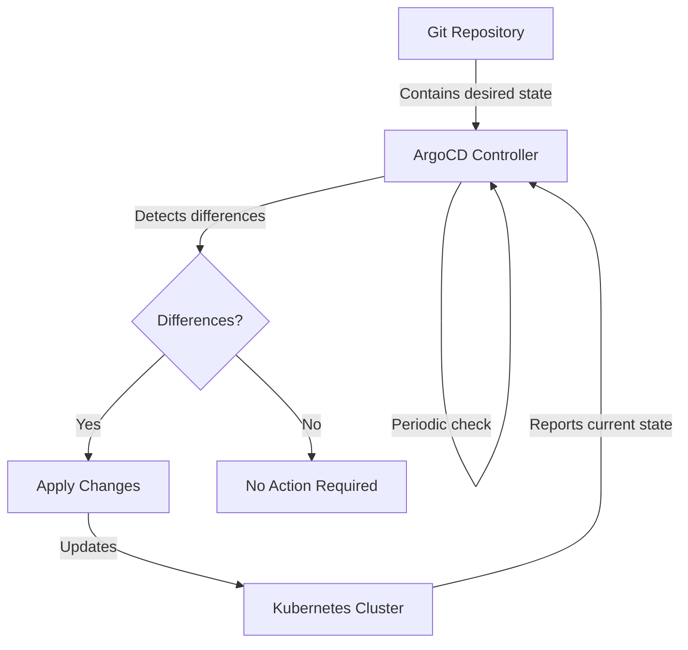
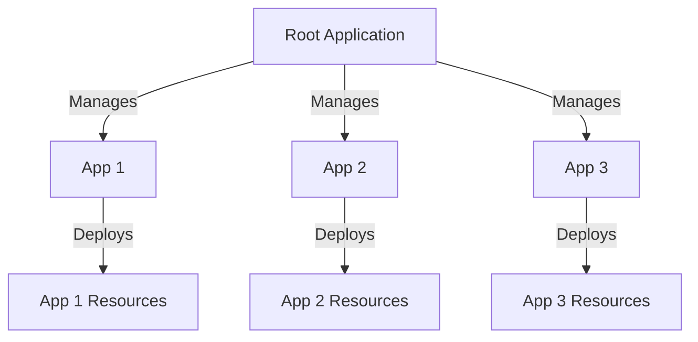

# ArgoCD in Action: Operations, Strategies

## Table of Contents
- [Reconciliation Loop](#reconciliation-loop)
- [Application Health Checks](#application-health-checks)
  - [Define Custom Health Checks using Lua Language](#define-custom-health-checks-using-lua-language)
- [Types of Sync Strategies](#types-of-sync-strategies)
- [Declarative Setup](#declarative-setup)
- [ArgoCD Application in ArgoCD Application (Apps in Apps)](#argocd-application-in-argocd-application-apps-in-apps)
- [Deploying ArgoCD Application using Helm Charts](#deploying-argocd-application-using-helm-charts)
- [Multi Cluster Application Deploying](#multi-cluster-application-deploying)

## Reconciliation Loop

The reconciliation loop is the core mechanism of GitOps in general and ArgoCD in particular. It continuously ensures that the actual state in the cluster matches the desired state defined in Git.

### How the Reconciliation Loop Works



1. **Fetch**: The ArgoCD controller fetches the latest manifests from the Git repository
2. **Compare**: It compares the manifests with the current state in the cluster
3. **Report**: Differences are reported and visualized in the UI
4. **Apply**: If automatic sync is enabled, differences are reconciled by applying changes

### Key Reconciliation Settings

ArgoCD allows you to configure how the reconciliation loop behaves:

```yaml
apiVersion: argoproj.io/v1alpha1
kind: Application
metadata:
  name: myapp
spec:
  # ... other fields ...
  syncPolicy:
    automated:
      prune: true    # Remove resources that are no longer in Git
      selfHeal: true # Revert manual changes made to the cluster
    syncOptions:
      - Validate=true            # Validate resources against Kubernetes schema
      - CreateNamespace=true     # Create namespace if it doesn't exist
      - PruneLast=true           # Delete resources last during sync
      - ApplyOutOfSyncOnly=true  # Only apply resources that are out of sync
  # How frequently to check for changes (default is 3 minutes)
  refreshInterval: 3m
```

### Reconciliation Commands

```bash
# Force a refresh of the application state
argocd app refresh myapp

# Manually trigger reconciliation
argocd app sync myapp

# Check sync status
argocd app get myapp

# See reconciliation history
argocd app history myapp
```

## Application Health Checks

ArgoCD monitors not just the synchronization status but also the health of applications. Health represents whether the application is operating correctly, rather than just whether it was deployed correctly.

### Built-in Health Checks

ArgoCD includes built-in health check logic for common Kubernetes resources:

| Resource Type | Health Criteria |
|---------------|-----------------|
| Pod | Running and ready |
| Deployment | Desired replicas match available replicas |
| StatefulSet | All replicas are ready |
| Service | Endpoints exist if type is not ExternalName |
| Ingress | Has configured hosts and load balancer status |
| PersistentVolumeClaim | Bound to a PersistentVolume |
| Job | Successfully completed |

### Health Status Visualization

ArgoCD visualizes health status with simple indicators:

- **Healthy**: Application is running as expected
- **Degraded**: Application is not functioning correctly
- **Progressing**: Application is being deployed or updated
- **Suspended**: Application is suspended (e.g., zero replicas)
- **Missing**: Resources are missing
- **Unknown**: Health cannot be determined

### Define Custom Health Checks using Lua Language

For custom resources or more complex health requirements, ArgoCD supports custom health checks using Lua scripts.

**Example: Custom Health Check in ConfigMap**

```yaml
apiVersion: v1
kind: ConfigMap
metadata:
  name: argocd-cm
  namespace: argocd
data:
  resource.customizations.health.mycrd.example.com_MyResource: |
    function hs = {}
    hs.status = "Progressing"
    hs.message = ""
    
    if obj.status ~= nil then
      if obj.status.phase == "Running" then
        hs.status = "Healthy"
        hs.message = "Application is running"
      elseif obj.status.phase == "Failed" then
        hs.status = "Degraded"
        hs.message = "Application has failed"
      end
    end
    
    return hs
```

**Example: Custom Health Check for a Kafka Cluster**

```yaml
apiVersion: v1
kind: ConfigMap
metadata:
  name: argocd-cm
  namespace: argocd
data:
  resource.customizations.health.kafka.strimzi.io_Kafka: |
    function hs = {}
    hs.status = "Progressing"
    hs.message = ""
    
    if obj.status ~= nil and obj.status.conditions ~= nil then
      for i, condition in ipairs(obj.status.conditions) do
        if condition.type == "Ready" and condition.status == "True" then
          hs.status = "Healthy"
          hs.message = "Kafka cluster is ready"
          return hs
        elseif condition.type == "NotReady" and condition.status == "True" then
          hs.status = "Degraded"
          hs.message = condition.message
          return hs
        end
      end
    end
    
    return hs
```

### Health Check Commands

```bash
# Check application health
argocd app get myapp

# Get detailed health information
argocd app get myapp --hard-refresh

# Watch health status in real-time
watch argocd app get myapp
```

## Types of Sync Strategies

ArgoCD offers several synchronization strategies to accommodate different deployment requirements.

### Manual vs Automated Sync

**Manual Sync**:
- Changes in Git don't automatically deploy
- Requires explicit approval via UI or CLI
- Useful for production environments with strict controls

```yaml
apiVersion: argoproj.io/v1alpha1
kind: Application
metadata:
  name: myapp
spec:
  # No syncPolicy specified = manual sync
```

**Automated Sync**:
- Changes in Git automatically deploy
- Reduces human intervention
- Ideal for development environments

```yaml
apiVersion: argoproj.io/v1alpha1
kind: Application
metadata:
  name: myapp
spec:
  syncPolicy:
    automated: {}  # Enable automated sync
```

### Sync Options and Flags

ArgoCD provides various options to control the sync behavior:

```yaml
apiVersion: argoproj.io/v1alpha1
kind: Application
metadata:
  name: myapp
spec:
  syncPolicy:
    automated:
      prune: true     # Remove resources that are no longer in Git
      selfHeal: true  # Revert manual changes made to the cluster
    syncOptions:
      - Validate=true             # Validate resources against Kubernetes schema
      - CreateNamespace=true      # Create namespace if it doesn't exist
      - PruneLast=true            # Delete resources last during sync
      - ApplyOutOfSyncOnly=true   # Only apply out-of-sync resources
      - Replace=true              # Use kubectl replace instead of apply
      - RespectIgnoreDifferences=true  # Respect configured ignore differences
```

### Selective Sync

You can selectively sync specific resources instead of the entire application:

```bash
# Sync only specific resources
argocd app sync myapp --resource guestbook:Deployment:frontend

# Sync multiple resources
argocd app sync myapp --resource guestbook:Deployment:frontend --resource guestbook:Service:frontend

# Sync by kind
argocd app sync myapp --kind Deployment
```

### Sync Waves and Hooks

ArgoCD allows controlling the order of resource creation/deletion using waves and hooks:

**Sync Waves**:
```yaml
apiVersion: v1
kind: ConfigMap
metadata:
  name: config
  annotations:
    argocd.argoproj.io/sync-wave: "0"  # Lower numbers go first
---
apiVersion: apps/v1
kind: Deployment
metadata:
  name: app
  annotations:
    argocd.argoproj.io/sync-wave: "1"  # Higher numbers go after
```

**Sync Hooks**:
```yaml
apiVersion: batch/v1
kind: Job
metadata:
  name: db-migration
  annotations:
    argocd.argoproj.io/hook: PreSync  # Run before sync
    argocd.argoproj.io/hook-delete-policy: HookSucceeded  # Delete after success
```

Available hook types:
- `PreSync`: Run before sync
- `Sync`: Run during sync
- `PostSync`: Run after sync
- `SyncFail`: Run if sync fails

Hook deletion policies:
- `HookSucceeded`: Delete after success
- `HookFailed`: Delete after failure
- `BeforeHookCreation`: Delete before running new hook
- `HookCompleted`: Delete after completion regardless of success

## Declarative Setup

ArgoCD itself can be configured declaratively, applying GitOps principles to ArgoCD's own configuration.

### Installing ArgoCD Declaratively

```bash
# Clone the ArgoCD installer repo
git clone https://github.com/argoproj/argo-cd.git
cd argo-cd

# Install non-HA version
kubectl create namespace argocd
kubectl apply -n argocd -f manifests/install.yaml

# Or install HA version
kubectl apply -n argocd -f manifests/ha/install.yaml
```

### Managing ArgoCD Configuration

ArgoCD configuration is stored in ConfigMaps and Secrets that can be version-controlled:

```yaml
# argocd-cm.yaml
apiVersion: v1
kind: ConfigMap
metadata:
  name: argocd-cm
  namespace: argocd
data:
  # General settings
  url: https://argocd.example.com
  
  # SSO configuration
  dex.config: |
    connectors:
      - type: github
        id: github
        name: GitHub
        config:
          clientID: $github-client-id
          clientSecret: $github-client-secret
          orgs:
          - name: my-organization
  
  # Repository credentials
  repositories: |
    - url: https://github.com/my-org/my-repo
      type: git
      passwordSecret:
        name: repo-secret
        key: password
      usernameSecret:
        name: repo-secret
        key: username
```

```yaml
# argocd-rbac-cm.yaml
apiVersion: v1
kind: ConfigMap
metadata:
  name: argocd-rbac-cm
  namespace: argocd
data:
  policy.csv: |
    p, role:org-admin, applications, *, */*, allow
    p, role:org-admin, clusters, get, *, allow
    p, role:org-admin, repositories, get, *, allow
    p, role:org-admin, repositories, create, *, allow
    p, role:org-admin, repositories, update, *, allow
    p, role:org-admin, repositories, delete, *, allow
    
    g, my-github-org:admin-team, role:org-admin
```

### Applying Declarative Configuration

```bash
# Apply configuration
kubectl apply -f argocd-cm.yaml
kubectl apply -f argocd-rbac-cm.yaml

# Restart ArgoCD to apply changes (if needed)
kubectl rollout restart deployment argocd-server -n argocd
kubectl rollout restart deployment argocd-repo-server -n argocd
```

## ArgoCD Application in ArgoCD Application (Apps in Apps)

The "App of Apps" pattern is a powerful way to manage multiple applications as a group. This pattern uses one ArgoCD Application to manage other ArgoCD Applications.

### Basic App of Apps Pattern



### Implementation Example

**Directory Structure:**
```
apps/
├── Chart.yaml
├── templates/
│   ├── api-app.yaml
│   ├── frontend-app.yaml
│   └── database-app.yaml
└── values.yaml
```

**Root Application:**
```yaml
apiVersion: argoproj.io/v1alpha1
kind: Application
metadata:
  name: all-apps
  namespace: argocd
spec:
  project: default
  source:
    repoURL: https://github.com/my-org/gitops-apps.git
    targetRevision: HEAD
    path: apps
  destination:
    server: https://kubernetes.default.svc
    namespace: argocd
  syncPolicy:
    automated:
      prune: true
      selfHeal: true
```

**Child Application Template (database-app.yaml):**
```yaml
apiVersion: argoproj.io/v1alpha1
kind: Application
metadata:
  name: database
  namespace: argocd
spec:
  project: default
  source:
    repoURL: {{ .Values.repoURL }}
    targetRevision: {{ .Values.targetRevision }}
    path: services/database
  destination:
    server: {{ .Values.destination.server }}
    namespace: database
  syncPolicy:
    automated:
      prune: true
      selfHeal: true
```

**Values File:**
```yaml
repoURL: https://github.com/my-org/gitops-apps.git
targetRevision: HEAD
destination:
  server: https://kubernetes.default.svc
```

### Managing the App of Apps

```bash
# Create the root application
argocd app create all-apps \
  --repo https://github.com/my-org/gitops-apps.git \
  --path apps \
  --dest-server https://kubernetes.default.svc \
  --dest-namespace argocd \
  --sync-policy automated \
  --auto-prune \
  --self-heal

# Sync all apps
argocd app sync all-apps
```

## Deploying ArgoCD Application using Helm Charts

Helm is a popular Kubernetes package manager, and ArgoCD integrates well with Helm charts.

### Deploying a Helm Chart with ArgoCD

**Example Application Definition:**
```yaml
apiVersion: argoproj.io/v1alpha1
kind: Application
metadata:
  name: prometheus
  namespace: argocd
spec:
  project: default
  source:
    repoURL: https://prometheus-community.github.io/helm-charts
    chart: prometheus
    targetRevision: 15.5.3
    helm:
      releaseName: prometheus
      values: |
        server:
          persistentVolume:
            enabled: false
        alertmanager:
          persistentVolume:
            enabled: false
  destination:
    server: https://kubernetes.default.svc
    namespace: monitoring
  syncPolicy:
    automated:
      prune: true
      selfHeal: true
    syncOptions:
      - CreateNamespace=true
```

### Using CLI to Create Helm-based Application

```bash
# Add a Helm repository to ArgoCD
argocd repo add https://prometheus-community.github.io/helm-charts --type helm --name prometheus-community

# Create an application from a Helm chart
argocd app create prometheus \
  --repo https://prometheus-community.github.io/helm-charts \
  --helm-chart prometheus \
  --revision 15.5.3 \
  --dest-namespace monitoring \
  --dest-server https://kubernetes.default.svc \
  --helm-set server.persistentVolume.enabled=false \
  --helm-set alertmanager.persistentVolume.enabled=false \
  --sync-policy automated \
  --auto-prune \
  --self-heal
```

### Advanced Helm Integration

ArgoCD supports various Helm features:

**Value File Management:**
```yaml
apiVersion: argoproj.io/v1alpha1
kind: Application
metadata:
  name: grafana
spec:
  source:
    repoURL: https://grafana.github.io/helm-charts
    chart: grafana
    targetRevision: 6.32.0
    helm:
      releaseName: grafana
      # Using values files from the Git repository
      valueFiles:
      - values.yaml
      - environments/production/values.yaml
      # Inline values override both files
      values: |
        service:
          type: ClusterIP
  destination:
    server: https://kubernetes.default.svc
    namespace: monitoring
```

**Using Helm Parameters:**
```yaml
apiVersion: argoproj.io/v1alpha1
kind: Application
metadata:
  name: redis
spec:
  source:
    repoURL: https://charts.bitnami.com/bitnami
    chart: redis
    targetRevision: 16.8.5
    helm:
      parameters:
      - name: architecture
        value: standalone
      - name: auth.enabled
        value: "false"
      - name: master.persistence.enabled
        value: "false"
```

**File-based Values:**
```yaml
apiVersion: argoproj.io/v1alpha1
kind: Application
metadata:
  name: mysql
  annotations:
    argocd.argoproj.io/sync-wave: "2"
spec:
  project: default
  source:
    repoURL: https://charts.bitnami.com/bitnami
    chart: mysql
    targetRevision: 9.2.0
    helm:
      fileParameters:
      - name: values.yaml
        path: mysql-values.yaml  # File in the same Git repository
  destination:
    server: https://kubernetes.default.svc
    namespace: database
```

## Multi Cluster Application Deploying

ArgoCD excels at managing applications across multiple clusters, which is essential for implementing consistent deployments in multi-environment or global infrastructures.

### Setting Up Multiple Clusters

```bash
# Add a cluster to ArgoCD
argocd cluster add <context-name>

# List registered clusters
argocd cluster list
```

**Declarative Cluster Registration:**
```yaml
apiVersion: v1
kind: Secret
metadata:
  name: cluster-prod
  namespace: argocd
  labels:
    argocd.argoproj.io/secret-type: cluster
type: Opaque
stringData:
  name: prod-cluster
  server: https://kubernetes.prod.example.com
  config: |
    {
      "bearerToken": "<token>",
      "tlsClientConfig": {
        "insecure": false,
        "caData": "<base64-encoded-ca-cert>"
      }
    }
```

### Deploying to Multiple Clusters

**Single Application to Multiple Clusters:**
```yaml
apiVersion: argoproj.io/v1alpha1
kind: Application
metadata:
  name: guestbook-prod
  namespace: argocd
spec:
  project: default
  source:
    repoURL: https://github.com/argoproj/argocd-example-apps.git
    targetRevision: HEAD
    path: guestbook
  destination:
    server: https://kubernetes.prod.example.com
    namespace: guestbook
```

### Environment-Specific Configurations

There are several strategies for managing environment-specific configurations:

**1. Separate Paths:**
```yaml
apiVersion: argoproj.io/v1alpha1
kind: Application
metadata:
  name: guestbook-prod
spec:
  source:
    repoURL: https://github.com/myorg/myapp.git
    path: environments/prod/guestbook
  # ... rest of spec
```

**2. Branches for Environments:**
```yaml
apiVersion: argoproj.io/v1alpha1
kind: Application
metadata:
  name: guestbook-prod
spec:
  source:
    repoURL: https://github.com/myorg/myapp.git
    targetRevision: production
    path: guestbook
  # ... rest of spec
```

**3. Helm Values by Environment:**
```yaml
apiVersion: argoproj.io/v1alpha1
kind: Application
metadata:
  name: guestbook-prod
spec:
  source:
    repoURL: https://github.com/myorg/myapp.git
    path: charts/guestbook
    helm:
      valueFiles:
      - values-prod.yaml
  # ... rest of spec
```

**4. Kustomize Overlays:**
```yaml
apiVersion: argoproj.io/v1alpha1
kind: Application
metadata:
  name: guestbook-prod
spec:
  source:
    repoURL: https://github.com/myorg/myapp.git
    path: kustomize/overlays/production
    kustomize:
      namePrefix: prod-
  # ... rest of spec
```

### Multi-Cluster Deployment Patterns

**Deployment to Multiple Clusters:**
```bash
# Create applications targeting different clusters
argocd app create guestbook-dev \
  --repo https://github.com/argoproj/argocd-example-apps.git \
  --path guestbook \
  --dest-server https://kubernetes.dev.example.com \
  --dest-namespace guestbook

argocd app create guestbook-prod \
  --repo https://github.com/argoproj/argocd-example-apps.git \
  --path guestbook \
  --dest-server https://kubernetes.prod.example.com \
  --dest-namespace guestbook
```

**Using App of Apps for Multiple Clusters:**
```yaml
# Root application (parent)
apiVersion: argoproj.io/v1alpha1
kind: Application
metadata:
  name: all-clusters
  namespace: argocd
spec:
  project: default
  source:
    repoURL: https://github.com/myorg/gitops.git
    targetRevision: HEAD
    path: clusters
  destination:
    server: https://kubernetes.default.svc
    namespace: argocd
```

**Template for each cluster (in clusters/templates/):**
```yaml
apiVersion: argoproj.io/v1alpha1
kind: Application
metadata:
  name: guestbook-{{.Values.clusterName}}
  namespace: argocd
spec:
  project: default
  source:
    repoURL: https://github.com/myorg/gitops.git
    targetRevision: HEAD
    path: {{.Values.appPath}}
    helm:
      valueFiles:
      - values-{{.Values.clusterName}}.yaml
  destination:
    server: {{.Values.clusterURL}}
    namespace: guestbook
```

### Multi-Cluster Sync Strategies

When deploying to multiple clusters, consider these sync strategies:

1. **Progressive Deployment**: Deploy to dev/staging clusters first, then production
   ```yaml
   metadata:
     annotations:
       argocd.argoproj.io/sync-wave: "1"  # Lower number for dev/staging
   ```

2. **Blue/Green Across Clusters**: Deploy to a new cluster before switching traffic
   ```bash
   # Deploy to green cluster
   argocd app sync app-green
   
   # After validation, update load balancer to point to green
   kubectl apply -f load-balancer-config-green.yaml
   ```

3. **Canary Across Regions**: Deploy to a subset of regional clusters first
   ```bash
   # Deploy to canary region
   argocd app sync app-us-west
   
   # Then deploy to remaining regions
   argocd app sync app-us-east app-eu-central app-ap-south
   ```

### Multi-Cluster Management Commands

```bash
# Get all applications across all clusters
argocd app list

# Synchronize applications on all clusters
argocd app sync -l environment=production

# Check health across clusters
argocd app get -o name | xargs -I {} argocd app get {} --hard-refresh -o json | jq '.status.health.status'

# Export all applications (for backup/migration)
argocd app list -o json > all-apps.json
```

By implementing these multi-cluster strategies with ArgoCD, organizations can achieve consistent deployments across their entire infrastructure while maintaining environment-specific configurations.