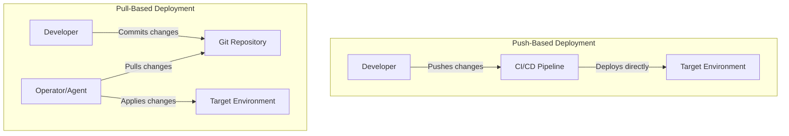
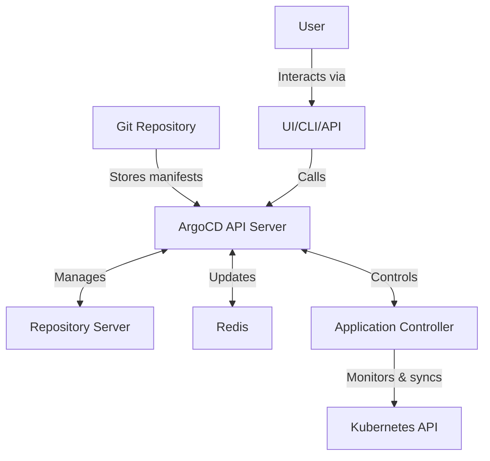

# GitOps Basics

## Table of Contents
- [Introduction](#introduction)
- [DevOps vs GitOps](#devops-vs-gitops)
- [Push vs Pull Based Deployments](#push-vs-pull-based-deployments)
- [GitOps Benefits & Drawbacks](#gitops-benefits--drawbacks)
- [GitOps Tool: ArgoCD](#gitops-tool-argocd)
  - [Why/What/How ArgoCD](#whywhatwhy-argocd)
  - [ArgoCD Concepts and Terminology](#argocd-concepts-and-terminology)
  - [Features](#features)
  - [Architecture](#architecture)
  - [ArgoCD Applications](#argocd-applications)
  - [ArgoCD Projects](#argocd-projects)
  - [Creating Application using CLI](#creating-application-using-cli)
  - [ConfigMaps](#configmaps)
    - [What is a ConfigMap](#what-is-a-configmap)
    - [How to Edit a ConfigMap](#how-to-edit-a-configmap)

## Introduction

GitOps is an operational framework that takes DevOps best practices used for application development such as version control, collaboration, compliance, and CI/CD, and applies them to infrastructure automation. GitOps uses Git repositories as the single source of truth for defining the desired state of infrastructure and applications.

At its core, GitOps involves:

1. **Declarative Configuration**: Entire system described declaratively
2. **Version Controlled**: All changes tracked in Git
3. **Automated Synchronization**: Changes automatically applied to the infrastructure
4. **Continuous Reconciliation**: System constantly compares actual state with desired state

## DevOps vs GitOps

| Aspect | DevOps | GitOps |
|--------|--------|--------|
| **Focus** | Broad collaboration & automation | Infrastructure as code with Git as source of truth |
| **Change Process** | Various tools & processes | Git-centric workflow |
| **Infrastructure Definition** | Often mixed approaches | Declarative configuration |
| **Deployment Method** | Often push-based | Pull-based (typically) |
| **Tooling** | Diverse toolset | Git + specialized controllers |
| **Audit Trail** | Depends on implementation | Built-in through Git history |
| **Security Model** | Varies widely | Git authentication & authorization |

GitOps can be considered an evolution or specialized implementation of DevOps principles, specifically for cloud-native and Kubernetes environments.

## Push vs Pull Based Deployments



### Push-Based Deployments

In push-based deployments:

- CI/CD pipeline has credentials to access the target environment
- Deployment is triggered by a pipeline or manual action
- Changes are pushed directly to the target environment
- Example tools: Jenkins, GitHub Actions, CircleCI

**Command example (traditional CI/CD):**
```bash
# In a typical CI/CD pipeline
kubectl apply -f deployment.yaml
```

### Pull-Based Deployments

In pull-based deployments:

- An agent within the environment has read-only access to Git
- Agent continuously monitors the Git repository for changes
- When changes are detected, the agent pulls and applies them
- Example tools: ArgoCD, Flux CD

**Command example (GitOps agent):**
```bash
# The agent runs inside the cluster and periodically executes
argocd app sync my-application
```

## GitOps Benefits & Drawbacks

### Benefits

- **Single Source of Truth**: Git repository serves as the definitive record of intended system state
- **Audit Trail**: Complete history of changes through Git commits
- **Rollbacks**: Easy reversion to previous states
- **Security**: Reduced attack surface (no external systems need access to cluster)
- **Developer Experience**: Familiar Git workflow for infrastructure changes
- **Self-documentation**: Git history describes system evolution
- **Consistency**: Same process for all environments

### Drawbacks

- **Learning Curve**: Teams must learn new tools and workflows
- **Git Limitations**: Git may not be ideal for all configuration types (particularly secrets)
- **Complexity**: Additional tooling and patterns to maintain
- **Real-time Operations**: Not ideal for immediate actions needed in emergencies
- **Stateful Applications**: May require additional considerations
- **Resource Overhead**: GitOps controllers consume cluster resources

## GitOps Tool: ArgoCD

### Why/What/How ArgoCD

**Why ArgoCD?**
- Purpose-built for Kubernetes
- Strong community support and CNCF project
- Rich feature set (SSO, RBAC, UI, notifications)
- Multi-cluster support
- Extensibility

**What is ArgoCD?**
ArgoCD is a declarative, GitOps continuous delivery tool for Kubernetes. It automates the deployment of applications to specified target environments, ensuring that the actual state in the cluster matches the desired state defined in Git.

**How ArgoCD Works:**
1. Monitors Git repositories containing Kubernetes manifests
2. Compares manifests to live state in the cluster
3. Reports differences and visualizes application health
4. Automatically or manually syncs changes to bring cluster state in line with Git

### ArgoCD Concepts and Terminology

- **Application**: A group of Kubernetes resources that are deployed together
- **Project**: Logical grouping of applications with shared permissions
- **Repository**: Git repository containing Kubernetes manifests
- **Target State**: The desired state defined in Git
- **Live State**: The actual state in the Kubernetes cluster
- **Sync**: Process of applying the target state to the cluster
- **Sync Status**: Indicator of whether live state matches target state
- **Health Status**: Indicator of application's operational health

### Features

- **Web UI**: Visual representation of applications and their state
- **Automated Sync**: Automatic application of Git changes
- **SSO Integration**: Works with OIDC, LDAP, SAML, etc.
- **RBAC**: Fine-grained access control
- **Webhook Integration**: Trigger syncs from Git events
- **Notifications**: Alert on state changes
- **Resource Tracking**: Visualize application components
- **Drift Detection**: Identify manual changes to the cluster
- **Rollback Capability**: Revert to previous application versions

### Architecture



ArgoCD consists of the following components:

1. **API Server**: Exposes the API consumed by the UI, CLI, and CI/CD systems
2. **Repository Server**: Internal service that maintains a local cache of Git repositories
3. **Application Controller**: Continuously monitors running applications and compares current state with desired state
4. **Redis**: Cache for application state and repository information

### ArgoCD Applications

An ArgoCD Application is a custom resource (CR) that represents a deployed application in a target environment. It defines the source of the application manifests and the target cluster and namespace.

**Example Application Definition:**

```yaml
apiVersion: argoproj.io/v1alpha1
kind: Application
metadata:
  name: guestbook
  namespace: argocd
spec:
  project: default
  source:
    repoURL: https://github.com/argoproj/argocd-example-apps.git
    targetRevision: HEAD
    path: guestbook
  destination:
    server: https://kubernetes.default.svc
    namespace: guestbook
  syncPolicy:
    automated:
      prune: true
      selfHeal: true
```

Key fields:
- `source`: Where to find application manifests
- `destination`: Where to deploy the application
- `syncPolicy`: How to handle synchronization
- `project`: The ArgoCD project this application belongs to

### ArgoCD Projects

Projects provide a logical grouping of applications with specific rules and constraints. They help with multi-tenancy and separation of concerns.

**Example Project Definition:**

```yaml
apiVersion: argoproj.io/v1alpha1
kind: AppProject
metadata:
  name: team-alpha
  namespace: argocd
spec:
  description: "Team Alpha's Applications"
  
  # Source repositories that applications in this project can pull from
  sourceRepos:
  - "https://github.com/team-alpha/*"
  
  # Destination clusters and namespaces
  destinations:
  - namespace: team-alpha-*
    server: https://kubernetes.default.svc
  
  # Allowed resource kinds
  clusterResourceWhitelist:
  - group: ""
    kind: Namespace
  
  # Regular resource whitelist
  namespaceResourceWhitelist:
  - group: "*"
    kind: "*"
    
  # Team roles
  roles:
  - name: developer
    description: Developer role
    policies:
    - p, proj:team-alpha:developer, applications, get, team-alpha/*, allow
    - p, proj:team-alpha:developer, applications, sync, team-alpha/*, allow
```

### Creating Application using CLI

ArgoCD provides a CLI tool for managing applications.

**Installation:**

```bash
# Install ArgoCD CLI
curl -sSL -o argocd-linux-amd64 https://github.com/argoproj/argo-cd/releases/latest/download/argocd-linux-amd64
sudo install -m 555 argocd-linux-amd64 /usr/local/bin/argocd
rm argocd-linux-amd64

# Login to ArgoCD
argocd login <ARGOCD_SERVER> --username admin --password <PASSWORD>
```

**Creating an Application:**

```bash
# Basic application creation
argocd app create guestbook \
  --repo https://github.com/argoproj/argocd-example-apps.git \
  --path guestbook \
  --dest-server https://kubernetes.default.svc \
  --dest-namespace guestbook

# With auto-sync options
argocd app create guestbook \
  --repo https://github.com/argoproj/argocd-example-apps.git \
  --path guestbook \
  --dest-server https://kubernetes.default.svc \
  --dest-namespace guestbook \
  --sync-policy automated \
  --auto-prune \
  --self-heal
```

**Managing Applications:**

```bash
# List applications
argocd app list

# Get application details
argocd app get guestbook

# Sync application
argocd app sync guestbook

# Delete application
argocd app delete guestbook

# Application history
argocd app history guestbook

# Rollback to a previous version
argocd app rollback guestbook 1
```

### ConfigMaps

#### What is a ConfigMap

ConfigMaps are Kubernetes resources used to store non-confidential configuration data in key-value pairs. They decouple configuration from container images, making applications more portable.

**Example ConfigMap:**

```yaml
apiVersion: v1
kind: ConfigMap
metadata:
  name: app-config
  namespace: my-app
data:
  settings.json: |
    {
      "log_level": "INFO",
      "feature_flags": {
        "new_ui": true,
        "beta_features": false
      }
    }
  database.conf: |
    DB_HOST=postgres
    DB_PORT=5432
    DB_NAME=myapp
```

ConfigMaps can be used in pods as:
- Environment variables
- Command-line arguments
- Configuration files in a volume

**Usage Example in a Pod:**

```yaml
apiVersion: v1
kind: Pod
metadata:
  name: app
spec:
  containers:
  - name: app
    image: myapp:1.0
    volumeMounts:
    - name: config-volume
      mountPath: /app/config
    env:
      - name: LOG_LEVEL
        valueFrom:
          configMapKeyRef:
            name: app-config
            key: LOG_LEVEL
  volumes:
  - name: config-volume
    configMap:
      name: app-config
```

#### How to Edit a ConfigMap

In GitOps, the preferred way to update ConfigMaps is by changing them in Git. However, there are situations where direct edits may be needed.

**Direct Editing (Not GitOps Way):**

```bash
# Edit interactively
kubectl edit configmap app-config -n my-app

# Patch a specific value
kubectl patch configmap app-config -n my-app --patch '{"data":{"settings.json":"{\"log_level\":\"DEBUG\"}"}}'

# Replace from file
kubectl create configmap app-config -n my-app --from-file=settings.json --dry-run=client -o yaml | kubectl replace -f -
```

**GitOps Way to Edit ConfigMaps:**

1. Update the ConfigMap in your Git repository
2. Commit and push the changes
3. ArgoCD will detect the changes and sync them to the cluster

**Handling ConfigMap Updates in Applications:**

Many applications don't automatically reload when ConfigMaps change. Options to handle this:

1. Use applications that support dynamic reloading
2. Use a ConfigMap reloader sidecar
3. Implement a rollout strategy that restarts pods when configs change

**Example with ConfigMap Reloader:**

```yaml
apiVersion: apps/v1
kind: Deployment
metadata:
  name: myapp
  annotations:
    configmap.reloader.stakater.com/reload: "app-config"  # Trigger reload when this ConfigMap changes
spec:
  template:
    spec:
      containers:
      - name: myapp
        image: myapp:1.0
        # ...
```

When working with ArgoCD, remember that ConfigMaps are typically part of your application manifests and should be version-controlled in Git.