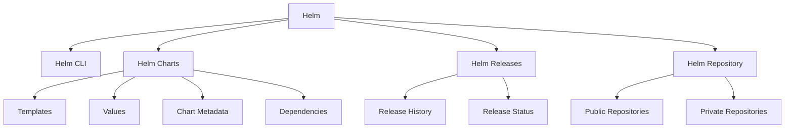

# Helm Components

## Table of Contents
- [Overview](#overview)
- [Helm CLI](#helm-cli)
  - [Installation](#installation)
  - [Configuration](#configuration)
  - [Common Commands](#common-commands)
- [Helm Charts](#helm-charts)
  - [Chart Structure](#chart-structure)
  - [Templates](#templates)
  - [Customizing Chart Parameters](#customizing-chart-parameters)
  - [Helm Charts Anatomy](#helm-charts-anatomy)
    - [Creating a Helm Chart](#creating-a-helm-chart)
    - [Templatizing](#templatizing)
    - [Template Objects](#template-objects)
    - [Verifying Helm Charts](#verifying-helm-charts)
    - [Template Functions](#template-functions)
    - [Pipelines](#pipelines)
    - [Conditionals](#conditionals)
    - [With Blocks](#with-blocks)
    - [Ranges](#ranges)
    - [Named Templates](#named-templates)
  - [Chart Hooks](#chart-hooks)
    - [Creating Hooks](#creating-hooks)
  - [Packaging and Signing Charts](#packaging-and-signing-charts)
  - [Uploading Charts](#uploading-charts)
- [Helm Releases](#helm-releases)
  - [Managing Releases](#managing-releases)
  - [Lifecycle Management with Helm](#lifecycle-management-with-helm)
- [Helm Repository](#helm-repository)
  - [ArtifactHub](#artifacthub)
  - [Creating Your Own Repository](#creating-your-own-repository)

## Overview

Helm consists of several key components that work together to provide a complete package management solution for Kubernetes. This document details each component, its purpose, and how to use it effectively.



## Helm CLI

The Helm CLI (Command Line Interface) is the primary tool for interacting with Helm. It provides commands for managing charts, releases, and repositories.

### Installation

```bash
# macOS (using Homebrew)
brew install helm

# Windows (using Chocolatey)
choco install kubernetes-helm

# Linux (using Snap)
sudo snap install helm --classic

# Using script
curl -fsSL -o get_helm.sh https://raw.githubusercontent.com/helm/helm/main/scripts/get-helm-3
chmod 700 get_helm.sh
./get_helm.sh
```

Verify the installation:
```bash
helm version
```

### Configuration

Helm uses the Kubernetes configuration file (~/.kube/config) to communicate with the Kubernetes cluster. You can configure Helm's behavior with environment variables or by creating a Helm configuration file.

```bash
# Common environment variables
export HELM_DRIVER=secret       # Storage driver (secret or configmap)
export HELM_NAMESPACE=default   # Default namespace
export HELM_REPOSITORY_CACHE=~/.cache/helm/repository  # Repository cache location
export HELM_REPOSITORY_CONFIG=~/.config/helm/repositories.yaml  # Repository config

# Print Helm home directory
helm env
```

### Common Commands

Here are the most frequently used Helm CLI commands:

| Command Category | Command | Description | Example |
|-----------------|---------|-------------|---------|
| **Chart Management** | `create` | Create a new chart with the given name | `helm create my-chart` |
| | `package` | Package a chart directory into a chart archive | `helm package my-chart` |
| | `pull` | Download a chart from a repository | `helm pull stable/mysql` |
| | `show` | Show information of a chart | `helm show all my-chart` |
| | `template` | Render chart templates locally | `helm template my-release my-chart` |
| **Release Management** | `install` | Install a chart | `helm install my-release my-chart` |
| | `uninstall` | Uninstall a release | `helm uninstall my-release` |
| | `upgrade` | Upgrade a release | `helm upgrade my-release my-chart` |
| | `rollback` | Roll back a release to a previous revision | `helm rollback my-release 1` |
| | `list` | List releases | `helm list` |
| | `history` | Fetch release history | `helm history my-release` |
| | `status` | Display the status of the named release | `helm status my-release` |
| | `get` | Download extended information of a named release | `helm get all my-release` |
| **Repository Management** | `repo add` | Add a chart repository | `helm repo add bitnami https://charts.bitnami.com/bitnami` |
| | `repo list` | List chart repositories | `helm repo list` |
| | `repo remove` | Remove a chart repository | `helm repo remove bitnami` |
| | `repo update` | Update information of available charts locally | `helm repo update` |
| | `search` | Search for a chart | `helm search repo nginx` |
| **Plugin Management** | `plugin install` | Install a plugin | `helm plugin install https://github.com/helm/helm-2to3` |
| | `plugin list` | List installed plugins | `helm plugin list` |
| | `plugin uninstall` | Uninstall a plugin | `helm plugin uninstall 2to3` |

## Helm Charts

Helm Charts are packages of pre-configured Kubernetes resources. They are the fundamental unit of Helm's functionality.

### Chart Structure

A Helm chart has a specific directory structure:

```
mychart/
  ├── Chart.yaml           # Chart metadata
  ├── values.yaml          # Default configuration values
  ├── values.schema.json   # Optional JSON schema for values validation
  ├── charts/              # Directory of dependency charts
  ├── templates/           # Directory of templates
  │   ├── deployment.yaml  # Kubernetes manifest templates
  │   ├── service.yaml
  │   ├── ingress.yaml
  │   ├── NOTES.txt        # Optional notes displayed after installation
  │   ├── _helpers.tpl     # Template helper functions
  │   └── tests/           # Test templates
  └── .helmignore          # Patterns to ignore when packaging
```

### Templates

Templates are Kubernetes manifest files with Helm template directives. They use the Go templating language to generate dynamic Kubernetes manifests based on values provided.

Example template (deployment.yaml):
```yaml
apiVersion: apps/v1
kind: Deployment
metadata:
  name: {{ include "mychart.fullname" . }}
  labels:
    {{- include "mychart.labels" . | nindent 4 }}
spec:
  replicas: {{ .Values.replicaCount }}
  selector:
    matchLabels:
      {{- include "mychart.selectorLabels" . | nindent 6 }}
  template:
    metadata:
      labels:
        {{- include "mychart.selectorLabels" . | nindent 8 }}
    spec:
      containers:
        - name: {{ .Chart.Name }}
          image: "{{ .Values.image.repository }}:{{ .Values.image.tag | default .Chart.AppVersion }}"
          imagePullPolicy: {{ .Values.image.pullPolicy }}
          ports:
            - name: http
              containerPort: {{ .Values.service.port }}
              protocol: TCP
```

### Customizing Chart Parameters

Values in Helm charts can be customized in multiple ways:

1. **Default values file**: `values.yaml` in the chart directory
2. **User-supplied values file**: Provided with `-f` or `--values` flag
3. **Individual values**: Provided with `--set` flag

```bash
# Install with custom values file
helm install my-release my-chart -f custom-values.yaml

# Install with multiple values files (rightmost file takes precedence)
helm install my-release my-chart -f values1.yaml -f values2.yaml

# Install with individual values
helm install my-release my-chart --set replicaCount=3 --set image.tag=v1.0.0

# Combine methods (values from --set override values from -f)
helm install my-release my-chart -f custom-values.yaml --set service.type=NodePort
```

### Helm Charts Anatomy

#### Creating a Helm Chart

```bash
# Create a new chart with default templates
helm create mychart

# Create an empty chart (without default templates)
mkdir -p mychart/templates
cat > mychart/Chart.yaml << EOF
apiVersion: v2
name: mychart
description: A Helm chart for Kubernetes
type: application
version: 0.1.0
appVersion: "1.0.0"
EOF
cat > mychart/values.yaml << EOF
# Default values for mychart
replicaCount: 1
EOF
```

#### Templatizing

Templatizing is the process of converting static Kubernetes manifests into dynamic templates using Go template syntax.

Steps to templatize existing manifests:

1. Move your Kubernetes YAML files into the `templates` directory.
2. Identify values that might change (image tags, replica counts, resource limits).
3. Replace those values with template expressions.
4. Add default values to `values.yaml`.

Example of templatizing a Deployment:

```yaml
# Before templatizing
apiVersion: apps/v1
kind: Deployment
metadata:
  name: nginx-deployment
spec:
  replicas: 3
  selector:
    matchLabels:
      app: nginx
  template:
    metadata:
      labels:
        app: nginx
    spec:
      containers:
      - name: nginx
        image: nginx:1.14.2
        ports:
        - containerPort: 80
```

```yaml
# After templatizing
apiVersion: apps/v1
kind: Deployment
metadata:
  name: {{ .Release.Name }}-deployment
spec:
  replicas: {{ .Values.replicaCount }}
  selector:
    matchLabels:
      app: {{ .Release.Name }}
  template:
    metadata:
      labels:
        app: {{ .Release.Name }}
    spec:
      containers:
      - name: {{ .Chart.Name }}
        image: "{{ .Values.image.repository }}:{{ .Values.image.tag }}"
        ports:
        - containerPort: {{ .Values.service.port }}
```

With corresponding values.yaml:
```yaml
replicaCount: 3
image:
  repository: nginx
  tag: "1.14.2"
service:
  port: 80
```

#### Template Objects

Helm provides several built-in objects that you can use in your templates:

1. **Release**: Information about the release
   ```yaml
   # Examples
   {{ .Release.Name }}        # Release name
   {{ .Release.Namespace }}   # Namespace of the release
   {{ .Release.IsUpgrade }}   # Whether this is an upgrade operation
   {{ .Release.IsInstall }}   # Whether this is an install operation
   {{ .Release.Revision }}    # Revision number of this release
   {{ .Release.Service }}     # Service that conducted the release ("Helm")
   ```

2. **Chart**: Information from the Chart.yaml file
   ```yaml
   # Examples
   {{ .Chart.Name }}          # Chart name
   {{ .Chart.Version }}       # Chart version
   {{ .Chart.AppVersion }}    # Chart appVersion
   {{ .Chart.Description }}   # Chart description
   ```

3. **Capabilities**: Information about the Kubernetes cluster
   ```yaml
   # Examples
   {{ .Capabilities.KubeVersion.Version }}         # Kubernetes version
   {{ .Capabilities.KubeVersion.Major }}           # Kubernetes major version
   {{ .Capabilities.KubeVersion.Minor }}           # Kubernetes minor version
   {{ .Capabilities.APIVersions.Has "apps/v1" }}   # Whether the cluster supports apps/v1 API
   ```

4. **Values**: Values from the values.yaml file and user-supplied values
   ```yaml
   # Examples
   {{ .Values.replicaCount }}   # Access a top-level value
   {{ .Values.image.tag }}      # Access a nested value
   ```

5. **Files**: Access to files within the chart
   ```yaml
   # Examples
   {{ .Files.Get "config.json" }}   # Get the contents of a file
   {{ .Files.GetBytes "logo.png" | b64enc }}   # Get file as base64-encoded string
   ```

#### Verifying Helm Charts

Helm provides several commands to verify charts before installation:

1. **Lint**: Check a chart for possible issues
   ```bash
   helm lint mychart
   ```

2. **Template**: Render chart templates locally
   ```bash
   # Render all templates
   helm template my-release mychart

   # Render specific template
   helm template my-release mychart -s templates/deployment.yaml

   # Render with custom values
   helm template my-release mychart -f custom-values.yaml
   ```

3. **Dry Run**: Simulate an installation
   ```bash
   helm install my-release mychart --dry-run

   # Dry run with debug information
   helm install my-release mychart --dry-run --debug
   ```

4. **Validate**: Check if the manifests are valid Kubernetes resources
   ```bash
   # Template and pipe to kubectl validation
   helm template my-release mychart | kubectl apply --validate=true --dry-run=client -f -
   ```

#### Template Functions

Helm uses Go template functions plus many Sprig library functions to manipulate data in templates:

1. **String Functions**
   ```yaml
   # Examples
   {{ upper "hello" }}                # "HELLO"
   {{ lower "HELLO" }}                # "hello"
   {{ title "hello world" }}          # "Hello World"
   {{ trim " hello " }}               # "hello"
   {{ replace "hello" "h" "H" }}      # "Hello"
   ```

2. **Math Functions**
   ```yaml
   # Examples
   {{ add 1 2 }}           # 3
   {{ sub 3 2 }}           # 1
   {{ mul 2 3 }}           # 6
   {{ div 6 3 }}           # 2
   {{ mod 5 3 }}           # 2
   ```

3. **Default Values**
   ```yaml
   # Examples
   {{ .Values.key | default "default_value" }}
   image: {{ .Values.image.repository }}:{{ .Values.image.tag | default .Chart.AppVersion }}
   ```

4. **Flow Control**
   ```yaml
   # Examples
   {{ if .Values.enabled }}# do something{{ end }}
   {{ if ne .Values.service.type "ClusterIP" }}# do something{{ end }}
   ```

5. **Type Conversion**
   ```yaml
   # Examples
   {{ .Values.replicas | int }}           # Convert to integer
   {{ .Values.enabled | toString }}       # Convert to string
   {{ .Values.data | toYaml }}            # Convert to YAML
   {{ .Values.data | toJson }}            # Convert to JSON
   ```

6. **Path Functions**
   ```yaml
   # Examples
   {{ base "path/to/file.txt" }}          # "file.txt"
   {{ dir "path/to/file.txt" }}           # "path/to"
   {{ ext "path/to/file.txt" }}           # ".txt"
   ```

#### Pipelines

Pipelines in Helm templates allow you to chain multiple functions together, passing the result of one function to the next. This is denoted by the pipe symbol `|`.

```yaml
# Basic pipeline example
{{ .Values.name | upper | quote }}

# Practical example: indent YAML properly
spec:
  template:
    metadata:
      labels:
        {{- include "mychart.labels" . | nindent 8 }}

# Multiple operations
{{ .Values.data | toYaml | indent 2 }}
```

Common pipeline patterns:
```yaml
# Default value with quoting
env: {{ .Values.env | default "production" | quote }}

# YAML formatting for nested structures
data:
  {{- .Values.configData | toYaml | nindent 2 }}

# Join list with commas
args: [{{ .Values.arguments | join "," }}]
```

#### Conditionals

Conditionals allow you to include or exclude parts of a template based on values.

Basic syntax:
```yaml
{{ if CONDITION }}
  # Content to include if condition is true
{{ else if OTHER_CONDITION }}
  # Content to include if other condition is true
{{ else }}
  # Content to include if no conditions match
{{ end }}
```

Examples:
```yaml
# Simple condition
{{- if .Values.serviceAccount.create }}
serviceAccountName: {{ include "mychart.serviceAccountName" . }}
{{- end }}

# Condition with else
{{- if .Values.persistence.enabled }}
volumeMounts:
  - name: data
    mountPath: /data
{{- else }}
emptyDir: {}
{{- end }}

# Multiple conditions
{{- if eq .Values.service.type "ClusterIP" }}
  # ClusterIP specific settings
{{- else if eq .Values.service.type "LoadBalancer" }}
  # LoadBalancer specific settings
{{- else }}
  # Default settings
{{- end }}
```

Operators:
- `eq`: Equal
- `ne`: Not equal
- `lt`: Less than
- `le`: Less than or equal
- `gt`: Greater than
- `ge`: Greater than or equal
- `and`: Logical AND
- `or`: Logical OR
- `not`: Logical NOT

Complex condition example:
```yaml
{{- if and .Values.persistence.enabled (not .Values.persistence.existingClaim) }}
# Create new PVC
{{- end }}
```

#### With Blocks

`with` blocks allow you to change the scope of the dot (`.`) within a section of your template, making it easier to access deeply nested values.

Basic syntax:
```yaml
{{- with VALUE }}
  # Inside this block, . refers to VALUE instead of the root context
{{- end }}
```

Examples:
```yaml
# Without with block
containers:
  - name: {{ .Chart.Name }}
    image: "{{ .Values.image.repository }}:{{ .Values.image.tag }}"
    ports:
      - containerPort: {{ .Values.service.port }}

# With with block
containers:
  - name: {{ .Chart.Name }}
    {{- with .Values.image }}
    image: "{{ .repository }}:{{ .tag }}"
    {{- end }}
    {{- with .Values.service }}
    ports:
      - containerPort: {{ .port }}
    {{- end }}
```

Important note: Within a `with` block, you cannot access the parent context directly. To access the root context within a `with` block, you need to save it to a variable first:

```yaml
{{- $root := . -}}
{{- with .Values.image }}
image: "{{ .repository }}:{{ .tag }}"
app: {{ $root.Release.Name }}
{{- end }}
```

#### Ranges

`range` blocks allow you to iterate over lists, maps, dictionaries, or collections.

Basic syntax for lists:
```yaml
{{- range COLLECTION }}
  # . refers to the current item
{{- end }}
```

Basic syntax for maps:
```yaml
{{- range $key, $val := MAP }}
  # $key contains the key
  # $val contains the value
{{- end }}
```

Examples:

Iterating over a list:
```yaml
# values.yaml
ports:
  - 8080
  - 8443
  - 9000

# template
ports:
{{- range .Values.ports }}
  - containerPort: {{ . }}
{{- end }}
```

Iterating over a map:
```yaml
# values.yaml
env:
  DB_HOST: postgresql
  DB_PORT: 5432
  DEBUG: "true"

# template
env:
{{- range $key, $val := .Values.env }}
  - name: {{ $key }}
    value: {{ $val | quote }}
{{- end }}
```

Advanced example with conditionals:
```yaml
# Iterate with index
{{- range $index, $service := .Values.services }}
  {{- if ne $index 0 }}
  ---
  {{- end }}
  # Service definition for {{ $service.name }}
{{- end }}
```

#### Named Templates

Named templates (also called partials or subtemplates) allow you to define reusable chunks of template code. They are typically defined in `_helpers.tpl` files.

Defining a named template:
```yaml
{{/* Generate basic labels */}}
{{- define "mychart.labels" -}}
app.kubernetes.io/name: {{ .Chart.Name }}
helm.sh/chart: {{ .Chart.Name }}-{{ .Chart.Version }}
app.kubernetes.io/instance: {{ .Release.Name }}
app.kubernetes.io/managed-by: {{ .Release.Service }}
{{- end -}}
```

Using a named template:
```yaml
# Using template function (doesn't support indentation)
metadata:
  labels:
    {{ template "mychart.labels" . }}

# Using include function (supports pipeline operations like indent)
metadata:
  labels:
    {{- include "mychart.labels" . | nindent 4 }}
```

Passing values to named templates:
```yaml
# Define template with parameters
{{- define "mychart.container" -}}
- name: {{ .name }}
  image: {{ .image }}
  ports:
  {{- range .ports }}
    - containerPort: {{ . }}
  {{- end }}
{{- end -}}

# Use template with specific values
spec:
  containers:
  {{- include "mychart.container" (dict "name" "web" "image" "nginx" "ports" (list 80 443)) | nindent 2 }}
```

## Chart Hooks

Helm hooks allow you to intervene at certain points in a release's lifecycle. They are implemented as annotations on Kubernetes resources.

Available hook types:
- `pre-install`: Execute before any resources are installed
- `post-install`: Execute after all resources are installed
- `pre-delete`: Execute before deletion of any resources
- `post-delete`: Execute after all resources are deleted
- `pre-upgrade`: Execute before any resources are upgraded
- `post-upgrade`: Execute after all resources are upgraded
- `pre-rollback`: Execute before any resources are rolled back
- `post-rollback`: Execute after all resources are rolled back
- `test`: Execute when `helm test` is invoked

### Creating Hooks

To create a hook, add the `helm.sh/hook` annotation to any Kubernetes resource:

```yaml
apiVersion: batch/v1
kind: Job
metadata:
  name: {{ .Release.Name }}-db-init
  annotations:
    "helm.sh/hook": post-install
    "helm.sh/hook-weight": "5"
    "helm.sh/hook-delete-policy": hook-succeeded
spec:
  template:
    spec:
      containers:
      - name: db-init
        image: "{{ .Values.dbInit.image }}"
        command: ["./init-db.sh"]
      restartPolicy: Never
```

Hook weights determine the order of execution:
```yaml
annotations:
  "helm.sh/hook-weight": "5"  # Lower numbers execute first
```

Hook deletion policies control how hook resources are cleaned up:
```yaml
annotations:
  "helm.sh/hook-delete-policy": hook-succeeded,hook-failed
```

Available deletion policies:
- `hook-succeeded`: Delete after the hook succeeds
- `hook-failed`: Delete after the hook fails
- `before-hook-creation`: Delete before a new hook is launched
- `before-hook-deletion`: Delete before a hook resource is deleted

Example test hook:
```yaml
apiVersion: v1
kind: Pod
metadata:
  name: {{ .Release.Name }}-test
  annotations:
    "helm.sh/hook": test
spec:
  containers:
    - name: test
      image: busybox
      command: ['wget', '{{ .Release.Name }}-service:{{ .Values.service.port }}']
  restartPolicy: Never
```

## Packaging and Signing Charts

Once your chart is ready, you can package it for distribution.

Packaging a chart:
```bash
# Package a chart into a versioned chart archive file
helm package ./mychart

# Package with a custom version
helm package ./mychart --version 1.2.3

# Package with app version
helm package ./mychart --app-version 2.0.0

# Package with a specific destination
helm package ./mychart -d ./charts
```

Signing a chart (requires a GPG key):
```bash
# Create a GPG key if you don't have one
gpg --gen-key

# Export your public key
gpg --export-secret-keys >~/.gnupg/secring.gpg

# Configure Helm with your key
helm plugin install https://github.com/helm/helm-gpg

# Sign a chart
helm package --sign --key 'John Smith' --keyring ~/.gnupg/secring.gpg ./mychart

# Verify a signed chart
helm verify ./mychart-0.1.0.tgz
```

## Uploading Charts

Once your chart is packaged, you can share it with others by uploading it to a chart repository.

Options for hosting charts:
1. **GitHub Pages**
2. **Artifact Hub**
3. **Chart Museum** (self-hosted chart repository)
4. **Harbor** (container registry with Helm chart support)
5. **Cloud storage** (GCS, S3, Azure Blob Storage)

Using ChartMuseum:
```bash
# Install ChartMuseum
helm repo add chartmuseum https://chartmuseum.github.io/charts
helm install my-chartmuseum chartmuseum/chartmuseum

# Upload a chart using curl
curl --data-binary "@mychart-0.1.0.tgz" http://localhost:8080/api/charts

# Or use the ChartMuseum CLI tool
chartmuseum-client push mychart-0.1.0.tgz --url http://localhost:8080
```

## Helm Releases

A Helm release is an instance of a chart running in a Kubernetes cluster. Each time you install a chart, a new release is created.

### Managing Releases

List all releases:
```bash
# List all releases in the current namespace
helm list

# List all releases in all namespaces
helm list --all-namespaces

# List releases in a specific namespace
helm list -n my-namespace

# List all releases, including failed ones
helm list --all

# Filter releases by status
helm list --pending
helm list --failed
```

Get detailed information about a release:
```bash
# Get all information
helm get all my-release

# Get just the values
helm get values my-release

# Get the values as YAML
helm get values my-release -o yaml

# Get just the notes
helm get notes my-release

# Get the manifest
helm get manifest my-release
```

Retrieve release history:
```bash
# Get release history
helm history my-release

# Get detailed history
helm history my-release --max 10
```

### Lifecycle Management with Helm

Helm provides commands for managing the full lifecycle of applications:

Installation:
```bash
# Basic installation
helm install my-release mychart

# Install with custom values
helm install my-release mychart -f values.yaml

# Install with --wait flag to wait until all resources are ready
helm install my-release mychart --wait

# Install with timeout
helm install my-release mychart --timeout 10m

# Install with description
helm install my-release mychart --description "Initial deployment"
```

Upgrading:
```bash
# Basic upgrade
helm upgrade my-release mychart

# Upgrade with values
helm upgrade my-release mychart -f new-values.yaml

# Install if not exists, upgrade if exists
helm upgrade --install my-release mychart

# Force resource updates through delete/recreate
helm upgrade my-release mychart --force

# Perform an atomic upgrade (rollback on failure)
helm upgrade my-release mychart --atomic

# Clean up old release versions
helm upgrade my-release mychart --cleanup-on-fail
```

Rollback:
```bash
# Rollback to the previous release
helm rollback my-release

# Rollback to a specific revision
helm rollback my-release 2

# Wait until rollback completes
helm rollback my-release 2 --wait

# Clean up on rollback failure
helm rollback my-release 2 --cleanup-on-fail
```

Uninstallation:
```bash
# Basic uninstall
helm uninstall my-release

# Keep history for potential restore
helm uninstall my-release --keep-history

# Perform dry-run uninstall
helm uninstall my-release --dry-run
```

## Helm Repository

Helm repositories are locations where charts can be stored and shared. They are HTTP servers that serve an index.yaml file and chart packages.

### ArtifactHub

[Artifact Hub](https://artifacthub.io) is the official platform for discovering and sharing Helm charts. It provides a centralized location to search for and find charts from various repositories.

Using Artifact Hub:
```bash
# Search for charts on Artifact Hub
helm search hub wordpress

# Add a repository from Artifact Hub
helm repo add bitnami https://charts.bitnami.com/bitnami

# Update your local repository cache
helm repo update

# Search within added repositories
helm search repo wordpress
```

### Creating Your Own Repository

You can create your own Helm repository to share charts with your team or organization.

Basic steps:

1. Create a directory structure:
```bash
mkdir -p my-helm-repo/charts
```

2. Move your packaged charts to this directory:
```bash
cp mychart-0.1.0.tgz my-helm-repo/charts/
```

3. Generate an index file:
```bash
helm repo index my-helm-repo/
```

4. Host this directory on a web server or use GitHub Pages.

5. Add your repository:
```bash
helm repo add myrepo https://example.com/my-helm-repo
```

Using GitHub Pages:
```bash
# Create a gh-pages branch
git checkout --orphan gh-pages

# Remove everything and add your charts
rm -rf *
mkdir charts
cp /path/to/mychart-0.1.0.tgz charts/

# Generate index
helm repo index .

# Commit and push
git add .
git commit -m "Add Helm repository"
git push origin gh-pages
```

Then users can add your repository:
```bash
helm repo add myrepo https://username.github.io/repo-name
```