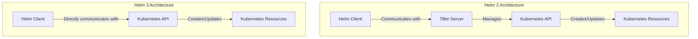

# Helm 2 vs Helm 3

## Table of Contents
- [Introduction](#introduction)
- [Architecture Comparison](#architecture-comparison)
  - [Tiller in Helm 2](#tiller-in-helm-2)
  - [Tiller-less Architecture in Helm 3](#tiller-less-architecture-in-helm-3)
- [Three-Way Strategic Merge Patch](#three-way-strategic-merge-patch)
- [Advantages of Helm 3](#advantages-of-helm-3)
  - [Security Improvements](#security-improvements)
  - [Release Management](#release-management)
  - [Rollbacks and Upgrades](#rollbacks-and-upgrades)
- [Migration from Helm 2 to Helm 3](#migration-from-helm-2-to-helm-3)
- [Command Comparison](#command-comparison)

## Introduction

Helm has undergone a significant evolution from version 2 to version 3. Released in November 2019, Helm 3 addressed many of the architectural limitations and security concerns present in Helm 2. This document outlines the key differences between these versions and explains why upgrading to Helm 3 is beneficial.

## Architecture Comparison

The most fundamental difference between Helm 2 and Helm 3 is the overall architecture, particularly the removal of the Tiller component.



### Tiller in Helm 2

Tiller was a server-side component in Helm 2 that ran inside the Kubernetes cluster. It was responsible for:

1. **Receiving commands** from the Helm client
2. **Combining charts and configuration** to build a release
3. **Installing charts** into Kubernetes and tracking releases
4. **Upgrading and modifying** existing releases
5. **Storing release history** in ConfigMaps within the cluster

**Installation of Tiller in Helm 2:**
```bash
# Initialize Helm 2 with Tiller installation
helm init

# For RBAC-enabled clusters, create service account for Tiller
kubectl create serviceaccount --namespace kube-system tiller
kubectl create clusterrolebinding tiller-cluster-rule --clusterrole=cluster-admin --serviceaccount=kube-system:tiller

# Initialize with service account
helm init --service-account tiller
```

**Issues with Tiller:**

1. **Security Concerns**: Tiller typically required broad cluster permissions (often cluster-admin), creating a security vulnerability.
2. **Multi-tenancy Problems**: A single Tiller instance with elevated permissions could manage releases across all namespaces.
3. **Complexity**: Added operational overhead and another component to troubleshoot.
4. **Race Conditions**: Could occur when multiple users interacted with the same Tiller instance.

### Tiller-less Architecture in Helm 3

Helm 3 completely removed Tiller, resulting in:

1. **Direct Communication**: Helm client communicates directly with the Kubernetes API server.
2. **Client-only Architecture**: No server-side component is required.
3. **User Permissions**: Helm operations use the credentials and permissions of the user's kubeconfig file.
4. **Improved Security**: No need for cluster-wide permissions for installation.
5. **Release Storage**: Releases are stored as Secrets (instead of ConfigMaps) and are scoped to namespaces.

**Initializing Helm 3:**
```bash
# No initialization required for Helm 3 itself
# Just add repositories as needed
helm repo add stable https://charts.helm.sh/stable
helm repo update
```

## Three-Way Strategic Merge Patch

One of the most significant improvements in Helm 3 is the adoption of a three-way strategic merge patch for upgrades and rollbacks.

### How it Works:

1. **Helm 2 (Two-Way Merge)**: Compared the current state with the desired state, which could miss resources deleted outside of Helm.
   ```
   Current State (Live) vs. Desired State (Chart)
   ```

2. **Helm 3 (Three-Way Merge)**: Compares the previous chart, the current state, and the desired state.
   ```
   Previous Chart vs. Current State (Live) vs. Desired State (New Chart)
   ```

### Benefits of Three-Way Merge:

| Scenario | Helm 2 Behavior | Helm 3 Behavior |
|----------|----------------|----------------|
| Resource manually deleted | Not recreated during upgrade | Recreated during upgrade |
| Resource manually added | Preserved during upgrades | Preserved during upgrades |
| Resource manually modified | Might lead to conflicts | Better conflict resolution |

### Example of the Difference:

Imagine you deployed a chart that includes a ConfigMap, and someone manually deleted that ConfigMap:

```bash
# In Helm 2
helm upgrade my-release my-chart  # The ConfigMap remains deleted

# In Helm 3
helm upgrade my-release my-chart  # The ConfigMap is recreated
```

## Advantages of Helm 3

### Security Improvements

1. **Removal of Tiller**: Eliminates the security risk associated with Tiller's cluster-wide permissions.
   
2. **Namespaced Releases**: Releases are scoped to namespaces, improving multi-tenant security.
   ```bash
   # Helm 3 explicitly requires namespace specification
   helm install my-release my-chart --namespace my-namespace
   ```

3. **Secrets for Release Information**: Uses Kubernetes Secrets instead of ConfigMaps for storing sensitive release information.

4. **XDG Directory Specification**: Better adherence to XDG specs for local files.
   ```bash
   # Configuration is typically stored in
   ~/.config/helm/
   ```

### Release Management

1. **Improved Release Name Requirements**: Release names must be within a namespace.
   ```bash
   # You can now reuse release names across different namespaces
   helm install frontend my-chart --namespace team-a
   helm install frontend my-chart --namespace team-b
   ```

2. **Removal of `helm serve`**: Local repository management was removed in favor of using tools like ChartMuseum or Harbor.

3. **JSON Schema Validation**: Chart values can be validated against a JSON schema.
   ```yaml
   # values.schema.json
   {
     "$schema": "https://json-schema.org/draft-07/schema#",
     "type": "object",
     "required": ["replicaCount"],
     "properties": {
       "replicaCount": {
         "type": "integer",
         "minimum": 1
       }
     }
   }
   ```

4. **Library Charts Support**: Introduced charts that can be used as libraries.
   ```yaml
   # Chart.yaml with library dependency
   dependencies:
     - name: common
       version: 1.0.0
       repository: https://charts.helm.sh/stable
       tags:
         - common-library
   ```

### Rollbacks and Upgrades

Helm 3 significantly improved the reliability of rollbacks and upgrades:

1. **More Reliable Rollbacks**: Thanks to three-way strategic merge.
   ```bash
   # Rolling back in Helm 3
   helm rollback my-release 1
   ```

2. **Test Hooks Run on Rollback**: In Helm 3, test hooks also run during rollbacks.
   ```bash
   # Run tests after rollback
   helm test my-release
   ```

3. **Atomic Installations**: All-or-nothing installations reduce partial failures.
   ```bash
   # Atomic installation
   helm install my-release my-chart --atomic
   ```

4. **Wait Flags**: More reliable wait functionality.
   ```bash
   # Wait for all resources to be ready
   helm install my-release my-chart --wait
   ```

## Migration from Helm 2 to Helm 3

To assist in the migration process, the Helm team provided a plugin:

```bash
# Install the helm-2to3 plugin
helm plugin install https://github.com/helm/helm-2to3

# Migrate Helm 2 configuration
helm 2to3 move config

# Migrate Helm 2 releases
helm 2to3 convert RELEASE_NAME

# Migrate all releases in a namespace
helm 2to3 convert --all --namespace NAMESPACE
```

## Command Comparison

| Function | Helm 2 | Helm 3 |
|----------|--------|--------|
| Initialize | `helm init` | Not required |
| Install a chart | `helm install my-chart` | `helm install my-release my-chart` |
| Upgrade a release | `helm upgrade my-release my-chart` | `helm upgrade my-release my-chart` |
| List releases | `helm list` | `helm list` (namespace scoped) |
| Delete a release | `helm delete my-release` | `helm uninstall my-release` |
| Repository management | `helm repo add/list/update` | `helm repo add/list/update` |
| Package a chart | `helm package my-chart` | `helm package my-chart` |
| Create a chart | `helm create my-chart` | `helm create my-chart` |
| Render templates | `helm template my-chart` | `helm template my-release my-chart` |
| Get release status | `helm status my-release` | `helm status my-release` |
| Get release values | `helm get values my-release` | `helm get values my-release` |
| Rollback a release | `helm rollback my-release 1` | `helm rollback my-release 1` |