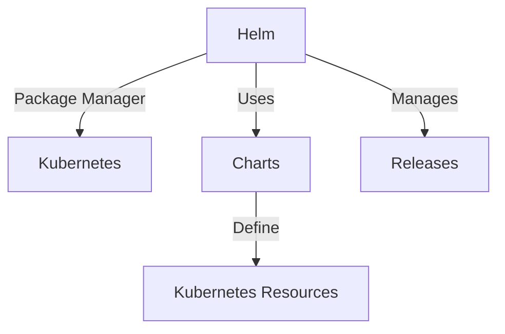

# What is Helm?

## Table of Contents
- [Introduction to Helm](#introduction-to-helm)
- [Why Do We Need Helm?](#why-do-we-need-helm)
- [Problems Faced Without Helm](#problems-faced-without-helm)
- [Key Concepts](#key-concepts)
- [Getting Started with Helm](#getting-started-with-helm)

## Introduction to Helm

Helm is often described as the "package manager for Kubernetes." Just as package managers like apt, yum, or npm make it easier to install and manage software on various platforms, Helm provides similar functionality for Kubernetes applications.

At its core, Helm is a tool that streamlines the installation and management of Kubernetes applications. It uses a packaging format called charts, which are collections of files that describe a related set of Kubernetes resources.



## Why Do We Need Helm?

Kubernetes is powerful but complex. Managing applications on Kubernetes involves creating and maintaining multiple resource definitions - Deployments, Services, ConfigMaps, Secrets, and more. This complexity grows with application size and the number of environments.

Helm addresses these challenges by:

1. **Simplifying Deployment** - Package multiple Kubernetes resources into a single unit
2. **Managing Complexity** - Abstract away the details of Kubernetes manifests
3. **Enabling Reusability** - Reuse charts across different environments
4. **Facilitating Versioning** - Track changes to application deployments
5. **Standardizing Releases** - Provide consistent deployment patterns

## Problems Faced Without Helm

Without Helm, teams often encounter several challenges when working with Kubernetes:

### 1. Manual Resource Management

Without Helm, developers need to manually create and update YAML files for each Kubernetes resource:

```bash
# Without Helm, you would need to apply each file individually
kubectl apply -f deployment.yaml
kubectl apply -f service.yaml
kubectl apply -f configmap.yaml
kubectl apply -f ingress.yaml
```

This approach becomes tedious and error-prone as applications grow more complex.

### 2. Configuration Management Across Environments

Managing configuration differences between environments (development, staging, production) becomes challenging:

- Different resource limits
- Environment-specific URLs and endpoints
- Varying replica counts
- Different database configurations

Without Helm, teams often resort to maintaining separate copies of YAML files for each environment or using complex scripting solutions.

### 3. Versioning and Release Management

Without Helm, tracking which version of your application is deployed becomes difficult:

- No built-in mechanism to track deployment history
- Difficult to roll back to previous versions
- No consistent way to name and track releases

### 4. Dependency Management

Modern applications often depend on other components. Without Helm:

- No standard way to define dependencies between applications
- Manual tracking of which components work together
- Difficult to ensure compatible versions are deployed

### 5. Knowledge Sharing and Reuse

Without Helm's charts:

- No standardized way to share Kubernetes applications
- Difficult to reuse deployment patterns across teams
- Limited ability to leverage community-maintained infrastructure components

## Key Concepts

Before diving deeper, let's clarify some key Helm concepts:

- **Chart**: A package of pre-configured Kubernetes resources
- **Release**: An instance of a chart running in a Kubernetes cluster
- **Repository**: A collection of charts available for use
- **Values**: Configuration that can be supplied to customize a chart

## Getting Started with Helm

### Installing Helm

```bash
# Using Homebrew (macOS)
brew install helm

# Using Chocolatey (Windows)
choco install kubernetes-helm

# Using Snap (Linux)
sudo snap install helm --classic

# Using script (Any OS)
curl -fsSL -o get_helm.sh https://raw.githubusercontent.com/helm/helm/main/scripts/get-helm-3
chmod 700 get_helm.sh
./get_helm.sh
```

### Basic Helm Commands

```bash
# Add a repository
helm repo add bitnami https://charts.bitnami.com/bitnami

# Update repositories
helm repo update

# Search for charts
helm search repo wordpress

# Install a chart
helm install my-wordpress bitnami/wordpress

# List releases
helm list

# Uninstall a release
helm uninstall my-wordpress
```

### Your First Helm Deployment

Let's deploy a simple application using Helm:

```bash
# Add the Bitnami repository (if not already added)
helm repo add bitnami https://charts.bitnami.com/bitnami

# Install Nginx
helm install my-nginx bitnami/nginx

# Check the status
helm status my-nginx

# Get the service URL
kubectl get svc my-nginx
```

With these simple commands, Helm has deployed a complete Nginx setup, including Deployment, Service, and associated resources, demonstrating how Helm simplifies the Kubernetes application deployment process.

Helm represents a significant improvement in how we manage applications on Kubernetes, addressing many pain points and enabling teams to work more efficiently with complex, multi-component applications.