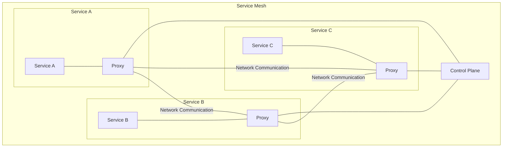
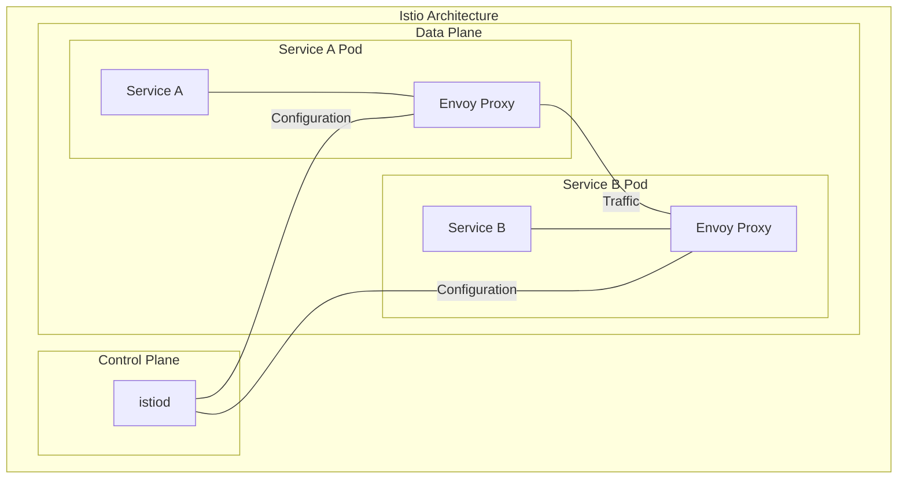

# Introduction to Service Mesh

## Table of Contents
- [Challenges Before Service Mesh](#challenges-before-service-mesh)
- [What is a Service Mesh?](#what-is-a-service-mesh)
- [Solutions Service Mesh Provides](#solutions-service-mesh-provides)
- [What is Istio Service Mesh?](#what-is-istio-service-mesh)
- [When to Use Istio Service Mesh?](#when-to-use-istio-service-mesh)
- [Architecture of Istio Service Mesh](#architecture-of-istio-service-mesh)
  - [Control Plane](#control-plane)
  - [Data Plane](#data-plane)
  - [What are Sidecars?](#what-are-sidecars)
  - [What is Envoy?](#what-is-envoy)
- [Installation](#installation)
  - [Prerequisites](#prerequisites)
  - [Installing Istio](#installing-istio)
  - [Verifying Installation](#verifying-installation)
- [Getting Started with a Sample Application](#getting-started-with-a-sample-application)
  - [Deploying the Bookinfo Application](#deploying-the-bookinfo-application)
  - [Accessing the Application](#accessing-the-application)

## Challenges Before Service Mesh

Before the advent of service meshes, microservices architectures faced several significant challenges:

1. **Network Complexity**: 
   - Managing service-to-service communication became increasingly complex as the number of services grew
   - Each service needed to implement its own networking logic

2. **Security Concerns**:
   - Implementing mutual TLS between services required significant effort
   - Authentication and authorization needed to be built into each service

3. **Observability Limitations**:
   - Difficult to trace requests across multiple services
   - Lack of unified metrics and monitoring
   - Challenging to identify the source of failures in distributed systems

4. **Traffic Management**:
   - Limited control over routing between services
   - Difficulty implementing patterns like circuit breaking, retries, and timeouts
   - Canary deployments and A/B testing required custom solutions

5. **Reliability Issues**:
   - No standardized approach for handling failures
   - Inconsistent implementation of resilience patterns across services

6. **Operational Burden**:
   - DevOps teams needed to manage numerous components
   - Developers had to include networking code in their applications

## What is a Service Mesh?

A service mesh is a dedicated infrastructure layer for facilitating service-to-service communications between services or microservices, using a proxy instance.



Key characteristics of a service mesh:

- **Transparent**: Works without requiring changes to application code
- **Decoupled**: Separates networking concerns from business logic
- **Uniform**: Provides consistent networking capabilities across all services
- **Platform-Independent**: Can work with various deployment platforms (Kubernetes, VMs, etc.)

## Solutions Service Mesh Provides

Service meshes address the challenges of microservices architectures by providing:

1. **Traffic Management**:
   - Intelligent routing and traffic shifting
   - Load balancing
   - Fault injection for testing resilience
   - Circuit breaking to prevent cascading failures

2. **Security**:
   - Automatic mutual TLS (mTLS) encryption
   - Identity-based authentication and authorization
   - Certificate management and rotation

3. **Observability**:
   - Distributed tracing of requests
   - Metrics collection and monitoring
   - Logging and visualization
   - Service health checking

4. **Reliability**:
   - Retry policies
   - Timeout management
   - Health checks
   - Fault tolerance

5. **Policy Enforcement**:
   - Rate limiting
   - Access control
   - Quota management

## What is Istio Service Mesh?

Istio is an open-source service mesh platform that provides a way to control how microservices share data with one another. It includes APIs that let it integrate with any logging platform, telemetry, or policy system.

Istio was initially developed by Google, IBM, and Lyft and was first released in 2017. It has since become one of the most popular service mesh implementations.

Key features of Istio:

- **Platform Support**: Primarily designed for Kubernetes but can run on other platforms
- **Programming Language Agnostic**: Works with any programming language or framework
- **Extensible Architecture**: Can be extended with custom components and integrations
- **Community Support**: Backed by a large and active open-source community

## When to Use Istio Service Mesh?

Istio is particularly beneficial in these scenarios:

1. **Complex Microservices Environments**:
   - When you have numerous services that need to communicate
   - In environments with frequent service updates or replacements

2. **Security Requirements**:
   - When secure communication between services is critical
   - When you need fine-grained access control

3. **Advanced Traffic Management Needs**:
   - For implementing canary deployments or A/B testing
   - When sophisticated load balancing is required

4. **Observability Requirements**:
   - When you need detailed visibility into service behavior
   - For troubleshooting complex distributed systems

5. **Hybrid/Multi-Cloud Architectures**:
   - When services span multiple clusters or cloud providers
   - For consistent networking across diverse environments

Consider the following factors before implementing Istio:

| Factor | Consideration |
|--------|---------------|
| Cluster Size | Small clusters (< 10 services) may not justify the overhead |
| Team Experience | Requires operational knowledge to maintain effectively |
| Performance Requirements | Adds some latency (typically < 10ms) to service calls |
| Resource Availability | Requires additional CPU and memory resources |
| Organizational Maturity | Works best with established DevOps practices |

## Architecture of Istio Service Mesh

Istio has a modular architecture divided into two main components: the control plane and the data plane.



### Control Plane

The control plane manages and configures the proxies to route traffic and enforces policies. In Istio 1.5 and later, the control plane components were consolidated into a single component called **istiod**, which includes:

1. **Pilot**: Responsible for service discovery and traffic management configuration
2. **Citadel**: Handles certificate issuance and rotation for secure communication
3. **Galley**: Validates, processes, and distributes configuration

### Data Plane

The data plane consists of a set of intelligent proxies (Envoy) deployed as sidecars to your services. These proxies:

1. Mediate and control all network communication between microservices
2. Collect and report telemetry data
3. Enforce traffic and security policies

### What are Sidecars?

In the context of Istio, a sidecar is a proxy container that runs alongside your application container in the same pod. This pattern allows:

- **Separation of Concerns**: Application containers focus on business logic while sidecars handle networking
- **Transparency**: Application doesn't need to be aware of the service mesh
- **Independent Scaling**: Network functionality can be updated without changing application code

The sidecar proxy intercepts all inbound and outbound network traffic to the application container, enabling:

- Traffic routing and manipulation
- Policy enforcement
- Metrics collection
- Security features like mTLS

### What is Envoy?

Envoy is the proxy used by Istio for its data plane. It's a high-performance, C++ distributed proxy designed for single services and applications, as well as a communication bus and universal data plane.

Key features of Envoy:

1. **Layer 7 Proxy**: Can route based on HTTP/gRPC attributes
2. **Extensible**: Supports filters for custom processing
3. **Dynamic Configuration**: Can be configured via API
4. **Observability**: Built-in statistics, logging, and tracing
5. **Advanced Load Balancing**: Supports multiple algorithms and health checking
6. **Service Discovery**: Can integrate with multiple service discovery systems

Envoy configuration in Istio:

```yaml
# Example of an Envoy configuration generated by Istio
apiVersion: networking.istio.io/v1alpha3
kind: EnvoyFilter
metadata:
  name: example-filter
  namespace: istio-system
spec:
  configPatches:
    - applyTo: HTTP_FILTER
      match:
        context: SIDECAR_INBOUND
        listener:
          filterChain:
            filter:
              name: "envoy.http_connection_manager"
      patch:
        operation: INSERT_BEFORE
        value:
          name: "example.filter"
          typed_config:
            "@type": "type.googleapis.com/example.filter.Config"
            config_field: "config_value"
```

## Installation

### Prerequisites

Before installing Istio, ensure you have:

1. A Kubernetes cluster (v1.21 or newer)
2. At least 4 vCPUs and 8 GB of memory available
3. kubectl installed and configured to communicate with your cluster
4. Appropriate cluster permissions (cluster-admin)

### Installing Istio

There are several methods to install Istio. Here's the most common approach using istioctl:

1. **Download Istio**:
   ```bash
   curl -L https://istio.io/downloadIstio | sh -
   cd istio-[version]
   export PATH=$PWD/bin:$PATH
   ```

2. **Install Istio using default profile**:
   ```bash
   istioctl install --set profile=default -y
   ```

   Available profiles include:
   - `default`: Balanced resource usage and functionality
   - `demo`: Feature-rich configuration for testing
   - `minimal`: Minimal set of components for production
   - `empty`: No components installed (base for custom installations)
   - `preview`: For testing experimental features

3. **Custom installation with additional options**:
   ```bash
   istioctl install --set values.global.tracer.zipkin.address=<zipkin-address> -y

   # Or using a configuration file
   istioctl install -f my-istio-config.yaml -y
   ```

### Verifying Installation

After installation, verify that Istio is running properly:

```bash
# Check if Istio components are deployed
kubectl get pods -n istio-system

# Verify CRDs are installed
kubectl get crd | grep istio

# Check istioctl version
istioctl version
```

### Enabling Automatic Sidecar Injection

To automatically inject Envoy sidecars into your applications:

```bash
# Label the namespace for automatic injection
kubectl label namespace default istio-injection=enabled

# Verify the label
kubectl get namespace -L istio-injection
```

## Getting Started with a Sample Application

### Deploying the Bookinfo Application

Istio includes a sample application called Bookinfo that you can use to explore its features:

```bash
# Deploy the application
kubectl apply -f samples/bookinfo/platform/kube/bookinfo.yaml

# Check if the application pods are running
kubectl get pods

# Deploy the Istio gateway and virtual service
kubectl apply -f samples/bookinfo/networking/bookinfo-gateway.yaml
```

### Accessing the Application

Once deployed, you can access the application:

```bash
# Get the ingress gateway URL
export INGRESS_HOST=$(kubectl -n istio-system get service istio-ingressgateway -o jsonpath='{.status.loadBalancer.ingress[0].ip}')
export INGRESS_PORT=$(kubectl -n istio-system get service istio-ingressgateway -o jsonpath='{.spec.ports[?(@.name=="http2")].port}')
export GATEWAY_URL=$INGRESS_HOST:$INGRESS_PORT

# Access the application
echo "http://$GATEWAY_URL/productpage"
```

Visit the URL in your browser to see the Bookinfo application.