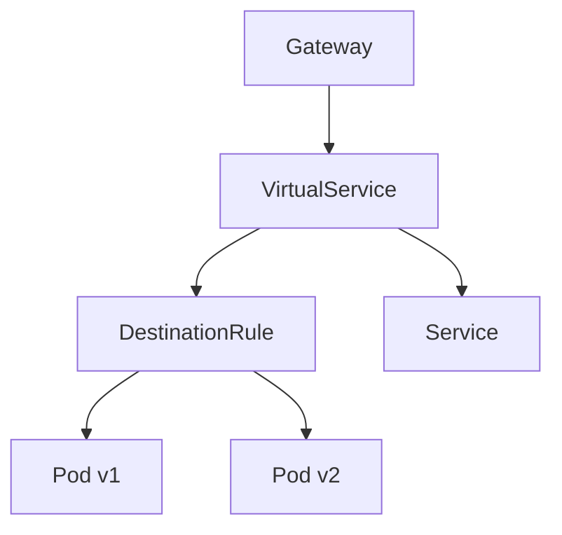

# Traffic Management in Istio

## Table of Contents
- [Introduction to Traffic Management](#introduction-to-traffic-management)
- [Gateway](#gateway)
  - [Gateway Resource](#gateway-resource)
  - [Gateway Configuration Examples](#gateway-configuration-examples)
  - [Commands for Gateway Management](#commands-for-gateway-management)
- [Virtual Services](#virtual-services)
  - [Virtual Service Resource](#virtual-service-resource)
  - [Routing Rules](#routing-rules)
  - [Virtual Service Examples](#virtual-service-examples)
  - [Commands for Virtual Service Management](#commands-for-virtual-service-management)
- [Destination Rules](#destination-rules)
  - [Destination Rule Resource](#destination-rule-resource)
  - [Subsets](#subsets)
  - [Traffic Policy](#traffic-policy)
  - [Destination Rule Examples](#destination-rule-examples)
  - [Commands for Destination Rule Management](#commands-for-destination-rule-management)
- [Fault Injection](#fault-injection)
  - [Types of Faults](#types-of-faults)
  - [Fault Injection Examples](#fault-injection-examples)
  - [Testing with Fault Injection](#testing-with-fault-injection)
- [Timeouts](#timeouts)
  - [Timeout Configuration](#timeout-configuration)
  - [Timeout Examples](#timeout-examples)
- [Retries](#retries)
  - [Retry Configuration](#retry-configuration)
  - [Retry Examples](#retry-examples)
- [Circuit Breaking](#circuit-breaking)
  - [Circuit Breaker Configuration](#circuit-breaker-configuration)
  - [Circuit Breaking Examples](#circuit-breaking-examples)
  - [Testing Circuit Breaking](#testing-circuit-breaking)
- [A/B Testing](#ab-testing)
  - [A/B Testing with Istio](#ab-testing-with-istio)
  - [A/B Testing Examples](#ab-testing-examples)
  - [Monitoring A/B Tests](#monitoring-ab-tests)

## Introduction to Traffic Management

Traffic management in Istio allows you to control how traffic flows between services in your service mesh. It provides capabilities for:

- Routing traffic to different versions of services
- Testing the resiliency of your applications
- Rolling out new versions in a controlled manner
- Implementing traffic policies like timeouts and retries

Istio's traffic management model relies on several key resources working together:



## Gateway

A Gateway in Istio defines load balancers operating at the edge of the mesh that receive incoming or outgoing HTTP/TCP connections.

### Gateway Resource

The Gateway resource configures:
- Exposed ports
- Protocol types
- SNI configuration for servers
- TLS settings

```yaml
apiVersion: networking.istio.io/v1alpha3
kind: Gateway
metadata:
  name: my-gateway
spec:
  selector:
    istio: ingressgateway  # Use the default Istio ingress gateway
  servers:
  - port:
      number: 80
      name: http
      protocol: HTTP
    hosts:
    - "example.com"
```

### Gateway Configuration Examples

**Basic HTTP Gateway:**
```yaml
apiVersion: networking.istio.io/v1alpha3
kind: Gateway
metadata:
  name: bookinfo-gateway
spec:
  selector:
    istio: ingressgateway
  servers:
  - port:
      number: 80
      name: http
      protocol: HTTP
    hosts:
    - "bookinfo.example.com"
```

**HTTPS Gateway with TLS:**
```yaml
apiVersion: networking.istio.io/v1alpha3
kind: Gateway
metadata:
  name: secure-gateway
spec:
  selector:
    istio: ingressgateway
  servers:
  - port:
      number: 443
      name: https
      protocol: HTTPS
    tls:
      mode: SIMPLE
      credentialName: example-credential  # Must match Secret name in istio-system namespace
    hosts:
    - "secure.example.com"
```

**Multi-port Gateway:**
```yaml
apiVersion: networking.istio.io/v1alpha3
kind: Gateway
metadata:
  name: multi-port-gateway
spec:
  selector:
    istio: ingressgateway
  servers:
  - port:
      number: 80
      name: http
      protocol: HTTP
    hosts:
    - "example.com"
  - port:
      number: 9080
      name: http-alt
      protocol: HTTP
    hosts:
    - "api.example.com"
```

### Commands for Gateway Management

```bash
# Create a gateway
kubectl apply -f gateway.yaml

# List all gateways
kubectl get gateway
kubectl get gateway -n <namespace>

# Get details about a specific gateway
kubectl describe gateway <gateway-name>
kubectl describe gateway <gateway-name> -n <namespace>

# Delete a gateway
kubectl delete gateway <gateway-name>
kubectl delete gateway <gateway-name> -n <namespace>

# Watch the status of gateways
kubectl get gateway -w

# Check gateway configuration using istioctl
istioctl analyze gateway <gateway-name> -n <namespace>
```

## Virtual Services

Virtual Services define how requests are routed to a service. They enable advanced traffic routing capabilities including weighted routing, header-based routing, and more.

### Virtual Service Resource

The Virtual Service resource configures:
- Hosts to which the routing rules apply
- Gateway attachments
- HTTP/TCP/TLS routing rules

```yaml
apiVersion: networking.istio.io/v1alpha3
kind: VirtualService
metadata:
  name: reviews-route
spec:
  hosts:
  - reviews
  http:
  - route:
    - destination:
        host: reviews
        subset: v1
      weight: 75
    - destination:
        host: reviews
        subset: v2
      weight: 25
```

### Routing Rules

Virtual Services support several types of routing rules:

| Rule Type | Description |
|-----------|-------------|
| URI-based | Route based on the URI path |
| Header-based | Route based on HTTP headers |
| Method-based | Route based on HTTP method (GET, POST, etc.) |
| Weight-based | Route to different destinations with specified weights |
| Query parameter-based | Route based on query parameters |

### Virtual Service Examples

**Basic Routing:**
```yaml
apiVersion: networking.istio.io/v1alpha3
kind: VirtualService
metadata:
  name: reviews
spec:
  hosts:
  - reviews
  http:
  - route:
    - destination:
        host: reviews
        subset: v1
```

**Traffic Splitting:**
```yaml
apiVersion: networking.istio.io/v1alpha3
kind: VirtualService
metadata:
  name: reviews-split
spec:
  hosts:
  - reviews
  http:
  - route:
    - destination:
        host: reviews
        subset: v1
      weight: 80
    - destination:
        host: reviews
        subset: v2
      weight: 20
```

**Path-based Routing:**
```yaml
apiVersion: networking.istio.io/v1alpha3
kind: VirtualService
metadata:
  name: bookinfo
spec:
  hosts:
  - "bookinfo.example.com"
  gateways:
  - bookinfo-gateway
  http:
  - match:
    - uri:
        prefix: /reviews
    route:
    - destination:
        host: reviews
  - match:
    - uri:
        prefix: /ratings
    route:
    - destination:
        host: ratings
```

**Header-based Routing:**
```yaml
apiVersion: networking.istio.io/v1alpha3
kind: VirtualService
metadata:
  name: reviews-by-user
spec:
  hosts:
  - reviews
  http:
  - match:
    - headers:
        end-user:
          exact: jason
    route:
    - destination:
        host: reviews
        subset: v2
  - route:
    - destination:
        host: reviews
        subset: v1
```

### Commands for Virtual Service Management

```bash
# Create a virtual service
kubectl apply -f virtual-service.yaml

# List all virtual services
kubectl get virtualservice
kubectl get virtualservice -n <namespace>

# Get details about a specific virtual service
kubectl describe virtualservice <vs-name>
kubectl describe virtualservice <vs-name> -n <namespace>

# Delete a virtual service
kubectl delete virtualservice <vs-name>
kubectl delete virtualservice <vs-name> -n <namespace>

# Export virtual service definition
kubectl get virtualservice <vs-name> -o yaml > vs-export.yaml

# Check if a virtual service is properly configured
istioctl analyze virtualservice <vs-name> -n <namespace>

# Validate traffic routing for a virtual service
istioctl x describe service <service-name>
```

## Destination Rules

Destination Rules configure what happens to traffic after it has been routed by a Virtual Service. They define policies that apply to traffic intended for a service.

### Destination Rule Resource

The Destination Rule resource configures:
- Service subsets (e.g., different versions)
- Load balancing policies
- Connection pool settings
- Outlier detection (circuit breaking)

```yaml
apiVersion: networking.istio.io/v1alpha3
kind: DestinationRule
metadata:
  name: reviews
spec:
  host: reviews
  trafficPolicy:
    loadBalancer:
      simple: RANDOM
  subsets:
  - name: v1
    labels:
      version: v1
  - name: v2
    labels:
      version: v2
```

### Subsets

Subsets allow you to group service instances by specific labels. This enables routing to different versions of a service:

```yaml
subsets:
- name: v1
  labels:
    version: v1
- name: v2
  labels:
    version: v2
```

### Traffic Policy

Traffic policies configure how client traffic is handled:

```yaml
trafficPolicy:
  loadBalancer:
    simple: ROUND_ROBIN  # or RANDOM, LEAST_CONN
  connectionPool:
    tcp:
      maxConnections: 100
    http:
      http1MaxPendingRequests: 10
  outlierDetection:
    consecutiveErrors: 5
    interval: 5s
    baseEjectionTime: 30s
```

### Destination Rule Examples

**Basic Destination Rule with Subsets:**
```yaml
apiVersion: networking.istio.io/v1alpha3
kind: DestinationRule
metadata:
  name: reviews
spec:
  host: reviews
  subsets:
  - name: v1
    labels:
      version: v1
  - name: v2
    labels:
      version: v2
```

**Custom Load Balancing:**
```yaml
apiVersion: networking.istio.io/v1alpha3
kind: DestinationRule
metadata:
  name: reviews-lb
spec:
  host: reviews
  trafficPolicy:
    loadBalancer:
      simple: LEAST_CONN
  subsets:
  - name: v1
    labels:
      version: v1
```

**Connection Pool Settings:**
```yaml
apiVersion: networking.istio.io/v1alpha3
kind: DestinationRule
metadata:
  name: reviews-connection-pool
spec:
  host: reviews
  trafficPolicy:
    connectionPool:
      tcp:
        maxConnections: 100
        connectTimeout: 30ms
      http:
        http1MaxPendingRequests: 10
        maxRequestsPerConnection: 10
```

**TLS Settings:**
```yaml
apiVersion: networking.istio.io/v1alpha3
kind: DestinationRule
metadata:
  name: reviews-tls
spec:
  host: reviews
  trafficPolicy:
    tls:
      mode: ISTIO_MUTUAL  # Enable mTLS
```

### Commands for Destination Rule Management

```bash
# Create a destination rule
kubectl apply -f destination-rule.yaml

# List all destination rules
kubectl get destinationrule
kubectl get destinationrule -n <namespace>

# Get details about a specific destination rule
kubectl describe destinationrule <dr-name>
kubectl describe destinationrule <dr-name> -n <namespace>

# Delete a destination rule
kubectl delete destinationrule <dr-name>
kubectl delete destinationrule <dr-name> -n <namespace>

# Export destination rule definition
kubectl get destinationrule <dr-name> -o yaml > dr-export.yaml

# Validate a destination rule
istioctl analyze destinationrule <dr-name> -n <namespace>
```

## Fault Injection

Fault injection is a testing method that intentionally introduces faults to test the resiliency and error handling of applications.

### Types of Faults

Istio supports two types of faults:

1. **Delays** - Add latency to requests to simulate network delays or service overloads
2. **Aborts** - Return error codes to simulate failed services

### Fault Injection Examples

**Delay Fault:**
```yaml
apiVersion: networking.istio.io/v1alpha3
kind: VirtualService
metadata:
  name: ratings-delay
spec:
  hosts:
  - ratings
  http:
  - fault:
      delay:
        percentage:
          value: 50.0
        fixedDelay: 5s
    route:
    - destination:
        host: ratings
        subset: v1
```

**Abort Fault:**
```yaml
apiVersion: networking.istio.io/v1alpha3
kind: VirtualService
metadata:
  name: ratings-abort
spec:
  hosts:
  - ratings
  http:
  - fault:
      abort:
        percentage:
          value: 20.0
        httpStatus: 500
    route:
    - destination:
        host: ratings
        subset: v1
```

**Combined Fault (Delay + Abort):**
```yaml
apiVersion: networking.istio.io/v1alpha3
kind: VirtualService
metadata:
  name: ratings-combined-fault
spec:
  hosts:
  - ratings
  http:
  - fault:
      delay:
        percentage:
          value: 10.0
        fixedDelay: 2s
      abort:
        percentage:
          value: 10.0
        httpStatus: 503
    route:
    - destination:
        host: ratings
        subset: v1
```

### Testing with Fault Injection

To test service resiliency:

1. Apply a fault injection configuration
2. Generate traffic to your service
3. Monitor service behavior and response times
4. Verify that timeout and retry mechanisms work correctly

```bash
# Apply fault injection
kubectl apply -f fault-injection.yaml

# Generate traffic (using curl or a testing tool)
for i in {1..100}; do curl -s http://$GATEWAY_URL/productpage | grep -o "ratings"; done

# Check metrics and logs
kubectl logs <pod-name> -c istio-proxy

# Remove fault injection when testing is complete
kubectl delete -f fault-injection.yaml
```

## Timeouts

Timeouts limit the time a service waits for a response from another service. They prevent services from waiting indefinitely for responses that may never come.

### Timeout Configuration

Timeouts are configured in Virtual Services:

```yaml
apiVersion: networking.istio.io/v1alpha3
kind: VirtualService
metadata:
  name: reviews-timeout
spec:
  hosts:
  - reviews
  http:
  - route:
    - destination:
        host: reviews
        subset: v2
    timeout: 5s  # 5 second timeout
```

### Timeout Examples

**Basic Timeout:**
```yaml
apiVersion: networking.istio.io/v1alpha3
kind: VirtualService
metadata:
  name: ratings-timeout
spec:
  hosts:
  - ratings
  http:
  - route:
    - destination:
        host: ratings
    timeout: 10s
```

**Timeout with Specific Match Conditions:**
```yaml
apiVersion: networking.istio.io/v1alpha3
kind: VirtualService
metadata:
  name: ratings-api-timeout
spec:
  hosts:
  - ratings
  http:
  - match:
    - uri:
        prefix: /api/v2
    route:
    - destination:
        host: ratings
        subset: v2
    timeout: 3s  # Short timeout for API calls
  - route:
    - destination:
        host: ratings
        subset: v1
    timeout: 30s  # Longer timeout for other operations
```

## Retries

Retries allow Istio to automatically retry failed requests, improving the resiliency of your services.

### Retry Configuration

Retries are configured in Virtual Services:

```yaml
apiVersion: networking.istio.io/v1alpha3
kind: VirtualService
metadata:
  name: ratings-retry
spec:
  hosts:
  - ratings
  http:
  - route:
    - destination:
        host: ratings
    retries:
      attempts: 3
      perTryTimeout: 2s
      retryOn: gateway-error,connect-failure,refused-stream
```

Retry parameters:
- `attempts`: Maximum number of retry attempts
- `perTryTimeout`: Timeout per retry attempt
- `retryOn`: Conditions that trigger retries

Common `retryOn` values:
- `5xx`: Retry on 5xx response codes
- `gateway-error`: Retry on 502, 503, or 504 response codes
- `connect-failure`: Retry on connection failures
- `refused-stream`: Retry if the upstream host refuses the stream
- `retriable-status-codes`: Retry on specific status codes listed in the `retriableStatusCodes` field

### Retry Examples

**Basic Retry:**
```yaml
apiVersion: networking.istio.io/v1alpha3
kind: VirtualService
metadata:
  name: ratings-basic-retry
spec:
  hosts:
  - ratings
  http:
  - route:
    - destination:
        host: ratings
    retries:
      attempts: 2
      perTryTimeout: 3s
      retryOn: 5xx
```

**Advanced Retry Configuration:**
```yaml
apiVersion: networking.istio.io/v1alpha3
kind: VirtualService
metadata:
  name: ratings-advanced-retry
spec:
  hosts:
  - ratings
  http:
  - route:
    - destination:
        host: ratings
    retries:
      attempts: 5
      perTryTimeout: 1s
      retryOn: gateway-error,connect-failure,refused-stream,5xx
      retriableStatusCodes: [503, 504]
```

**Retry with Path-specific Policies:**
```yaml
apiVersion: networking.istio.io/v1alpha3
kind: VirtualService
metadata:
  name: ratings-path-retry
spec:
  hosts:
  - ratings
  http:
  - match:
    - uri:
        prefix: /api/critical
    route:
    - destination:
        host: ratings
    retries:
      attempts: 5
      perTryTimeout: 500ms
      retryOn: 5xx,gateway-error
  - route:
    - destination:
        host: ratings
    retries:
      attempts: 2
      perTryTimeout: 1s
      retryOn: 5xx
```

## Circuit Breaking

Circuit breaking is a resiliency pattern that stops cascading failures by limiting the impact of service failures. It prevents a single failing service from consuming all available resources.

### Circuit Breaker Configuration

Circuit breakers are configured in Destination Rules using the `outlierDetection` field:

```yaml
apiVersion: networking.istio.io/v1alpha3
kind: DestinationRule
metadata:
  name: reviews-circuit-breaker
spec:
  host: reviews
  trafficPolicy:
    connectionPool:
      tcp:
        maxConnections: 100
      http:
        http1MaxPendingRequests: 10
        maxRequestsPerConnection: 10
    outlierDetection:
      consecutiveErrors: 5
      interval: 1s
      baseEjectionTime: 30s
      maxEjectionPercent: 100
```

Circuit breaker parameters:
- `consecutiveErrors`: Number of errors before a host is ejected
- `interval`: Time between analysis sweeps
- `baseEjectionTime`: Minimum ejection duration
- `maxEjectionPercent`: Maximum percentage of hosts that can be ejected

### Circuit Breaking Examples

**Basic Circuit Breaker:**
```yaml
apiVersion: networking.istio.io/v1alpha3
kind: DestinationRule
metadata:
  name: reviews-basic-cb
spec:
  host: reviews
  trafficPolicy:
    connectionPool:
      tcp:
        maxConnections: 1
      http:
        http1MaxPendingRequests: 1
        maxRequestsPerConnection: 1
    outlierDetection:
      consecutiveErrors: 1
      interval: 1s
      baseEjectionTime: 3m
      maxEjectionPercent: 100
```

**Production-Ready Circuit Breaker:**
```yaml
apiVersion: networking.istio.io/v1alpha3
kind: DestinationRule
metadata:
  name: reviews-prod-cb
spec:
  host: reviews
  trafficPolicy:
    connectionPool:
      tcp:
        maxConnections: 100
        connectTimeout: 30ms
        tcpKeepalive:
          time: 7200s
          interval: 75s
      http:
        http1MaxPendingRequests: 10
        maxRequestsPerConnection: 10
        maxRetries: 3
    outlierDetection:
      consecutiveErrors: 5
      interval: 10s
      baseEjectionTime: 30s
      maxEjectionPercent: 50
```

**Subset-Specific Circuit Breaker:**
```yaml
apiVersion: networking.istio.io/v1alpha3
kind: DestinationRule
metadata:
  name: reviews-subset-cb
spec:
  host: reviews
  subsets:
  - name: v1
    labels:
      version: v1
    trafficPolicy:
      connectionPool:
        tcp:
          maxConnections: 100
        http:
          http1MaxPendingRequests: 10
      outlierDetection:
        consecutiveErrors: 3
        interval: 5s
        baseEjectionTime: 30s
  - name: v2
    labels:
      version: v2
    trafficPolicy:
      connectionPool:
        tcp:
          maxConnections: 50
        http:
          http1MaxPendingRequests: 5
      outlierDetection:
        consecutiveErrors: 5
        interval: 10s
        baseEjectionTime: 60s
```

### Testing Circuit Breaking

You can test circuit breaking by generating a high volume of traffic:

```bash
# Create a testing pod
kubectl apply -f - <<EOF
apiVersion: v1
kind: Pod
metadata:
  name: fortio-deploy
spec:
  containers:
  - name: fortio
    image: fortio/fortio:latest
    command: ["fortio", "server"]
EOF

# Access the fortio pod
kubectl exec -it fortio-deploy -- /bin/bash

# Generate traffic to test circuit breaking
fortio load -c 3 -qps 0 -n 20 -loglevel Warning http://reviews:9080/
```

Monitor the results to see if the circuit breaker is triggered:

```bash
# Check proxy metrics
kubectl exec -it <pod-name> -c istio-proxy -- pilot-agent request GET stats | grep circuit_breaker
```

## A/B Testing

A/B testing is a method of comparing two versions of a service to determine which performs better.

### A/B Testing with Istio

Istio enables A/B testing through Virtual Services and Destination Rules:

1. Define subsets for different versions in a Destination Rule
2. Create a Virtual Service to split traffic between versions
3. Collect metrics to compare performance

### A/B Testing Examples

**Basic A/B Test:**
```yaml
apiVersion: networking.istio.io/v1alpha3
kind: VirtualService
metadata:
  name: reviews-ab-test
spec:
  hosts:
  - reviews
  http:
  - route:
    - destination:
        host: reviews
        subset: a  # Original version
      weight: 50
    - destination:
        host: reviews
        subset: b  # New version
      weight: 50
```

**A/B Test with User Targeting:**
```yaml
apiVersion: networking.istio.io/v1alpha3
kind: VirtualService
metadata:
  name: reviews-ab-test-user
spec:
  hosts:
  - reviews
  http:
  - match:
    - headers:
        cookie:
          regex: "^(.*?;)?(user=test)(;.*)?$"
    route:
    - destination:
        host: reviews
        subset: b  # Test users get the new version
  - route:
    - destination:
        host: reviews
        subset: a  # Everyone else gets the original version
```

**Gradual Rollout A/B Test:**
```yaml
apiVersion: networking.istio.io/v1alpha3
kind: VirtualService
metadata:
  name: reviews-gradual-rollout
spec:
  hosts:
  - reviews
  http:
  - route:
    - destination:
        host: reviews
        subset: v1  # Original version
      weight: 90
    - destination:
        host: reviews
        subset: v2  # New version
      weight: 10
```

### Monitoring A/B Tests

To effectively analyze A/B tests:

1. Set up Prometheus and Grafana for metrics collection and visualization
2. Configure Istio telemetry for both versions
3. Create dashboards to monitor key performance indicators

```bash
# Install Prometheus and Grafana
kubectl apply -f samples/addons/prometheus.yaml
kubectl apply -f samples/addons/grafana.yaml

# Access Grafana dashboards
kubectl port-forward service/grafana 3000:3000 -n istio-system
```

Key metrics to monitor:
- Response time
- Error rate
- Success rate
- Conversion rate (if applicable)
- Resource utilization

After gathering sufficient data, adjust your traffic split based on results:

```yaml
apiVersion: networking.istio.io/v1alpha3
kind: VirtualService
metadata:
  name: reviews-ab-conclusion
spec:
  hosts:
  - reviews
  http:
  - route:
    - destination:
        host: reviews
        subset: v2  # New version (winner)
      weight: 100  # Full rollout
```