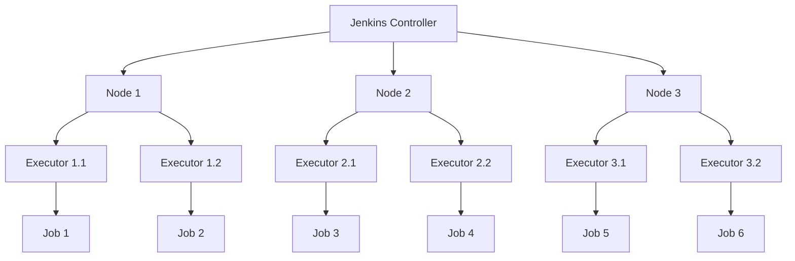

# Jenkins Architecture, Projects, and Installation

## Table of Contents

1. [Introduction to Jenkins](#introduction-to-jenkins)
   - [What is Jenkins?](#what-is-jenkins)
   - [What is Jenkins Used For?](#what-is-jenkins-used-for)
   - [Key Features of Jenkins](#key-features-of-jenkins)

2. [Jenkins Architecture](#jenkins-architecture)
   - [Jenkins Controller Node](#jenkins-controller-node)
   - [Jenkins Worker Nodes](#jenkins-worker-nodes)
   - [Connection Protocols](#connection-protocols)
   - [Distributed Builds Architecture](#distributed-builds-architecture)

3. [Types of Jenkins Projects](#types-of-jenkins-projects)
   - [Freestyle Project](#freestyle-project)
   - [Pipeline Project](#pipeline-project)
   - [Multibranch Pipeline Project](#multibranch-pipeline-project)
   - [Maven Project](#maven-project)
   - [Multi-Configuration Project](#multi-configuration-project)
   - [Organization Folders](#organization-folders)

4. [Jenkins Installation](#jenkins-installation)
   - [System Requirements](#system-requirements)
   - [Installation on Ubuntu](#installation-on-ubuntu)
   - [Installation on Windows](#installation-on-windows)
   - [Installation on macOS](#installation-on-macos)
   - [Post-Installation Setup](#post-installation-setup)

## Introduction to Jenkins

### What is Jenkins?

Jenkins is an open-source automation server that enables developers to build, test, and deploy their software reliably. Originally developed by Kohsuke Kawaguchi in 2004 as "Hudson," it was renamed to Jenkins in 2011 and has since become one of the most popular automation tools in the software development industry.

### What is Jenkins Used For?

Jenkins is primarily used for:

1. **Continuous Integration (CI)**: Automatically building and testing code changes as they are committed, ensuring code quality and early detection of integration issues.

2. **Continuous Delivery (CD)**: Automating the process of deploying applications to test, staging, and production environments.

3. **Automation**: Handling repetitive tasks like builds, tests, code analysis, and deployments, allowing developers to focus on development rather than operational tasks.

4. **Monitoring**: Tracking the execution of externally run jobs, such as cron jobs and procmail jobs, even those running on remote machines.

### Key Features of Jenkins

- **Extensibility**: Jenkins can be extended via plugins, with over 1,800 plugins available in the Jenkins Update Center.
- **Distributed Architecture**: Jenkins can distribute work across multiple machines for faster builds, tests, and deployments.
- **Platform Independence**: Jenkins runs on various operating systems, including Windows, Linux, and macOS.
- **Configuration as Code**: Jenkins configurations can be defined as code, enabling version control and easier replication.
- **Pipeline Support**: Jenkins supports defining complex workflows as code using the Pipeline feature.
- **Community Support**: Jenkins has a large, active community that contributes to its development and provides support.

## Jenkins Architecture

Jenkins follows a master-agent architecture (also known as controller-worker), where the workload is distributed across multiple machines.

### Jenkins Controller Node

The Jenkins Controller Node (formerly known as the Master) is the central coordination point in the Jenkins architecture. It is responsible for:

- **Handling HTTP Requests**: The controller serves the web interface and handles API requests.
- **Managing Configuration**: It stores and manages the configurations for all jobs and system settings.
- **Scheduling Jobs**: The controller determines when and where jobs should run.
- **Dispatching Builds**: It assigns builds to worker nodes based on their capabilities and availability.

Key components of the Controller Node include:

#### Plugins

Plugins extend Jenkins functionality. They are installed on the controller and can affect both the controller and the worker nodes.

Common types of plugins include:
- Build plugins (Maven, Gradle)
- Source code management plugins (Git, SVN)
- Notification plugins (Email, Slack)
- Authentication plugins (LDAP, OAuth)

#### Jobs

Jobs (or projects) are the basic unit of work in Jenkins. They define what should be done and how it should be executed.

#### Nodes

Nodes represent machines that can execute jobs. The controller node itself is also a node that can execute jobs, but it's often recommended to use dedicated worker nodes for build execution.

#### Credentials

Jenkins securely stores credentials for accessing various systems like source code repositories, deployment targets, and cloud services.

#### Configurations

This includes system configurations, global tool configurations, and security settings.

### Jenkins Worker Nodes

Worker Nodes (formerly known as Slaves or Agents) are the machines that perform the actual work of building, testing, and deploying code. They help distribute the workload and can be configured to handle specific types of builds.

#### Agents

An agent is a Java executable that runs on a worker node. It communicates with the Jenkins controller to receive instructions and report status.

##### Docker Agents

Docker agents run builds inside Docker containers, providing:
- Isolation: Each build runs in its own container
- Consistency: Same environment for every build
- Efficiency: Containers can be quickly created and destroyed

To use Docker agents, add the "Docker Plugin" to Jenkins and configure it in the system settings.

Example Docker agent configuration in a Jenkinsfile:

```groovy
pipeline {
    agent {
        docker {
            image 'maven:3.8.6-openjdk-11'
            args '-v $HOME/.m2:/root/.m2'
        }
    }
    stages {
        stage('Build') {
            steps {
                sh 'mvn -B clean package'
            }
        }
    }
}
```

##### Kubernetes Agents

Kubernetes agents leverage Kubernetes clusters to dynamically provision and schedule Jenkins worker pods:
- Scalability: Automatically scales up/down based on workload
- Resource optimization: Efficient use of cluster resources
- Isolation: Each build runs in its own pod

To use Kubernetes agents, install the "Kubernetes Plugin" and configure your Kubernetes cluster details in the system settings.

Example Kubernetes agent configuration in a Jenkinsfile:

```groovy
pipeline {
    agent {
        kubernetes {
            yaml """
apiVersion: v1
kind: Pod
metadata:
  labels:
    app: jenkins-agent
spec:
  containers:
  - name: maven
    image: maven:3.8.6-openjdk-11
    command:
    - sleep
    args:
    - 99d
    volumeMounts:
    - name: maven-cache
      mountPath: /root/.m2
  volumes:
  - name: maven-cache
    persistentVolumeClaim:
      claimName: maven-cache
"""
        }
    }
    stages {
        stage('Build') {
            steps {
                container('maven') {
                    sh 'mvn -B clean package'
                }
            }
        }
    }
}
```

#### Executors

Executors are worker threads that run on a node. The number of executors determines how many jobs can run simultaneously on that node.

For example, if a node has 4 executors, it can run 4 jobs simultaneously. The number of executors should be based on the available resources (CPU, memory) of the node.

To change the number of executors on a node:
1. Go to "Manage Jenkins" > "Manage Nodes and Clouds"
2. Select the node
3. Click "Configure"
4. Update the "Number of executors" field

### Connection Protocols

Jenkins controller and worker nodes communicate using various protocols:

#### SSH

SSH is the most common protocol for Linux/Unix systems:
- Secure: Uses SSH encryption
- Simple: Requires only SSH access to the worker node
- Standard: Widely used and understood

To set up an SSH connection:
1. Generate SSH keys on the controller
2. Add the public key to the worker node's authorized_keys file
3. In Jenkins, go to "Manage Jenkins" > "Manage Nodes and Clouds" > "New Node"
4. Select "Launch method" as "Launch agents via SSH"
5. Enter the host, credentials, and other SSH settings

Example SSH connection command:

```bash
ssh -i /var/lib/jenkins/.ssh/id_rsa jenkins@worker-node
```

#### Java Web Start (JNLP)

JNLP is commonly used for Windows systems or when SSH is not available:
- Outbound: The worker initiates the connection to the controller
- Firewall-friendly: Works well in restrictive network environments
- Java-based: Requires Java on the worker node

To set up a JNLP connection:
1. In Jenkins, go to "Manage Jenkins" > "Manage Nodes and Clouds" > "New Node"
2. Select "Launch method" as "Launch agent by connecting it to the controller"
3. On the worker node, run the provided Java command to connect to the controller

Example JNLP connection command:

```bash
java -jar agent.jar -jnlpUrl http://jenkins-master:8080/computer/worker-node/slave-agent.jnlp -secret 1234abcd
```

### Distributed Builds Architecture

Jenkins distributed architecture allows for efficient build execution across multiple nodes:



This architecture provides:
- **Scalability**: Add more nodes to handle increased workload
- **Specialization**: Configure nodes for specific types of builds
- **Reliability**: If one node fails, others can continue working
- **Resource Optimization**: Distribute workload based on available resources

## Types of Jenkins Projects

Jenkins supports various types of projects to accommodate different build and deployment needs.

### Freestyle Project

A Freestyle Project is the most basic and flexible type of Jenkins project. It allows you to:
- Combine any SCM with any build system
- Trigger builds manually or automatically
- Incorporate various build steps and post-build actions

#### Creating a Freestyle Project

1. From the Jenkins dashboard, click "New Item"
2. Enter a name for your project
3. Select "Freestyle project" and click "OK"
4. Configure the project with source code management, build triggers, build steps, and post-build actions
5. Click "Save"

#### Chained Freestyle Project

Chained freestyle projects allow you to set up a sequence of projects where one project triggers another upon completion.

To create a chained freestyle project:
1. Create multiple freestyle projects
2. In the "Post-build Actions" section of the first project, select "Build other projects"
3. Enter the name of the project to trigger next
4. Optionally, select "Trigger only if build is stable" to only trigger the next project if the current one succeeds

Example workflow:
- Project A: Build application
- Project B: Run unit tests
- Project C: Deploy to staging

#### Controller Failure Freestyle Project

This type of project helps manage situations where the controller node fails:

1. Create a freestyle project
2. Add a build step to create a backup of critical Jenkins configurations
3. Add a post-build action to upload the backup to a secure location
4. Schedule the project to run regularly

Example script for backing up Jenkins configurations:

```bash
#!/bin/bash
BACKUP_DIR="/var/jenkins_backup"
DATE=$(date +%Y%m%d%H%M)
JENKINS_HOME="/var/jenkins_home"

# Create backup directory if it doesn't exist
mkdir -p $BACKUP_DIR

# Create backup archive
tar -czf $BACKUP_DIR/jenkins_backup_$DATE.tar.gz $JENKINS_HOME

# Delete backups older than 7 days
find $BACKUP_DIR -name "jenkins_backup_*.tar.gz" -type f -mtime +7 -delete
```

### Pipeline Project

Pipeline projects define the entire build/test/deploy pipeline as code, using the Jenkinsfile format. They provide:
- Durability: Pipelines can survive controller restarts
- Pausability: Pipelines can wait for human input
- Versatility: Pipelines can incorporate conditional logic, loops, and parallelism
- Visualization: Pipelines can be visualized to show progress and status

#### Creating a Pipeline Project

1. From the Jenkins dashboard, click "New Item"
2. Enter a name for your project
3. Select "Pipeline" and click "OK"
4. Configure the project with a pipeline script or script path
5. Click "Save"

Example basic pipeline script:

```groovy
pipeline {
    agent any
    stages {
        stage('Build') {
            steps {
                echo 'Building the application...'
                sh 'mvn clean package'
            }
        }
        stage('Test') {
            steps {
                echo 'Running tests...'
                sh 'mvn test'
            }
        }
        stage('Deploy') {
            steps {
                echo 'Deploying the application...'
                sh './deploy.sh'
            }
        }
    }
    post {
        success {
            echo 'Pipeline completed successfully!'
        }
        failure {
            echo 'Pipeline failed!'
        }
    }
}
```

#### Parameterized Pipeline Project

Parameterized pipelines allow you to pass values to your pipeline when triggering the build.

To create a parameterized pipeline:
1. Create a pipeline project
2. In the pipeline configuration, select "This project is parameterized"
3. Add parameters (string, boolean, choice, etc.)
4. Use the parameters in your pipeline script

Example parameterized pipeline script:

```groovy
pipeline {
    agent any
    parameters {
        string(name: 'BRANCH', defaultValue: 'main', description: 'Branch to build')
        choice(name: 'ENVIRONMENT', choices: ['dev', 'staging', 'prod'], description: 'Deployment environment')
        booleanParam(name: 'RUN_TESTS', defaultValue: true, description: 'Run tests')
    }
    stages {
        stage('Checkout') {
            steps {
                echo "Checking out branch: ${params.BRANCH}"
                git branch: "${params.BRANCH}", url: 'https://github.com/user/repo.git'
            }
        }
        stage('Build') {
            steps {
                echo 'Building the application...'
                sh 'mvn clean package'
            }
        }
        stage('Test') {
            when {
                expression { params.RUN_TESTS == true }
            }
            steps {
                echo 'Running tests...'
                sh 'mvn test'
            }
        }
        stage('Deploy') {
            steps {
                echo "Deploying to ${params.ENVIRONMENT}..."
                sh "./deploy.sh ${params.ENVIRONMENT}"
            }
        }
    }
}
```

#### Controller Failure Pipeline Project

This type of pipeline project helps manage controller failures:

```groovy
pipeline {
    agent any
    triggers {
        cron('0 0 * * *') // Run daily at midnight
    }
    stages {
        stage('Backup Jenkins Configuration') {
            steps {
                sh '''
                    #!/bin/bash
                    BACKUP_DIR="/var/jenkins_backup"
                    DATE=$(date +%Y%m%d%H%M)
                    JENKINS_HOME="/var/jenkins_home"
                    
                    # Create backup directory if it doesn't exist
                    mkdir -p $BACKUP_DIR
                    
                    # Create backup archive
                    tar -czf $BACKUP_DIR/jenkins_backup_$DATE.tar.gz $JENKINS_HOME
                    
                    # Delete backups older than 7 days
                    find $BACKUP_DIR -name "jenkins_backup_*.tar.gz" -type f -mtime +7 -delete
                '''
            }
        }
        stage('Upload Backup') {
            steps {
                sh '''
                    # Upload backup to remote storage
                    aws s3 cp /var/jenkins_backup/jenkins_backup_$(date +%Y%m%d%H%M).tar.gz s3://jenkins-backups/
                '''
            }
        }
    }
    post {
        success {
            mail to: 'admin@example.com',
                 subject: 'Jenkins Backup Successful',
                 body: 'Jenkins configuration backup completed successfully.'
        }
        failure {
            mail to: 'admin@example.com',
                 subject: 'Jenkins Backup Failed',
                 body: 'Jenkins configuration backup failed. Please investigate.'
        }
    }
}
```

### Multibranch Pipeline Project

Multibranch pipeline projects automatically create pipeline jobs for each branch in a source code repository that contains a Jenkinsfile.

#### Creating a Multibranch Pipeline Project

1. From the Jenkins dashboard, click "New Item"
2. Enter a name for your project
3. Select "Multibranch Pipeline" and click "OK"
4. Configure the project with a branch source (Git, GitHub, etc.)
5. Specify the location of the Jenkinsfile within the repository
6. Click "Save"

Benefits of multibranch pipelines:
- Automatic job creation for new branches
- Automatic job deletion for removed branches
- Branch-specific pipeline configurations

Example repository structure:
```
└── my-repo
    ├── main branch
    │   └── Jenkinsfile
    ├── feature-a branch
    │   └── Jenkinsfile
    └── feature-b branch
        └── Jenkinsfile
```

Each branch can have its own Jenkinsfile with branch-specific configurations.

### Maven Project

Maven Projects are specialized for Maven-based Java projects. They provide:
- Automatic configuration of Maven goals
- Automatic artifact archiving
- Dependency tracking

#### Creating a Maven Project

1. From the Jenkins dashboard, click "New Item"
2. Enter a name for your project
3. Select "Maven project" and click "OK"
4. Configure the project with source code management, build triggers, and Maven goals
5. Click "Save"

Example Maven project configuration:
- Source code management: Git
- Build triggers: Poll SCM
- Maven goals: clean install
- Post-build actions: Archive artifacts

Note: To use Maven projects, you need to install the "Maven Integration" plugin.

### Multi-Configuration Project

Multi-Configuration Projects (also known as Matrix Projects) allow you to run the same build job on multiple configurations, such as different operating systems, JDK versions, or browsers.

#### Creating a Multi-Configuration Project

1. From the Jenkins dashboard, click "New Item"
2. Enter a name for your project
3. Select "Multi-configuration project" and click "OK"
4. Configure the project with source code management, build triggers, and configuration matrix
5. Click "Save"

Example configuration matrix:
- Axis 1: Platform (linux, windows, mac)
- Axis 2: Browser (chrome, firefox, safari)
- Axis 3: JDK version (8, 11, 17)

This would create 27 different build configurations (3 platforms × 3 browsers × 3 JDK versions).

Note: To use Multi-Configuration projects, you need to install the "Matrix Project" plugin.

### Organization Folders

Organization Folders automatically discover and manage multibranch pipelines for all repositories within an organization.

#### Creating an Organization Folder

1. From the Jenkins dashboard, click "New Item"
2. Enter a name for your project
3. Select "Organization Folder" and click "OK"
4. Configure the project with a GitHub or Bitbucket organization
5. Click "Save"

Benefits of organization folders:
- Automatic discovery of repositories
- Automatic creation of multibranch pipelines
- Centralized management of organization-wide projects

Note: To use Organization Folders, you need to install the "GitHub Branch Source" or "Bitbucket Branch Source" plugin.

## Jenkins Installation

### System Requirements

Minimum system requirements for Jenkins:
- 256 MB of RAM (1 GB+ recommended)
- 1 GB of disk space (10 GB+ recommended for larger installations)
- Java 11 or later

### Installation on Ubuntu

To install Jenkins on Ubuntu:

1. Update the package index:
```bash
sudo apt update
```

2. Install Java:
```bash
sudo apt install openjdk-11-jdk
```

3. Add the Jenkins repository key:
```bash
wget -q -O - https://pkg.jenkins.io/debian/jenkins.io.key | sudo apt-key add -
```

4. Add the Jenkins repository to the system:
```bash
sudo sh -c 'echo deb http://pkg.jenkins.io/debian-stable binary/ > /etc/apt/sources.list.d/jenkins.list'
```

5. Update the package index again:
```bash
sudo apt update
```

6. Install Jenkins:
```bash
sudo apt install jenkins
```

7. Start Jenkins service:
```bash
sudo systemctl start jenkins
```

8. Enable Jenkins to start at system boot:
```bash
sudo systemctl enable jenkins
```

9. Check Jenkins status:
```bash
sudo systemctl status jenkins
```

10. Access Jenkins in your web browser at `http://localhost:8080`

11. Get the initial admin password:
```bash
sudo cat /var/lib/jenkins/secrets/initialAdminPassword
```

### Installation on Windows

To install Jenkins on Windows:

1. Download the Jenkins Windows installer from [Jenkins.io](https://www.jenkins.io/download/).

2. Run the installer and follow the installation wizard.

3. When prompted, select the Java JDK installation directory.

4. Choose the installation directory for Jenkins.

5. Select the port for Jenkins to run on (default is 8080).

6. Complete the installation.

7. Access Jenkins in your web browser at `http://localhost:8080`.

8. Get the initial admin password from `C:\Program Files\Jenkins\secrets\initialAdminPassword`.

Alternatively, you can install Jenkins as a Docker container on Windows:

```bash
docker run -d -p 8080:8080 -p 50000:50000 -v jenkins_home:/var/jenkins_home jenkins/jenkins:lts
```

### Installation on macOS

To install Jenkins on macOS using Homebrew:

1. Install Homebrew if you haven't already:
```bash
/bin/bash -c "$(curl -fsSL https://raw.githubusercontent.com/Homebrew/install/HEAD/install.sh)"
```

2. Install Java:
```bash
brew install openjdk@11
```

3. Install Jenkins:
```bash
brew install jenkins-lts
```

4. Start Jenkins service:
```bash
brew services start jenkins-lts
```

5. Access Jenkins in your web browser at `http://localhost:8080`.

6. Get the initial admin password:
```bash
cat ~/.jenkins/secrets/initialAdminPassword
```

### Post-Installation Setup

After installing Jenkins, complete the following setup steps:

1. Unlock Jenkins:
   - Enter the initial admin password when prompted
   - The password is located at `/var/lib/jenkins/secrets/initialAdminPassword` on Linux/macOS or `C:\Program Files\Jenkins\secrets\initialAdminPassword` on Windows

2. Install suggested plugins or select specific plugins to install.

3. Create an admin user:
   - Enter username, password, and email address
   - Click "Save and Continue"

4. Configure the Jenkins URL:
   - Enter the URL where Jenkins will be accessed
   - Click "Save and Finish"

5. Start using Jenkins.

Additional post-installation tasks:

1. Configure security settings:
   - Go to "Manage Jenkins" > "Configure Global Security"
   - Set up authentication and authorization
   - Enable CSRF protection

2. Configure system settings:
   - Go to "Manage Jenkins" > "Configure System"
   - Set up email notifications, global properties, and other system-wide settings

3. Install additional plugins:
   - Go to "Manage Jenkins" > "Manage Plugins"
   - Install plugins based on your needs (Git, Pipeline, Docker, etc.)

4. Configure tools:
   - Go to "Manage Jenkins" > "Global Tool Configuration"
   - Set up JDK, Maven, Gradle, and other tool installations

5. Add nodes:
   - Go to "Manage Jenkins" > "Manage Nodes and Clouds"
   - Add worker nodes for distributed builds