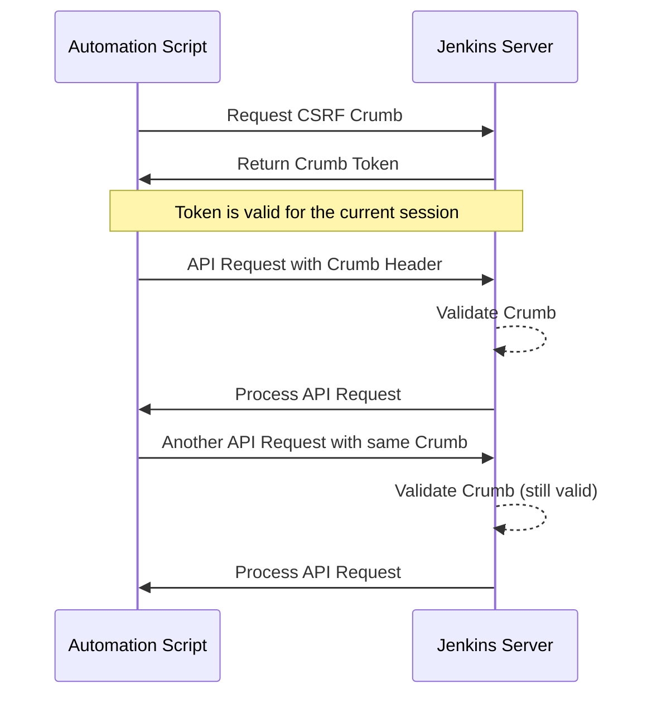
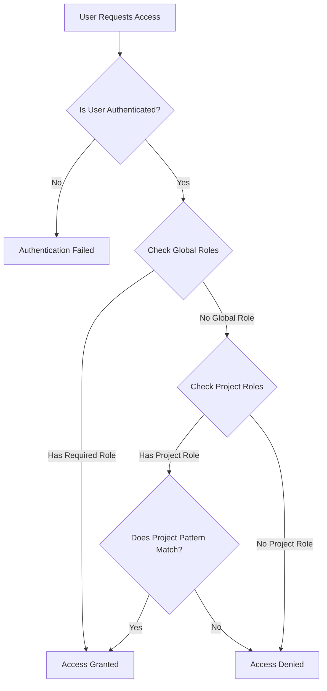

# Jenkins Automation and Security

## Table of Contents
1. [Introduction to Jenkins Automation](#introduction-to-jenkins-automation)
2. [Automating Jenkins Using CLI](#automating-jenkins-using-cli)
   - [Setting Up Jenkins CLI](#setting-up-jenkins-cli)
   - [Jenkins CLI Authentication](#jenkins-cli-authentication)
   - [Common Jenkins CLI Commands](#common-jenkins-cli-commands)
   - [Building a Job with CLI](#building-a-job-with-cli)
   - [CLI Command Examples](#cli-command-examples)
3. [Jenkins REST API](#jenkins-rest-api)
   - [REST API Basics](#rest-api-basics)
   - [Installing Plugins via REST API](#installing-plugins-via-rest-api)
   - [Common REST API Operations](#common-rest-api-operations)
   - [Automating Jenkins with Python and REST API](#automating-jenkins-with-python-and-rest-api)
4. [Shell Script for Jenkins Setup](#shell-script-for-jenkins-setup)
   - [Downloading and Installing Plugins](#downloading-and-installing-plugins)
   - [Jenkins Initial Configuration](#jenkins-initial-configuration)
   - [Complete Setup Script](#complete-setup-script)
5. [Jenkins Security](#jenkins-security)
   - [CSRF Protection with CRUMB](#csrf-protection-with-crumb)
   - [Jenkins Authentication](#jenkins-authentication)
     - [Security Realm Options](#security-realm-options)
     - [Authentication Configuration](#authentication-configuration)
   - [Jenkins Authorization](#jenkins-authorization)
     - [Matrix Authorization Strategy](#matrix-authorization-strategy)
     - [Role-Based Strategy](#role-based-strategy)

## Introduction to Jenkins Automation

Jenkins automation involves streamlining repetitive tasks through scripts, API calls, and CLI commands. Automating Jenkins operations offers significant benefits:

- **Reduced manual effort**: Eliminates tedious, error-prone manual configurations
- **Consistency**: Ensures consistent Jenkins environments across development, testing, and production
- **Reproducibility**: Makes Jenkins setups reproducible for disaster recovery
- **Version control**: Allows infrastructure configurations to be stored in version control systems
- **Scalability**: Facilitates managing large numbers of jobs, nodes, and configurations

Jenkins offers several interfaces for automation:
1. **Command Line Interface (CLI)**: For direct job manipulation and administration
2. **REST API**: For programmatic access to Jenkins features
3. **Configuration as Code (JCasC)**: For declaring your entire Jenkins configuration as code
4. **Job DSL and Pipeline**: For programmatically defining jobs and pipelines

In this guide, we'll explore these approaches with a focus on practical Python examples.

## Automating Jenkins Using CLI

### Setting Up Jenkins CLI

The Jenkins CLI (Command Line Interface) is a powerful tool that allows users to interact with Jenkins from a command-line environment. It's useful for script-based automation and performing bulk operations.

First, download the Jenkins CLI client JAR file from your Jenkins instance:

```bash
wget http://your-jenkins-url/jnlpJars/jenkins-cli.jar
```

Or using Python:

```python
import requests
import os

def download_jenkins_cli(jenkins_url, output_path="jenkins-cli.jar"):
    """Download the Jenkins CLI JAR file."""
    cli_url = f"{jenkins_url.rstrip('/')}/jnlpJars/jenkins-cli.jar"
    response = requests.get(cli_url)
    
    if response.status_code == 200:
        with open(output_path, 'wb') as f:
            f.write(response.content)
        print(f"Jenkins CLI downloaded to {output_path}")
        return True
    else:
        print(f"Failed to download Jenkins CLI: {response.status_code}")
        return False

# Example usage
jenkins_url = "http://localhost:8080"
download_jenkins_cli(jenkins_url)
```

### Jenkins CLI Authentication

There are several ways to authenticate with the Jenkins CLI:

1. **Using username and password**:
```bash
java -jar jenkins-cli.jar -s http://your-jenkins-url -auth username:password command
```

2. **Using API token** (recommended):
```bash
java -jar jenkins-cli.jar -s http://your-jenkins-url -auth username:apitoken command
```

3. **Using SSH keys**:
```bash
java -jar jenkins-cli.jar -s http://your-jenkins-url -i ~/.ssh/id_rsa command
```

4. **Using a NetRc file**:
Create a `.netrc` file:
```
machine your-jenkins-url
login username
password apitoken
```

Then run the CLI command:
```bash
java -jar jenkins-cli.jar -s http://your-jenkins-url command
```

### Common Jenkins CLI Commands

Here are some commonly used Jenkins CLI commands:

1. **Getting help**:
```bash
java -jar jenkins-cli.jar -s http://your-jenkins-url help
```

2. **Listing all jobs**:
```bash
java -jar jenkins-cli.jar -s http://your-jenkins-url -auth username:apitoken list-jobs
```

3. **Getting job details**:
```bash
java -jar jenkins-cli.jar -s http://your-jenkins-url -auth username:apitoken get-job JOB_NAME
```

4. **Creating a job**:
```bash
java -jar jenkins-cli.jar -s http://your-jenkins-url -auth username:apitoken create-job JOB_NAME < job_config.xml
```

5. **Updating a job**:
```bash
java -jar jenkins-cli.jar -s http://your-jenkins-url -auth username:apitoken update-job JOB_NAME < updated_job_config.xml
```

6. **Deleting a job**:
```bash
java -jar jenkins-cli.jar -s http://your-jenkins-url -auth username:apitoken delete-job JOB_NAME
```

7. **Running Jenkins Groovy scripts**:
```bash
java -jar jenkins-cli.jar -s http://your-jenkins-url -auth username:apitoken groovy script.groovy
```

8. **Restarting Jenkins**:
```bash
java -jar jenkins-cli.jar -s http://your-jenkins-url -auth username:apitoken restart
```

9. **Running a quiet restart** (waits for builds to finish):
```bash
java -jar jenkins-cli.jar -s http://your-jenkins-url -auth username:apitoken safe-restart
```

10. **Installing a plugin**:
```bash
java -jar jenkins-cli.jar -s http://your-jenkins-url -auth username:apitoken install-plugin PLUGIN_ID -deploy
```

11. **Listing installed plugins**:
```bash
java -jar jenkins-cli.jar -s http://your-jenkins-url -auth username:apitoken list-plugins
```

### Building a Job with CLI

The CLI provides multiple ways to build a job:

1. **Basic build command**:
```bash
java -jar jenkins-cli.jar -s http://your-jenkins-url -auth username:apitoken build JOB_NAME
```

2. **Building with parameters**:
```bash
java -jar jenkins-cli.jar -s http://your-jenkins-url -auth username:apitoken build JOB_NAME -p PARAM1=value1 -p PARAM2=value2
```

3. **Building and following the console output**:
```bash
java -jar jenkins-cli.jar -s http://your-jenkins-url -auth username:apitoken build JOB_NAME -s -v
```
The `-s` flag makes the command wait until the build completes, and `-v` shows the console output.

4. **Building a job on a specific node**:
```bash
java -jar jenkins-cli.jar -s http://your-jenkins-url -auth username:apitoken build JOB_NAME -s -v -p Node=specific_node_name
```

### CLI Command Examples

Here are examples of automating Jenkins operations with Python using the CLI:

**Example 1: Building multiple jobs in sequence**:

```python
import subprocess
import time

def build_job(jenkins_url, job_name, auth, parameters=None):
    """Build a Jenkins job using CLI and wait for completion."""
    cmd = [
        "java", "-jar", "jenkins-cli.jar",
        "-s", jenkins_url,
        "-auth", auth,
        "build", job_name, "-s", "-v"
    ]
    
    # Add parameters if provided
    if parameters:
        for key, value in parameters.items():
            cmd.extend(["-p", f"{key}={value}"])
    
    print(f"Starting job: {job_name}")
    process = subprocess.run(cmd, capture_output=True, text=True)
    
    if process.returncode == 0:
        print(f"Job {job_name} completed successfully")
        return True
    else:
        print(f"Job {job_name} failed with exit code {process.returncode}")
        print(f"Error: {process.stderr}")
        return False

# Example usage
jenkins_url = "http://localhost:8080"
auth = "admin:1234567890abcdef"  # username:apitoken

# Build multiple jobs in sequence
jobs_to_build = [
    {"name": "build-python-app", "params": {"BRANCH": "main"}},
    {"name": "run-unit-tests", "params": {"COVERAGE": "true"}},
    {"name": "deploy-to-staging", "params": {"VERSION": "1.2.3"}}
]

for job in jobs_to_build:
    success = build_job(jenkins_url, job["name"], auth, job.get("params"))
    if not success:
        print("Pipeline stopped due to job failure")
        break
    time.sleep(5)  # Wait between job executions
```


**Example 2: Bulk creating jobs from templates**:

```python
import subprocess
import os
import xml.etree.ElementTree as ET

def create_or_update_job(jenkins_url, auth, job_name, config_xml):
    """Create or update a Jenkins job from XML configuration."""
    # Check if job exists first
    check_cmd = [
        "java", "-jar", "jenkins-cli.jar",
        "-s", jenkins_url,
        "-auth", auth,
        "get-job", job_name
    ]
    
    try:
        # Try to get the job, if it exists
        result = subprocess.run(check_cmd, capture_output=True, text=True)
        job_exists = result.returncode == 0
    except Exception as e:
        job_exists = False
    
    # Command to create or update job
    if job_exists:
        action = "update-job"
    else:
        action = "create-job"
    
    # Create a temporary file with the XML configuration
    with open("temp_job_config.xml", "w") as f:
        f.write(config_xml)
    
    # Create or update the job
    cmd = [
        "java", "-jar", "jenkins-cli.jar",
        "-s", jenkins_url,
        "-auth", auth,
        action, job_name
    ]
    
    with open("temp_job_config.xml", "r") as f:
        process = subprocess.run(cmd, stdin=f, capture_output=True, text=True)
    
    # Remove temporary file
    os.remove("temp_job_config.xml")
    
    if process.returncode == 0:
        print(f"Job {job_name} {'updated' if job_exists else 'created'} successfully")
        return True
    else:
        print(f"Failed to {'update' if job_exists else 'create'} job {job_name}")
        print(f"Error: {process.stderr}")
        return False

def create_python_test_job(jenkins_url, auth, app_name, git_repo, branch="main"):
    """Create a Python test job for a specific application."""
    # XML template for a Python test job
    job_xml = f'''<?xml version="1.0" encoding="UTF-8"?>
<project>
  <description>Run tests for {app_name}</description>
  <keepDependencies>false</keepDependencies>
  <properties>
    <hudson.model.ParametersDefinitionProperty>
      <parameterDefinitions>
        <hudson.model.StringParameterDefinition>
          <name>BRANCH</name>
          <description>Git branch to build</description>
          <defaultValue>{branch}</defaultValue>
          <trim>true</trim>
        </hudson.model.StringParameterDefinition>
      </parameterDefinitions>
    </hudson.model.ParametersDefinitionProperty>
  </properties>
  <scm class="hudson.plugins.git.GitSCM">
    <configVersion>2</configVersion>
    <userRemoteConfigs>
      <hudson.plugins.git.UserRemoteConfig>
        <url>{git_repo}</url>
      </hudson.plugins.git.UserRemoteConfig>
    </userRemoteConfigs>
    <branches>
      <hudson.plugins.git.BranchSpec>
        <name>$BRANCH</name>
      </hudson.plugins.git.BranchSpec>
    </branches>
  </scm>
  <builders>
    <hudson.tasks.Shell>
      <command>
      
# Setup Python environment
python -m venv venv
source venv/bin/activate
pip install -r requirements.txt

# Run tests
pytest --junitxml=test-results.xml
      </command>
    </hudson.tasks.Shell>
  </builders>
  <publishers>
    <hudson.tasks.junit.JUnitResultArchiver>
      <testResults>test-results.xml</testResults>
      <keepLongStdio>false</keepLongStdio>
    </hudson.tasks.junit.JUnitResultArchiver>
  </publishers>
</project>'''
    
    return create_or_update_job(jenkins_url, auth, f"test-{app_name}", job_xml)

# Example usage: create test jobs for multiple Python applications
jenkins_url = "http://localhost:8080"
auth = "admin:1234567890abcdef"  # username:apitoken

applications = [
    {"name": "user-service", "repo": "https://github.com/myorg/user-service.git"},
    {"name": "payment-service", "repo": "https://github.com/myorg/payment-service.git"},
    {"name": "notification-service", "repo": "https://github.com/myorg/notification-service.git"}
]

for app in applications:
    create_python_test_job(jenkins_url, auth, app["name"], app["repo"])
```


## Jenkins REST API

### REST API Basics

Jenkins provides a robust REST API that allows programmatic control of almost all Jenkins operations. The REST API is useful for integration with other systems and for building automation scripts.

Base URL for the Jenkins REST API:
```
http://your-jenkins-url/api/
```

Jenkins supports several different output formats:
- JSON: `/api/json`
- XML: `/api/xml`
- Python: `/api/python`

To explore the API, you can access:
```
http://your-jenkins-url/api/
```

The basic authentication mechanism for REST API is the same as for the CLI:
- Username + Password
- Username + API Token (recommended)


Here's a basic Python example to interact with the Jenkins REST API:

```python
import requests
import json
from requests.auth import HTTPBasicAuth

def jenkins_api_request(jenkins_url, endpoint, username, api_token, method="GET", data=None):
    """Make a request to the Jenkins API."""
    url = f"{jenkins_url.rstrip('/')}/{endpoint.lstrip('/')}"
    auth = HTTPBasicAuth(username, api_token)
    headers = {'Content-Type': 'application/json'}
    
    if method == "GET":
        response = requests.get(url, auth=auth, headers=headers)
    elif method == "POST":
        response = requests.post(url, auth=auth, headers=headers, data=json.dumps(data) if data else None)
    elif method == "PUT":
        response = requests.put(url, auth=auth, headers=headers, data=json.dumps(data) if data else None)
    elif method == "DELETE":
        response = requests.delete(url, auth=auth, headers=headers)
    else:
        raise ValueError(f"Unsupported HTTP method: {method}")
    
    return response

# Example usage
jenkins_url = "http://localhost:8080"
username = "admin"
api_token = "1234567890abcdef"

# Get Jenkins info
response = jenkins_api_request(jenkins_url, "/api/json", username, api_token)
if response.status_code == 200:
    jenkins_info = response.json()
    print(f"Jenkins version: {jenkins_info.get('version', 'Unknown')}")
    print(f"Number of jobs: {len(jenkins_info.get('jobs', []))}")
else:
    print(f"Failed to get Jenkins info: {response.status_code}")
```


### Installing Plugins via REST API

You can install Jenkins plugins programmatically using the REST API:

```python
import requests
import time
from requests.auth import HTTPBasicAuth

def install_jenkins_plugin(jenkins_url, plugin_id, username, api_token):
    """Install a Jenkins plugin using the REST API."""
    # Get a crumb for CSRF protection
    crumb_url = f"{jenkins_url}/crumbIssuer/api/json"
    auth = HTTPBasicAuth(username, api_token)
    
    try:
        crumb_response = requests.get(crumb_url, auth=auth)
        crumb_data = crumb_response.json()
        crumb = crumb_data.get('crumb')
        crumb_header_name = crumb_data.get('crumbRequestField')
    except Exception as e:
        print(f"Failed to get CSRF crumb: {e}")
        print("Proceeding without CSRF protection...")
        crumb = None
        crumb_header_name = None
    
    # Prepare headers
    headers = {'Content-Type': 'application/json'}
    if crumb and crumb_header_name:
        headers[crumb_header_name] = crumb
    
    # Install the plugin
    install_url = f"{jenkins_url}/pluginManager/installNecessaryPlugins"
    xml_data = f'<jenkins><install plugin="{plugin_id}@latest" /></jenkins>'
    
    response = requests.post(
        install_url,
        auth=auth,
        headers=headers,
        data=xml_data
    )
    
    if response.status_code < 300:
        print(f"Installation of plugin {plugin_id} initiated successfully")
        return True
    else:
        print(f"Failed to install plugin {plugin_id}: {response.status_code}")
        print(response.text)
        return False

def wait_for_plugin_installation(jenkins_url, username, api_token, timeout=300):
    """Wait for any ongoing plugin installations to complete."""
    auth = HTTPBasicAuth(username, api_token)
    start_time = time.time()
    
    while time.time() - start_time < timeout:
        response = requests.get(
            f"{jenkins_url}/updateCenter/api/json?depth=1",
            auth=auth
        )
        
        if response.status_code == 200:
            data = response.json()
            jobs = data.get('jobs', [])
            
            # Check if there are any ongoing installation jobs
            active_jobs = [job for job in jobs if job.get('type') == 'InstallationJob' and not job.get('status', {}).get('success')]
            
            if not active_jobs:
                print("All plugin installations completed")
                return True
                
            print(f"Waiting for {len(active_jobs)} plugin installation(s) to complete...")
        else:
            print(f"Failed to check plugin installation status: {response.status_code}")
        
        time.sleep(5)
    
    print(f"Timed out waiting for plugin installations after {timeout} seconds")
    return False

# Example usage
jenkins_url = "http://localhost:8080"
username = "admin"
api_token = "1234567890abcdef"

# Install some useful plugins
plugins = [
    "blueocean",
    "pipeline-stage-view",
    "git",
    "matrix-auth",
    "role-strategy",
    "job-dsl"
]

for plugin in plugins:
    install_jenkins_plugin(jenkins_url, plugin, username, api_token)

# Wait for installations to complete
wait_for_plugin_installation(jenkins_url, username, api_token)
```


### Common REST API Operations

Here are some common operations you can perform with the Jenkins REST API:

1. **Get Jenkins information**:
```
GET /api/json
```

2. **List all jobs**:
```
GET /api/json?tree=jobs[name,url,color]
```

3. **Get job information**:
```
GET /job/JOB_NAME/api/json
```

4. **Get build information**:
```
GET /job/JOB_NAME/BUILD_NUMBER/api/json
```

5. **Get build console output**:
```
GET /job/JOB_NAME/BUILD_NUMBER/consoleText
```

6. **Build a job**:
```
POST /job/JOB_NAME/build
```

7. **Build a job with parameters**:
```
POST /job/JOB_NAME/buildWithParameters?PARAM1=value1&PARAM2=value2
```

8. **Create a job**:
```
POST /createItem?name=JOB_NAME
Content-Type: application/xml
<job configuration xml>
```

9. **Delete a job**:
```
POST /job/JOB_NAME/doDelete
```

10. **Enable/disable a job**:
```
POST /job/JOB_NAME/enable  # Enable
POST /job/JOB_NAME/disable  # Disable
```

11. **Restart Jenkins**:
```
POST /restart
```


### Automating Jenkins with Python and REST API

Here's a more comprehensive example of using the REST API with Python to automate common Jenkins tasks:

```python
import requests
import json
import time
from requests.auth import HTTPBasicAuth
import xml.etree.ElementTree as ET

class JenkinsAPI:
    def __init__(self, url, username, api_token):
        self.url = url.rstrip('/')
        self.auth = HTTPBasicAuth(username, api_token)
        self.crumb = self._get_crumb()
    
    def _get_crumb(self):
        """Get CSRF crumb for protected operations."""
        try:
            response = requests.get(
                f"{self.url}/crumbIssuer/api/json",
                auth=self.auth
            )
            if response.status_code == 200:
                data = response.json()
                return {
                    data.get('crumbRequestField'): data.get('crumb')
                }
            return {}
        except Exception:
            return {}
    
    def get_headers(self, content_type=None):
        """Get headers with CSRF crumb."""
        headers = self.crumb.copy() if self.crumb else {}
        if content_type:
            headers['Content-Type'] = content_type
        return headers
    
    def get_jenkins_info(self):
        """Get information about the Jenkins instance."""
        response = requests.get(
            f"{self.url}/api/json",
            auth=self.auth
        )
        if response.status_code == 200:
            return response.json()
        else:
            raise Exception(f"Failed to get Jenkins info: {response.status_code}")
    
    def list_jobs(self):
        """List all jobs in Jenkins."""
        response = requests.get(
            f"{self.url}/api/json?tree=jobs[name,url,color]",
            auth=self.auth
        )
        if response.status_code == 200:
            return response.json().get('jobs', [])
        else:
            raise Exception(f"Failed to list jobs: {response.status_code}")
    
    def get_job_info(self, job_name):
        """Get information about a specific job."""
        response = requests.get(
            f"{self.url}/job/{job_name}/api/json",
            auth=self.auth
        )
        if response.status_code == 200:
            return response.json()
        else:
            raise Exception(f"Failed to get job info: {response.status_code}")
    
    def create_job(self, job_name, config_xml):
        """Create a new Jenkins job."""
        headers = self.get_headers('application/xml')
        response = requests.post(
            f"{self.url}/createItem?name={job_name}",
            auth=self.auth,
            headers=headers,
            data=config_xml
        )
        if response.status_code < 300:
            print(f"Job {job_name} created successfully")
            return True
        else:
            print(f"Failed to create job {job_name}: {response.status_code}")
            print(response.text)
            return False
    
    def update_job(self, job_name, config_xml):
        """Update an existing Jenkins job."""
        headers = self.get_headers('application/xml')
        response = requests.post(
            f"{self.url}/job/{job_name}/config.xml",
            auth=self.auth,
            headers=headers,
            data=config_xml
        )
        if response.status_code < 300:
            print(f"Job {job_name} updated successfully")
            return True
        else:
            print(f"Failed to update job {job_name}: {response.status_code}")
            print(response.text)
            return False
    
    def delete_job(self, job_name):
        """Delete a Jenkins job."""
        headers = self.get_headers()
        response = requests.post(
            f"{self.url}/job/{job_name}/doDelete",
            auth=self.auth,
            headers=headers
        )
        if response.status_code < 300:
            print(f"Job {job_name} deleted successfully")
            return True
        else:
            print(f"Failed to delete job {job_name}: {response.status_code}")
            return False
    
    def build_job(self, job_name, parameters=None):
        """Build a Jenkins job, optionally with parameters."""
        headers = self.get_headers()
        
        if parameters:
            # Build with parameters
            query_params = "&".join([f"{k}={v}" for k, v in parameters.items()])
            url = f"{self.url}/job/{job_name}/buildWithParameters?{query_params}"
        else:
            # Build without parameters
            url = f"{self.url}/job/{job_name}/build"
        
        response = requests.post(
            url,
            auth=self.auth,
            headers=headers
        )
        
        if response.status_code < 300:
            # Get the queue item URL from the Location header
            queue_url = response.headers.get('Location')
            print(f"Job {job_name} build triggered, queue URL: {queue_url}")
            return queue_url
        else:
            print(f"Failed to build job {job_name}: {response.status_code}")
            return None
    
    def get_build_number_from_queue(self, queue_url, timeout=60):
        """Get the build number from a queued build."""
        start_time = time.time()
        
        while time.time() - start_time < timeout:
            response = requests.get(
                f"{queue_url}api/json",
                auth=self.auth
            )
            
            if response.status_code == 200:
                data = response.json()
                executable = data.get('executable')
                
                if executable:
                    return executable.get('number')
            
            time.sleep(2)
        
        return None
    
    def wait_for_build_completion(self, job_name, build_number, timeout=300):
        """Wait for a build to complete and return its result."""
        start_time = time.time()
        
        while time.time() - start_time < timeout:
            response = requests.get(
                f"{self.url}/job/{job_name}/{build_number}/api/json",
                auth=self.auth
            )
            
            if response.status_code == 200:
                data = response.json()
                building = data.get('building', False)
                
                if not building:
                    result = data.get('result')
                    print(f"Build {job_name} #{build_number} completed with result: {result}")
                    return result
            
            time.sleep(5)
        
        print(f"Timed out waiting for build {job_name} #{build_number} to complete")
        return None
    
    def get_console_output(self, job_name, build_number):
        """Get the console output for a build."""
        response = requests.get(
            f"{self.url}/job/{job_name}/{build_number}/consoleText",
            auth=self.auth
        )
        
        if response.status_code == 200:
            return response.text
        else:
            print(f"Failed to get console output: {response.status_code}")
            return None
    
    def install_plugin(self, plugin_id):
        """Install a Jenkins plugin."""
        headers = self.get_headers('application/xml')
        xml_data = f'<jenkins><install plugin="{plugin_id}@latest" /></jenkins>'
        
        response = requests.post(
            f"{self.url}/pluginManager/installNecessaryPlugins",
            auth=self.auth,
            headers=headers,
            data=xml_data
        )
        
        if response.status_code < 300:
            print(f"Installation of plugin {plugin_id} initiated successfully")
            return True
        else:
            print(f"Failed to install plugin {plugin_id}: {response.status_code}")
            return False

# Example usage
if __name__ == "__main__":
    jenkins = JenkinsAPI(
        url="http://localhost:8080",
        username="admin",
        api_token="1234567890abcdef"
    )
    
    # Create a simple Python pipeline job
    pipeline_job_xml = '''<?xml version="1.0" encoding="UTF-8"?>
<flow-definition plugin="workflow-job">
  <description>Example Python pipeline</description>
  <definition class="org.jenkinsci.plugins.workflow.cps.CpsFlowDefinition" plugin="workflow-cps">
    <script>
pipeline {
    agent any
    stages {
        stage('Setup') {
            steps {
                sh 'python --version'
            }
        }
        stage('Build') {
            steps {
                sh '''
                # Example Python build steps
                mkdir -p build
                echo "print('Hello, Jenkins!')" > build/example.py
                '''
            }
        }
        stage('Test') {
            steps {
                sh 'python build/example.py'
            }
        }
    }
}
    </script>
    <sandbox>true</sandbox>
  </definition>
  <triggers/>
</flow-definition>'''
    
    jenkins.create_job("python-pipeline-example", pipeline_job_xml)
    
    # Build the job
    queue_url = jenkins.build_job("python-pipeline-example")
    
    if queue_url:
        # Wait for the build to start
        build_number = jenkins.get_build_number_from_queue(queue_url)
        
        if build_number:
            # Wait for the build to complete
            result = jenkins.wait_for_build_completion("python-pipeline-example", build_number)
            
            if result == "SUCCESS":
                # Get the console output
                console_output = jenkins.get_console_output("python-pipeline-example", build_number)
                print("\nConsole Output:")
                print(console_output)
```

## Shell Script for Jenkins Setup

Shell scripting offers a powerful way to automate Jenkins installation and setup processes. By creating scripts that handle everything from initial installation to plugin management and configuration, you can ensure consistent Jenkins environments across your organization. Let's explore the different aspects of using shell scripts for Jenkins automation.

## Downloading and Installing Plugins

One of the most common automation tasks is installing plugins. Jenkins plugins extend functionality, but manually installing them through the UI is time-consuming and error-prone. Here's how to automate this process with shell scripts:

### Plugin Installation Methods

Jenkins offers several ways to install plugins programmatically:

1. **Using jenkins-cli.jar**:
   ```bash
   java -jar jenkins-cli.jar -s http://jenkins-server:8080/ -auth username:apitoken install-plugin plugin-id
   ```

2. **Using the REST API** with curl:
   ```bash
   curl -X POST -d '<jenkins><install plugin="plugin-id@latest" /></jenkins>' \
     --user username:apitoken \
     --header "Content-Type: text/xml" \
     http://jenkins-server:8080/pluginManager/installNecessaryPlugins
   ```

3. **Using the update-center JSON directly**:

```bash
#!/bin/bash

# Variables
JENKINS_URL="http://localhost:8080"
JENKINS_USER="admin"
JENKINS_API_TOKEN="your_api_token"
JENKINS_CRUMB=$(curl -s --user "${JENKINS_USER}:${JENKINS_API_TOKEN}" \
                "${JENKINS_URL}/crumbIssuer/api/xml?xpath=concat(//crumbRequestField,\":\",//crumb)")

# Function to install a plugin
install_plugin() {
    local plugin_name=$1
    local plugin_version=${2:-"latest"}
    
    echo "Installing plugin: ${plugin_name} (${plugin_version})"
    
    curl -s -X POST \
         -H "${JENKINS_CRUMB}" \
         --user "${JENKINS_USER}:${JENKINS_API_TOKEN}" \
         "${JENKINS_URL}/pluginManager/install?plugin.${plugin_name}.default=${plugin_version}"
    
    # Wait for installation to complete
    echo "Waiting for plugin ${plugin_name} to install..."
    sleep 10  # Basic waiting strategy; more sophisticated approach would poll the API
}

# Install common plugins
install_plugin "git"
install_plugin "pipeline"
install_plugin "docker-workflow"
install_plugin "credentials"
install_plugin "matrix-auth"
install_plugin "role-strategy" 
install_plugin "blueocean"
install_plugin "job-dsl"
install_plugin "configuration-as-code"

# Restart Jenkins to apply changes
echo "Restarting Jenkins to complete plugin installation..."
curl -X POST -H "${JENKINS_CRUMB}" --user "${JENKINS_USER}:${JENKINS_API_TOKEN}" "${JENKINS_URL}/safeRestart"
```

### Plugin Installation with Python

While shell scripts are powerful, Python offers more robust error handling and library support:

```python
#!/usr/bin/env python3

import requests
import time
import sys
import argparse
from requests.exceptions import RequestException

def get_crumb(jenkins_url, username, api_token):
    """Get CSRF crumb for Jenkins API requests"""
    try:
        response = requests.get(
            f"{jenkins_url}/crumbIssuer/api/json",
            auth=(username, api_token)
        )
        response.raise_for_status()
        return {response.json()['crumbRequestField']: response.json()['crumb']}
    except RequestException as e:
        print(f"Failed to get crumb: {e}")
        return {}

def install_plugin(jenkins_url, username, api_token, plugin_name, plugin_version="latest"):
    """Install a Jenkins plugin"""
    crumb = get_crumb(jenkins_url, username, api_token)
    
    if not crumb:
        print("No CSRF crumb available. Attempting to continue without it...")
    
    headers = crumb
    
    try:
        # First check if plugin is already installed
        plugin_info_url = f"{jenkins_url}/pluginManager/api/json?depth=1"
        response = requests.get(plugin_info_url, auth=(username, api_token))
        response.raise_for_status()
        
        plugins_data = response.json()
        installed_plugins = {plugin['shortName']: plugin['version'] for plugin in plugins_data.get('plugins', [])}
        
        if plugin_name in installed_plugins:
            print(f"Plugin '{plugin_name}' is already installed (version: {installed_plugins[plugin_name]})")
            return True
            
        # Install plugin
        print(f"Installing plugin: {plugin_name} ({plugin_version})")
        install_url = f"{jenkins_url}/pluginManager/install"
        params = {f"plugin.{plugin_name}.default": plugin_version}
        
        response = requests.post(
            install_url,
            params=params,
            headers=headers,
            auth=(username, api_token)
        )
        response.raise_for_status()
        
        # Wait for installation
        max_retries = 10
        for attempt in range(max_retries):
            time.sleep(5)  # Wait for installation to progress
            response = requests.get(plugin_info_url, auth=(username, api_token))
            response.raise_for_status()
            
            plugins_data = response.json()
            updated_plugins = {plugin['shortName']: plugin['version'] for plugin in plugins_data.get('plugins', [])}
            
            if plugin_name in updated_plugins:
                print(f"Successfully installed {plugin_name} version {updated_plugins[plugin_name]}")
                return True
                
            print(f"Waiting for plugin installation... ({attempt+1}/{max_retries})")
        
        print(f"Warning: Plugin {plugin_name} installation status unclear. Please verify manually.")
        return False
        
    except RequestException as e:
        print(f"Error installing plugin {plugin_name}: {e}")
        return False

def restart_jenkins(jenkins_url, username, api_token):
    """Restart Jenkins to apply plugin changes"""
    crumb = get_crumb(jenkins_url, username, api_token)
    headers = crumb
    
    try:
        print("Restarting Jenkins to complete plugin installation...")
        response = requests.post(
            f"{jenkins_url}/safeRestart",
            headers=headers,
            auth=(username, api_token)
        )
        response.raise_for_status()
        print("Restart initiated. Jenkins will be unavailable briefly.")
        
        # Wait for Jenkins to come back online
        print("Waiting for Jenkins to restart...")
        max_retries = 30
        for attempt in range(max_retries):
            time.sleep(5)
            try:
                response = requests.get(f"{jenkins_url}/api/json", auth=(username, api_token))
                if response.status_code == 200:
                    print("Jenkins is back online!")
                    return True
            except RequestException:
                print(f"Jenkins still restarting... ({attempt+1}/{max_retries})")
                
        print("Warning: Jenkins restart timeout. Please verify manually.")
        return False
        
    except RequestException as e:
        print(f"Error restarting Jenkins: {e}")
        return False

def main():
    parser = argparse.ArgumentParser(description="Install Jenkins plugins")
    parser.add_argument("--url", required=True, help="Jenkins URL")
    parser.add_argument("--user", required=True, help="Jenkins username")
    parser.add_argument("--token", required=True, help="Jenkins API token")
    parser.add_argument("--plugins", required=True, help="Comma-separated list of plugins to install")
    parser.add_argument("--restart", action="store_true", help="Restart Jenkins after installation")
    
    args = parser.parse_args()
    
    jenkins_url = args.url.rstrip("/")  # Remove trailing slash if present
    plugins = [p.strip() for p in args.plugins.split(",")]
    
    success_count = 0
    for plugin in plugins:
        if "@" in plugin:
            name, version = plugin.split("@")
            if install_plugin(jenkins_url, args.user, args.token, name, version):
                success_count += 1
        else:
            if install_plugin(jenkins_url, args.user, args.token, plugin):
                success_count += 1
    
    print(f"Successfully installed {success_count} out of {len(plugins)} plugins")
    
    if args.restart and success_count > 0:
        restart_jenkins(jenkins_url, args.user, args.token)

if __name__ == "__main__":
    main()

```

This Python script offers several advantages:
- Error handling and retries
- Checking if plugins are already installed before attempting installation
- Waiting for installations to complete
- Command-line arguments for flexibility

You can run it like this:

```bash
python3 install_jenkins_plugins.py \
  --url http://localhost:8080 \
  --user admin \
  --token your_api_token \
  --plugins "git,pipeline,docker-workflow,credentials" \
  --restart
```

## Jenkins Initial Configuration

Beyond plugin installation, you can automate the initial configuration of Jenkins. This includes creating credentials, configuring global settings, and setting up initial jobs.

### Using Jenkins Init Scripts

Jenkins looks for Groovy scripts in the `init.groovy.d` directory during startup and executes them. This is ideal for initial configuration:

```bash
#!/bin/bash

# Variables
JENKINS_HOME="/var/lib/jenkins"
INIT_DIR="${JENKINS_HOME}/init.groovy.d"

# Create init directory if it doesn't exist
mkdir -p ${INIT_DIR}

# Create a basic security setup script
cat > ${INIT_DIR}/basic-security.groovy << 'EOF'
#!groovy

import jenkins.model.*
import hudson.security.*
import hudson.util.*
import jenkins.install.*

def instance = Jenkins.getInstance()

// Disable setup wizard
instance.setInstallState(InstallState.INITIAL_SETUP_COMPLETED)

// Basic security setup
def hudsonRealm = new HudsonPrivateSecurityRealm(false)
hudsonRealm.createAccount("admin", "password123")
instance.setSecurityRealm(hudsonRealm)

def strategy = new FullControlOnceLoggedInAuthorizationStrategy()
strategy.setAllowAnonymousRead(false)
instance.setAuthorizationStrategy(strategy)

instance.save()
EOF

# Create a global tool configuration script
cat > ${INIT_DIR}/tool-config.groovy << 'EOF'
#!groovy

import jenkins.model.*
import hudson.model.*
import hudson.tools.*
import hudson.plugins.git.*

def instance = Jenkins.getInstance()

// Configure Git
def gitTool = new GitTool("Default", "/usr/bin/git", null)
def gitInstallations = [gitTool]

def gitToolDesc = instance.getDescriptor("hudson.plugins.git.GitTool")
gitToolDesc.setInstallations(gitInstallations)
gitToolDesc.save()

instance.save()
EOF

# Set proper permissions
chown -R jenkins:jenkins ${INIT_DIR}
chmod -R 700 ${INIT_DIR}

echo "Jenkins initialization scripts created at ${INIT_DIR}"
```

### Setting Up Global Configuration

Here's a Python script to modify global configuration settings:

```python
#!/usr/bin/env python3

import requests
import json
import xml.etree.ElementTree as ET
import argparse
from requests.exceptions import RequestException

def get_crumb(jenkins_url, username, api_token):
    """Get CSRF crumb for Jenkins API requests"""
    try:
        response = requests.get(
            f"{jenkins_url}/crumbIssuer/api/json",
            auth=(username, api_token)
        )
        response.raise_for_status()
        return {response.json()['crumbRequestField']: response.json()['crumb']}
    except RequestException as e:
        print(f"Failed to get crumb: {e}")
        return {}

def update_system_message(jenkins_url, username, api_token, message):
    """Set the Jenkins system message (displayed on the home page)"""
    crumb = get_crumb(jenkins_url, username, api_token)
    headers = crumb
    headers['Content-Type'] = 'application/x-www-form-urlencoded'
    
    try:
        data = {
            'system_message': message,
            'Submit': 'Save'
        }
        
        response = requests.post(
            f"{jenkins_url}/configure",
            headers=headers,
            auth=(username, api_token),
            data=data
        )
        response.raise_for_status()
        print(f"Successfully updated system message")
        return True
    except RequestException as e:
        print(f"Error updating system message: {e}")
        return False

def configure_global_properties(jenkins_url, username, api_token, properties):
    """Configure Jenkins global environment variables"""
    crumb = get_crumb(jenkins_url, username, api_token)
    headers = crumb
    headers['Content-Type'] = 'application/xml'
    
    try:
        # First get current config.xml
        response = requests.get(
            f"{jenkins_url}/config.xml",
            auth=(username, api_token)
        )
        response.raise_for_status()
        
        # Parse XML
        root = ET.fromstring(response.text)
        
        # Find or create globalNodeProperties
        node_props = root.find('globalNodeProperties')
        if node_props is None:
            node_props = ET.SubElement(root, 'globalNodeProperties')
        
        # Find or create EnvVars
        env_node = None
        for prop in node_props.findall('hudson.slaves.EnvironmentVariablesNodeProperty'):
            env_node = prop
            break
            
        if env_node is None:
            env_node = ET.SubElement(node_props, 'hudson.slaves.EnvironmentVariablesNodeProperty')
            ET.SubElement(env_node, 'envVars').set('class', 'tree-map')
            
        env_vars = env_node.find('envVars')
        
        # Add or update environment variables
        for key, value in properties.items():
            # Check if variable already exists
            found = False
            for entry in env_vars.findall('entry'):
                if entry.find('string[1]').text == key:
                    entry.find('string[2]').text = value
                    found = True
                    break
                    
            if not found:
                entry = ET.SubElement(env_vars, 'entry')
                key_elem = ET.SubElement(entry, 'string')
                key_elem.text = key
                value_elem = ET.SubElement(entry, 'string')
                value_elem.text = value
        
        # Convert back to XML string
        config_xml = ET.tostring(root, encoding='unicode')
        
        # Update config
        response = requests.post(
            f"{jenkins_url}/config.xml",
            headers=headers,
            auth=(username, api_token),
            data=config_xml
        )
        response.raise_for_status()
        print(f"Successfully updated global environment variables")
        
        # Reload configuration from disk
        response = requests.post(
            f"{jenkins_url}/reload",
            headers=crumb,
            auth=(username, api_token)
        )
        response.raise_for_status()
        print("Jenkins configuration reloaded")
        
        return True
    except RequestException as e:
        print(f"Error configuring global properties: {e}")
        return False
    except ET.ParseError as e:
        print(f"Error parsing Jenkins config XML: {e}")
        return False

def configure_master_executors(jenkins_url, username, api_token, num_executors):
    """Configure the number of executors on the Jenkins master"""
    crumb = get_crumb(jenkins_url, username, api_token)
    headers = crumb
    headers['Content-Type'] = 'application/x-www-form-urlencoded'
    
    try:
        data = {
            '_.numExecutors': str(num_executors),
            'Submit': 'Save'
        }
        
        response = requests.post(
            f"{jenkins_url}/computerSet/updateExecutors",
            headers=headers,
            auth=(username, api_token),
            data=data
        )
        response.raise_for_status()
        print(f"Successfully updated master executor count to {num_executors}")
        return True
    except RequestException as e:
        print(f"Error updating master executors: {e}")
        return False

def main():
    parser = argparse.ArgumentParser(description="Configure Jenkins global settings")
    parser.add_argument("--url", required=True, help="Jenkins URL")
    parser.add_argument("--user", required=True, help="Jenkins username")
    parser.add_argument("--token", required=True, help="Jenkins API token")
    parser.add_argument("--message", help="System message to display on Jenkins home page")
    parser.add_argument("--executors", type=int, help="Number of executors for master node")
    parser.add_argument("--env", action='append', help="Environment variables in KEY=VALUE format")
    
    args = parser.parse_args()
    
    jenkins_url = args.url.rstrip("/")
    
    if args.message:
        update_system_message(jenkins_url, args.user, args.token, args.message)
        
    if args.executors is not None:
        configure_master_executors(jenkins_url, args.user, args.token, args.executors)
        
    if args.env:
        env_vars = {}
        for env_var in args.env:
            if '=' in env_var:
                key, value = env_var.split('=', 1)
                env_vars[key] = value
        
        if env_vars:
            configure_global_properties(jenkins_url, args.user, args.token, env_vars)

if __name__ == "__main__":
    main()

```

This script can be used to:
- Update the system message displayed on the Jenkins home page
- Configure global environment variables
- Set the number of executors on the master node

Usage example:

```bash
python3 configure_jenkins.py \
  --url http://localhost:8080 \
  --user admin \
  --token your_api_token \
  --message "Production Jenkins Server - Contact DevOps Team for Support" \
  --executors 4 \
  --env "JAVA_HOME=/usr/lib/jvm/java-11" \
  --env "MAVEN_HOME=/opt/maven"
```

## Complete Setup Script

Now, let's combine the various automation components into a comprehensive Jenkins setup script:

```bash
#!/bin/bash
set -e

# Variables - Modify these as needed
JENKINS_URL="http://localhost:8080"
JENKINS_USER="admin"
JENKINS_PASSWORD="initialpassword"
JENKINS_HOME="/var/lib/jenkins"
JENKINS_WAR="/usr/share/jenkins/jenkins.war"
JENKINS_PORT=8080
JENKINS_PLUGINS="git,pipeline,docker-workflow,workflow-aggregator,matrix-auth,credentials,blueocean,job-dsl,configuration-as-code"
JAVA_OPTS="-Xmx2g"

# Color codes for output
GREEN='\033[0;32m'
YELLOW='\033[1;33m'
RED='\033[0;31m'
NC='\033[0m' # No Color

# Function to display status messages
log_message() {
    echo -e "${GREEN}[INFO]${NC} $1"
}

log_warning() {
    echo -e "${YELLOW}[WARNING]${NC} $1"
}

log_error() {
    echo -e "${RED}[ERROR]${NC} $1"
}

# Function to check if a command exists
command_exists() {
    command -v "$1" &> /dev/null
}

# Check prerequisites
check_prerequisites() {
    log_message "Checking prerequisites..."
    
    # Check Java
    if ! command_exists java; then
        log_error "Java is required but not installed. Aborting."
        exit 1
    fi
    
    # Check curl
    if ! command_exists curl; then
        log_error "curl is required but not installed. Aborting."
        exit 1
    fi
    
    # Check wget
    if ! command_exists wget; then
        log_warning "wget is not installed. Will use curl for downloads."
    fi
    
    java_version=$(java -version 2>&1 | awk -F '"' '/version/ {print $2}')
    log_message "Java version: $java_version"
}

# Install Jenkins if not already installed
install_jenkins() {
    if [ -f "$JENKINS_WAR" ]; then
        log_message "Jenkins appears to be already installed at $JENKINS_WAR"
        return
    fi
    
    log_message "Installing Jenkins..."
    
    # OS detection
    if [ -f /etc/os-release ]; then
        . /etc/os-release
        OS=$ID
    else
        log_error "Cannot detect operating system. Please install Jenkins manually."
        exit 1
    fi
    
    case $OS in
        ubuntu|debian)
            log_message "Detected $OS system, installing via apt..."
            if [ -z "$(apt-key list | grep 'Jenkins')" ]; then
                curl -fsSL https://pkg.jenkins.io/debian-stable/jenkins.io.key | sudo apt-key add -
                sudo sh -c 'echo deb https://pkg.jenkins.io/debian-stable binary/ > /etc/apt/sources.list.d/jenkins.list'
                sudo apt-get update
            fi
            sudo apt-get install -y jenkins
            ;;
        centos|rhel|fedora)
            log_message "Detected $OS system, installing via yum..."
            if [ ! -f /etc/yum.repos.d/jenkins.repo ]; then
                sudo wget -O /etc/yum.repos.d/jenkins.repo https://pkg.jenkins.io/redhat-stable/jenkins.repo
                sudo rpm --import https://pkg.jenkins.io/redhat-stable/jenkins.io.key
            fi
            sudo yum install -y jenkins
            ;;
        *)
            log_error "Unsupported operating system: $OS. Please install Jenkins manually."
            exit 1
            ;;
    esac
    
    log_message "Jenkins installed successfully!"
}

# Configure Jenkins system settings
configure_jenkins_system() {
    log_message "Configuring Jenkins system settings..."
    
    # Create Jenkins init scripts directory
    sudo mkdir -p "${JENKINS_HOME}/init.groovy.d"
    
    # Create basic security script
    cat > /tmp/basic-security.groovy << 'EOF'
#!groovy

import jenkins.model.*
import hudson.security.*
import hudson.util.*
import jenkins.install.*

def instance = Jenkins.getInstance()

println("--- Configuring basic security settings")

// Disable setup wizard
instance.setInstallState(InstallState.INITIAL_SETUP_COMPLETED)

// Configure security realm
def hudsonRealm = new HudsonPrivateSecurityRealm(false)
if(hudsonRealm.getAllUsers().isEmpty()) {
    println("--- Creating admin user")
    def adminUser = System.getenv('JENKINS_USER') ?: 'admin'
    def adminPassword = System.getenv('JENKINS_PASSWORD') ?: 'password123'
    hudsonRealm.createAccount(adminUser, adminPassword)
}
instance.setSecurityRealm(hudsonRealm)

// Configure authorization
def strategy = new FullControlOnceLoggedInAuthorizationStrategy()
strategy.setAllowAnonymousRead(false)
instance.setAuthorizationStrategy(strategy)

// Configure executors
def jenkinsExecutors = System.getenv('JENKINS_EXECUTORS') ?: '2'
instance.setNumExecutors(jenkinsExecutors.toInteger())

// Configure system message
def systemMessage = System.getenv('JENKINS_SYSTEM_MESSAGE') ?: 'Jenkins configured automatically by setup script.'
instance.setSystemMessage(systemMessage)

// Configure quiet period
instance.setQuietPeriod(5)

// Configure SCM checkout retry count
instance.setScmCheckoutRetryCount(3)

instance.save()
println("--- Basic security configuration completed")
EOF

    # Move script to Jenkins init directory
    sudo mv /tmp/basic-security.groovy "${JENKINS_HOME}/init.groovy.d/"
    sudo chown -R jenkins:jenkins "${JENKINS_HOME}/init.groovy.d/"
    sudo chmod -R 700 "${JENKINS_HOME}/init.groovy.d/"
    
    # Configure Jenkins environment variables
    if [ -f "/etc/default/jenkins" ]; then
        log_message "Configuring Jenkins environment variables..."
        sudo sed -i "s/^JAVA_OPTS=.*/JAVA_OPTS=\"${JAVA_OPTS}\"/" /etc/default/jenkins
        sudo sed -i "s/^HTTP_PORT=.*/HTTP_PORT=${JENKINS_PORT}/" /etc/default/jenkins
    fi
    
    # Set environment variables for the init scripts
    sudo tee /etc/environment > /dev/null << EOF
JENKINS_USER="${JENKINS_USER}"
JENKINS_PASSWORD="${JENKINS_PASSWORD}"
JENKINS_EXECUTORS="4"
JENKINS_SYSTEM_MESSAGE="Jenkins configured automatically by setup script on $(date)."
EOF

    log_message "Jenkins system configuration completed!"
}

# Wait for Jenkins to start
wait_for_jenkins() {
    log_message "Waiting for Jenkins to start..."
    
    max_attempts=30
    attempt=0
    
    while [ $attempt -lt $max_attempts ]; do
        attempt=$((attempt+1))
        
        if curl -s -f "${JENKINS_URL}" > /dev/null; then
            log_message "Jenkins is up and running!"
            return 0
        fi
        
        log_message "Waiting for Jenkins to start (attempt $attempt/$max_attempts)..."
        sleep 10
    done
    
    log_error "Jenkins did not start within the expected time. Please check the logs."
    exit 1
}

# Restart Jenkins
restart_jenkins() {
    log_message "Restarting Jenkins..."
    
    # Determine how to restart based on OS
    if command_exists systemctl; then
        sudo systemctl restart jenkins
    elif command_exists service; then
        sudo service jenkins restart
    else
        log_error "Cannot determine how to restart Jenkins. Please restart manually."
        exit 1
    fi
    
    wait_for_jenkins
}

# Get Jenkins initial admin password
get_admin_password() {
    log_message "Retrieving Jenkins initial admin password..."
    
    PASSWORD_FILE="${JENKINS_HOME}/secrets/initialAdminPassword"
    if [ -f "$PASSWORD_FILE" ]; then
        JENKINS_PASSWORD=$(sudo cat "$PASSWORD_FILE")
        log_message "Initial admin password: $JENKINS_PASSWORD"
    else
        log_warning "Initial admin password file not found. Using default password."
    fi
}

# Install Jenkins CLI
install_jenkins_cli() {
    log_message "Installing Jenkins CLI..."
    
    CLI_JAR="/tmp/jenkins-cli.jar"
    
    curl -s -o "$CLI_JAR" "${JENKINS_URL}/jnlpJars/jenkins-cli.jar"
    
    if [ ! -f "$CLI_JAR" ]; then
        log_error "Failed to download Jenkins CLI."
        exit 1
    fi
    
    log_message "Jenkins CLI downloaded successfully!"
}

# Install Jenkins plugins
install_plugins() {
    log_message "Installing Jenkins plugins..."
    
    # Wait for Jenkins to fully initialize
    sleep 30
    
    # Install plugins using Jenkins CLI
    CLI_JAR="/tmp/jenkins-cli.jar"
    
    IFS=',' read -ra PLUGIN_LIST <<< "$JENKINS_PLUGINS"
    for plugin in "${PLUGIN_LIST[@]}"; do
        log_message "Installing plugin: $plugin"
        java -jar "$CLI_JAR" -s "$JENKINS_URL" -auth "$JENKINS_USER:$JENKINS_PASSWORD" install-plugin "$plugin" || {
            log_warning "Failed to install plugin: $plugin. Continuing..."
        }
    done
    
    log_message "Plugin installation completed!"
    
    # Restart Jenkins to activate plugins
    restart_jenkins
}

# Create pipeline jobs
create_jobs() {
    log_message "Creating sample pipeline jobs..."
    
    # Create a sample pipeline job
    cat > /tmp/sample-pipeline.xml << EOF
<?xml version='1.1' encoding='UTF-8'?>
<flow-definition plugin="workflow-job@2.40">
  <description>Sample pipeline job created by setup script</description>
  <keepDependencies>false</keepDependencies>
  <properties/>
  <definition class="org.jenkinsci.plugins.workflow.cps.CpsFlowDefinition" plugin="workflow-cps@2.90">
    <script>
pipeline {
    agent any
    
    stages {
        stage('Build') {
            steps {
                echo 'Building...'
                // Add build steps here
            }
        }
        stage('Test') {
            steps {
                echo 'Testing...'
                // Add test steps here
            }
        }
        stage('Deploy') {
            steps {
                echo 'Deploying...'
                // Add deployment steps here
            }
        }
    }
    
    post {
        always {
            echo 'Pipeline completed'
        }
        success {
            echo 'Pipeline succeeded!'
        }
        failure {
            echo 'Pipeline failed!'
        }
    }
}
    </script>
    <sandbox>true</sandbox>
  </definition>
  <triggers/>
  <disabled>false</disabled>
</flow-definition>
EOF

    # Create the job using Jenkins CLI
    CLI_JAR="/tmp/jenkins-cli.jar"
    
    java -jar "$CLI_JAR" -s "$JENKINS_URL" -auth "$JENKINS_USER:$JENKINS_PASSWORD" create-job "sample-pipeline" < /tmp/sample-pipeline.xml || {
        log_warning "Failed to create sample pipeline job. Continuing..."
    }
    
    log_message "Sample jobs created successfully!"
}

# Main execution
main() {
    log_message "Starting Jenkins setup script..."
    
    check_prerequisites
    install_jenkins
    configure_jenkins_system
    restart_jenkins
    get_admin_password
    install_jenkins_cli
    install_plugins
    create_jobs
    
    log_message "Jenkins setup completed successfully!"
    log_message "Jenkins URL: ${JENKINS_URL}"
    log_message "Username: ${JENKINS_USER}"
    log_message "Password: ${JENKINS_PASSWORD}"
}

# Execute main function
main

```

This comprehensive script handles:
1. Checking prerequisites
2. Installing Jenkins if not already present
3. Configuring basic system settings
4. Setting up security with an admin user
5. Downloading and installing the Jenkins CLI
6. Installing specified plugins
7. Creating a sample pipeline job

To use the script:

```bash
# Make the script executable
chmod +x jenkins_setup.sh

# Run the script
./jenkins_setup.sh
```

You can customize the variables at the top of the script to match your specific requirements.

## Automated Backup Script

Regular Jenkins backups are crucial. Here's a Python script for automated backups:

```python
#!/usr/bin/env python3

import os
import sys
import time
import shutil
import argparse
import requests
import subprocess
import datetime
import logging
import tarfile
import smtplib
from email.mime.text import MIMEText
from email.mime.multipart import MIMEMultipart
from pathlib import Path

# Set up logging
logging.basicConfig(
    level=logging.INFO,
    format='%(asctime)s - %(levelname)s - %(message)s',
    handlers=[
        logging.StreamHandler(),
        logging.FileHandler("jenkins_backup.log")
    ]
)
logger = logging.getLogger(__name__)

def check_jenkins_status(jenkins_url, username=None, api_token=None):
    """Check if Jenkins is running and accessible"""
    try:
        auth = None
        if username and api_token:
            auth = (username, api_token)
            
        response = requests.get(f"{jenkins_url}/api/json", auth=auth, timeout=10)
        response.raise_for_status()
        return True
    except requests.exceptions.RequestException as e:
        logger.error(f"Jenkins is not accessible: {e}")
        return False

def prepare_backup_dir(backup_dir, retention_days=7):
    """Prepare backup directory and clean old backups"""
    # Create backup directory if it doesn't exist
    if not os.path.exists(backup_dir):
        os.makedirs(backup_dir)
        logger.info(f"Created backup directory: {backup_dir}")
    
    # Clean up old backups
    if retention_days > 0:
        logger.info(f"Checking for backups older than {retention_days} days")
        cutoff_time = time.time() - (retention_days * 86400)
        
        for file in os.listdir(backup_dir):
            file_path = os.path.join(backup_dir, file)
            if os.path.isfile(file_path) and file.startswith("jenkins_backup_") and file.endswith(".tar.gz"):
                file_time = os.path.getmtime(file_path)
                if file_time < cutoff_time:
                    os.remove(file_path)
                    logger.info(f"Deleted old backup: {file}")

def backup_jenkins(jenkins_home, backup_dir, exclude_patterns=None):
    """Create a backup of Jenkins home directory"""
    # Generate backup filename with timestamp
    timestamp = datetime.datetime.now().strftime("%Y%m%d_%H%M%S")
    backup_filename = f"jenkins_backup_{timestamp}.tar.gz"
    backup_path = os.path.join(backup_dir, backup_filename)
    
    logger.info(f"Starting backup of {jenkins_home} to {backup_path}")
    
    # Default exclude patterns
    if exclude_patterns is None:
        exclude_patterns = [
            "*/workspace/*",
            "*/builds/*",
            "*/fingerprints/*",
            "*.log",
            "*.tmp"
        ]
    
    try:
        # Create tar archive
        with tarfile.open(backup_path, "w:gz") as tar:
            jenkins_path = Path(jenkins_home)
            
            # Add all files/directories from jenkins_home, applying exclude filters
            for item in jenkins_path.glob("**/*"):
                # Skip excluded patterns
                if any(item.match(pattern) for pattern in exclude_patterns):
                    continue
                
                # Add to tar file, preserving relative path
                rel_path = item.relative_to(jenkins_path.parent)
                tar.add(item, arcname=rel_path)
                
        logger.info(f"Backup completed successfully: {backup_path}")
        return backup_path
    except Exception as e:
        logger.error(f"Backup failed: {e}")
        return None

def backup_jenkins_config(jenkins_url, username, api_token, backup_dir):
    """Download and save Jenkins configuration files using the API"""
    timestamp = datetime.datetime.now().strftime("%Y%m%d_%H%M%S")
    config_dir = os.path.join(backup_dir, f"jenkins_config_{timestamp}")
    os.makedirs(config_dir, exist_ok=True)
    
    auth = (username, api_token)
    endpoints = {
        "main_config": "/config.xml",
        "jenkins_nodes": "/computer/api/xml",
        "plugins_list": "/pluginManager/api/xml?depth=1",
        "credentials_config": "/credentials/store/system/domain/_/api/xml?depth=1",
        "users": "/asynchPeople/api/xml",
        "jobs_list": "/api/xml?tree=jobs[name,url]"
    }
    
    success = True
    for name, endpoint in endpoints.items():
        try:
            logger.info(f"Downloading {name}")
            response = requests.get(f"{jenkins_url}{endpoint}", auth=auth)
            response.raise_for_status()
            
            with open(os.path.join(config_dir, f"{name}.xml"), "wb") as f:
                f.write(response.content)
        except Exception as e:
            logger.error(f"Failed to download {name}: {e}")
            success = False
    
    # Get job configs
    try:
        response = requests.get(f"{jenkins_url}/api/json?tree=jobs[name,url]", auth=auth)
        response.raise_for_status()
        jobs = response.json().get("jobs", [])
        
        jobs_dir = os.path.join(config_dir, "jobs")
        os.makedirs(jobs_dir, exist_ok=True)
        
        for job in jobs:
            job_name = job.get("name")
            try:
                job_config_url = f"{jenkins_url}/job/{job_name}/config.xml"
                response = requests.get(job_config_url, auth=auth)
                response.raise_for_status()
                
                with open(os.path.join(jobs_dir, f"{job_name}.xml"), "wb") as f:
                    f.write(response.content)
            except Exception as e:
                logger.error(f"Failed to download config for job {job_name}: {e}")
                success = False
    except Exception as e:
        logger.error(f"Failed to list jobs: {e}")
        success = False
    
    if success:
        logger.info(f"Configuration backup completed successfully: {config_dir}")
        return config_dir
    else:
        logger.warning(f"Configuration backup completed with some errors: {config_dir}")
        return config_dir

def send_notification(smtp_server, smtp_port, sender, recipients, subject, message, 
                     username=None, password=None, use_tls=True):
    """Send email notification about backup status"""
    try:
        msg = MIMEMultipart()
        msg["From"] = sender
        msg["To"] = ", ".join(recipients)
        msg["Subject"] = subject
        
        msg.attach(MIMEText(message, "plain"))
        
        with smtplib.SMTP(smtp_server, smtp_port) as server:
            if use_tls:
                server.starttls()
            
            if username and password:
                server.login(username, password)
                
            server.send_message(msg)
            
        logger.info(f"Notification email sent to {recipients}")
        return True
    except Exception as e:
        logger.error(f"Failed to send notification: {e}")
        return False

def copy_to_remote(local_path, remote_path, ssh_user, ssh_host, ssh_key=None):
    """Copy backup to remote server using SCP"""
    try:
        ssh_key_param = f"-i {ssh_key}" if ssh_key else ""
        
        cmd = f"scp {ssh_key_param} {local_path} {ssh_user}@{ssh_host}:{remote_path}"
        logger.info(f"Copying backup to remote location: {ssh_host}:{remote_path}")
        
        process = subprocess.run(cmd, shell=True, check=True, 
                                 stdout=subprocess.PIPE, stderr=subprocess.PIPE)
        
        logger.info("Backup copied to remote location successfully")
        return True
    except subprocess.CalledProcessError as e:
        logger.error(f"Failed to copy backup to remote location: {e}")
        logger.error(f"Error output: {e.stderr.decode()}")
        return False

def main():
    parser = argparse.ArgumentParser(description="Jenkins Backup Script")
    parser.add_argument("--jenkins-home", required=True, help="Jenkins home directory")
    parser.add_argument("--backup-dir", required=True, help="Backup directory")
    parser.add_argument("--retention", type=int, default=7, help="Backup retention period in days")
    parser.add_argument("--jenkins-url", help="Jenkins URL for configuration backup")
    parser.add_argument("--username", help="Jenkins username")
    parser.add_argument("--api-token", help="Jenkins API token")
    parser.add_argument("--exclude", action="append", help="Exclude pattern (can be used multiple times)")
    parser.add_argument("--notify", action="store_true", help="Send email notification")
    parser.add_argument("--smtp-server", help="SMTP server for notifications")
    parser.add_argument("--smtp-port", type=int, default=587, help="SMTP port")
    parser.add_argument("--smtp-user", help="SMTP username")
    parser.add_argument("--smtp-password", help="SMTP password")
    parser.add_argument("--email-from", help="Sender email address")
    parser.add_argument("--email-to", action="append", help="Recipient email address (can be used multiple times)")
    parser.add_argument("--remote-copy", action="store_true", help="Copy backup to remote location")
    parser.add_argument("--remote-user", help="SSH username for remote copy")
    parser.add_argument("--remote-host", help="SSH host for remote copy")
    parser.add_argument("--remote-path", help="Remote path for backup copy")
    parser.add_argument("--ssh-key", help="SSH private key for remote copy")
    
    args = parser.parse_args()
    
    # Start backup process
    logger.info("=== Starting Jenkins backup process ===")
    
    # Check if Jenkins is running
    if args.jenkins_url:
        if not check_jenkins_status(args.jenkins_url, args.username, args.api_token):
            logger.warning("Jenkins is not accessible. Continuing with file-based backup only.")
    
    # Prepare backup directory and clean old backups
    prepare_backup_dir(args.backup_dir, args.retention)
    
    # Perform file backup
    backup_file = backup_jenkins(args.jenkins_home, args.backup_dir, args.exclude)
    
    # Perform API configuration backup if credentials provided
    config_dir = None
    if args.jenkins_url and args.username and args.api_token:
        config_dir = backup_jenkins_config(args.jenkins_url, args.username, args.api_token, args.backup_dir)
    
    # Copy backup to remote location if configured
    remote_copy_status = "Not configured"
    if args.remote_copy and backup_file and args.remote_user and args.remote_host and args.remote_path:
        if copy_to_remote(backup_file, args.remote_path, args.remote_user, args.remote_host, args.ssh_key):
            remote_copy_status = "Success"
        else:
            remote_copy_status = "Failed"
            
        # Copy config backup too if it exists
        if config_dir:
            config_archive = f"{config_dir}.tar.gz"
            with tarfile.open(config_archive, "w:gz") as tar:
                tar.add(config_dir, arcname=os.path.basename(config_dir))
                
            copy_to_remote(config_archive, args.remote_path, args.remote_user, args.remote_host, args.ssh_key)
    
    # Send notification if configured
    if args.notify and args.smtp_server and args.email_from and args.email_to:
        backup_size = "N/A"
        if backup_file and os.path.exists(backup_file):
            size_mb = os.path.getsize(backup_file) / (1024 * 1024)
            backup_size = f"{size_mb:.2f} MB"
        
        message = f"""
Jenkins Backup Report
====================
Date: {datetime.datetime.now().strftime('%Y-%m-%d %H:%M:%S')}
Jenkins Home: {args.jenkins_home}
Backup Directory: {args.backup_dir}

File Backup: {"Success" if backup_file else "Failed"}
Backup File: {os.path.basename(backup_file) if backup_file else "N/A"}
Backup Size: {backup_size}

Configuration Backup: {"Success" if config_dir else "Not performed"}
Remote Copy: {remote_copy_status}

For details, check the backup log.
"""
        
        send_notification(
            args.smtp_server, args.smtp_port,
            args.email_from, args.email_to,
            "Jenkins Backup Report", message,
            args.smtp_user, args.smtp_password
        )
    
    logger.info("=== Jenkins backup process completed ===")
    
if __name__ == "__main__":
    main()

```

This comprehensive backup script handles both file-based Jenkins backups and configuration backups via the API. Here are the key features:

### Key Backup Script Features:

1. **File-based backup** of the Jenkins home directory
   - Creates compressed tar.gz archives
   - Excludes unnecessary files like workspaces and build artifacts
   - Applies retention policy to remove old backups

2. **Configuration backup via API**
   - Downloads system configuration
   - Preserves job configurations
   - Backs up plugin information and credential settings

3. **Remote backup storage**
   - Secure copy (SCP) to remote server
   - SSH key authentication support

4. **Email notifications**
   - Reports on backup success/failure
   - Includes backup size and location information
   - Supports TLS and SMTP authentication

Usage example:

```bash
python3 jenkins_backup.py \
  --jenkins-home /var/lib/jenkins \
  --backup-dir /mnt/backups/jenkins \
  --retention 14 \
  --jenkins-url http://localhost:8080 \
  --username admin \
  --api-token your_api_token \
  --exclude "*/workspace/*" \
  --exclude "*/builds/*" \
  --notify \
  --smtp-server smtp.example.com \
  --smtp-port 587 \
  --smtp-user smtp_user \
  --smtp-password smtp_password \
  --email-from jenkins@example.com \
  --email-to admin@example.com \
  --remote-copy \
  --remote-user backup \
  --remote-host backup-server.example.com \
  --remote-path /backup/jenkins/ \
  --ssh-key /path/to/id_rsa
```

You can also schedule this script to run automatically using cron:

```bash
# Run Jenkins backup every day at 2 AM
0 2 * * * python3 /path/to/jenkins_backup.py --jenkins-home /var/lib/jenkins --backup-dir /mnt/backups/jenkins --retention 14
```

# Jenkins Security

Security is a critical aspect of Jenkins automation. As you automate Jenkins configurations, proper security measures must be implemented to protect your CI/CD pipeline from unauthorized access and potential security breaches.

## CSRF Protection with CRUMB

Cross-Site Request Forgery (CSRF) protection is enabled by default in Jenkins. When automating Jenkins with scripts, you'll need to obtain a crumb (a security token) before making API calls.

### Understanding CSRF Protection



### CSRF Crumb in Shell Script

```bash
#!/bin/bash

# Variables
JENKINS_URL="http://localhost:8080"
JENKINS_USER="admin"
JENKINS_API_TOKEN="your_api_token"

# Get CSRF crumb
CRUMB=$(curl -s --user "${JENKINS_USER}:${JENKINS_API_TOKEN}" \
  "${JENKINS_URL}/crumbIssuer/api/xml?xpath=concat(//crumbRequestField,\":\",%20//crumb)")

# Make API call with CSRF crumb
curl -X POST \
  -H "${CRUMB}" \
  --user "${JENKINS_USER}:${JENKINS_API_TOKEN}" \
  "${JENKINS_URL}/job/my-job/build"
```

### CSRF Crumb in Python

```python
import requests

def get_crumb(jenkins_url, username, api_token):
    """Get CSRF crumb from Jenkins"""
    url = f"{jenkins_url}/crumbIssuer/api/json"
    response = requests.get(url, auth=(username, api_token))
    
    if response.status_code == 200:
        data = response.json()
        return {data['crumbRequestField']: data['crumb']}
    else:
        print(f"Failed to get crumb: {response.status_code} {response.text}")
        return {}

# Usage
jenkins_url = "http://localhost:8080"
username = "admin"
api_token = "your_api_token"

# Get crumb
crumb_header = get_crumb(jenkins_url, username, api_token)

# Make API call with crumb
response = requests.post(
    f"{jenkins_url}/job/my-job/build",
    headers=crumb_header,
    auth=(username, api_token)
)
```

## Jenkins Authentication

Jenkins offers several authentication mechanisms that can be configured programmatically.

### Security Realm Options

1. **Jenkins' own user database** (default)
2. **LDAP**
3. **Active Directory**
4. **OAuth (GitHub, Google, etc.)**
5. **SAML**

### Authentication Configuration

Here's a Groovy script that can be placed in `init.groovy.d` to configure authentication:

```groovy
import jenkins.model.*
import hudson.security.*
import com.cloudbees.plugins.credentials.*
import com.cloudbees.plugins.credentials.domains.*
import com.cloudbees.plugins.credentials.impl.*
import com.cloudbees.jenkins.plugins.sshcredentials.impl.*
import org.jenkinsci.plugins.plaincredentials.impl.*
import jenkins.security.apitoken.*

// Get Jenkins instance
def jenkins = Jenkins.getInstance()

// Configure security realm - Jenkins internal database
def hudsonRealm = new HudsonPrivateSecurityRealm(false)

// Add users (username, password, full name, email, granted authority list)
hudsonRealm.createAccount('admin', 'admin_password')
hudsonRealm.createAccount('developer', 'developer_password')
hudsonRealm.createAccount('operator', 'operator_password')

// Set security realm
jenkins.setSecurityRealm(hudsonRealm)

// Save changes
jenkins.save()

// Generate and store API tokens for automation
def user = User.get('admin')
def apiTokenProperty = user.getProperty(ApiTokenProperty.class)

// Revoke all existing legacy tokens
def existingTokens = apiTokenProperty.getTokenList()
existingTokens.each { token ->
    apiTokenProperty.revokeToken(token.getUuid())
}

// Generate a new token
def result = apiTokenProperty.tokenStore.generateNewToken("automation-token")
def token = result.plainValue

// Print token for retrieval (will be logged in Jenkins logs)
println("Generated token for automation: " + token)

// Add credentials - SSH Key
def domain = Domain.global()
def store = Jenkins.instance.getExtensionList('com.cloudbees.plugins.credentials.SystemCredentialsProvider')[0].getStore()

// Add username/password credential
def usernamePasswordCredential = new UsernamePasswordCredentialsImpl(
    CredentialsScope.GLOBAL,
    "jenkins-user-pass", 
    "Jenkins User/Pass Credential",
    "service-account",
    "service-password"
)
store.addCredentials(domain, usernamePasswordCredential)

// Add SSH key credential (from file)
def privateKeyFile = new File("/path/to/id_rsa")
def privateKey = privateKeyFile.text

def sshKeyCredential = new BasicSSHUserPrivateKey(
    CredentialsScope.GLOBAL,
    "jenkins-ssh-key",
    "jenkins",
    new BasicSSHUserPrivateKey.DirectEntryPrivateKeySource(privateKey),
    "",
    "Jenkins SSH Key"
)
store.addCredentials(domain, sshKeyCredential)

// Add secret text credential
def secretTextCredential = new StringCredentialsImpl(
    CredentialsScope.GLOBAL,
    "api-token",
    "API Token",
    Secret.fromString("s3cr3t-t0k3n")
)
store.addCredentials(domain, secretTextCredential)

// Configure LDAP authentication (uncomment and modify as needed)
/*
def ldapRealm = new LDAPSecurityRealm(
    "ldap.example.com",       // LDAP server
    "dc=example,dc=com",      // Root DN
    "ou=People",              // User search base
    "uid={0}",                // User search filter
    "ou=Groups",              // Group search base
    "cn={0}",                 // Group search filter
    new LDAPSecurityRealm.DescriptorImpl.CacheConfiguration(1000, 1000),
    false,                    // Disable email resolver
    null,                     // Server
    null,                     // Display name attribute
    null,                     // Email address attribute
    null,                     // Group membership attribute
    null,                     // Manager DN
    null                      // Manager password
)
jenkins.setSecurityRealm(ldapRealm)
*/

// Save changes
jenkins.save()

```

### Using a Python Script to Configure LDAP Authentication

Here's a Python script that can update the Jenkins configuration to use LDAP:

```python
#!/usr/bin/env python3

import requests
import json
import xml.etree.ElementTree as ET
import argparse
import os
import sys

def get_crumb(jenkins_url, username, api_token):
    """Get CSRF crumb for Jenkins API requests"""
    try:
        response = requests.get(
            f"{jenkins_url}/crumbIssuer/api/json",
            auth=(username, api_token)
        )
        response.raise_for_status()
        return {response.json()['crumbRequestField']: response.json()['crumb']}
    except requests.exceptions.RequestException as e:
        print(f"Failed to get crumb: {e}")
        return {}

def configure_ldap_authentication(jenkins_url, username, api_token, ldap_config):
    """Configure Jenkins to use LDAP for authentication"""
    crumb = get_crumb(jenkins_url, username, api_token)
    
    # First, get current config.xml
    try:
        response = requests.get(
            f"{jenkins_url}/config.xml",
            auth=(username, api_token)
        )
        response.raise_for_status()
        
        # Parse XML
        root = ET.fromstring(response.text)
        
        # Check if securityRealm exists and update or create it
        security_realm = root.find('securityRealm')
        if security_realm is None:
            security_realm = ET.SubElement(root, 'securityRealm')
        else:
            # Remove existing security realm configuration
            root.remove(security_realm)
            security_realm = ET.SubElement(root, 'securityRealm')
        
        # Set class for LDAP security realm
        security_realm.set('class', 'hudson.security.LDAPSecurityRealm')
        security_realm.set('plugin', 'ldap')
        
        # Create configuration elements
        ET.SubElement(security_realm, 'server').text = ldap_config['server']
        ET.SubElement(security_realm, 'rootDN').text = ldap_config['root_dn']
        ET.SubElement(security_realm, 'inhibitInferRootDN').text = str(ldap_config.get('inhibit_infer_root_dn', 'false')).lower()
        ET.SubElement(security_realm, 'userSearchBase').text = ldap_config['user_search_base']
        ET.SubElement(security_realm, 'userSearch').text = ldap_config['user_search']
        ET.SubElement(security_realm, 'groupSearchBase').text = ldap_config.get('group_search_base', '')
        ET.SubElement(security_realm, 'groupSearchFilter').text = ldap_config.get('group_search_filter', '')
        
        # Manager DN and password if provided
        if 'manager_dn' in ldap_config and 'manager_password' in ldap_config:
            ET.SubElement(security_realm, 'managerDN').text = ldap_config['manager_dn']
            ET.SubElement(security_realm, 'managerPasswordSecret').text = ldap_config['manager_password']
        
        # Additional advanced settings
        if 'display_name_attribute' in ldap_config:
            ET.SubElement(security_realm, 'displayNameAttributeName').text = ldap_config['display_name_attribute']
        if 'email_attribute' in ldap_config:
            ET.SubElement(security_realm, 'mailAddressAttributeName').text = ldap_config['email_attribute']
        
        # Convert modified XML back to string
        config_xml = ET.tostring(root, encoding='unicode')
        
        # Update Jenkins configuration
        headers = crumb.copy()
        headers['Content-Type'] = 'text/xml'
        
        response = requests.post(
            f"{jenkins_url}/config.xml",
            auth=(username, api_token),
            headers=headers,
            data=config_xml
        )
        response.raise_for_status()
        
        print("LDAP authentication configuration updated successfully!")
        
        # Reload configuration from disk
        response = requests.post(
            f"{jenkins_url}/reload",
            auth=(username, api_token),
            headers=crumb
        )
        response.raise_for_status()
        print("Jenkins configuration reloaded.")
        
        return True
    except requests.exceptions.RequestException as e:
        print(f"Error configuring LDAP authentication: {e}")
        if hasattr(e, 'response') and e.response is not None:
            print(f"Response: {e.response.text}")
        return False
    except ET.ParseError as e:
        print(f"Error parsing Jenkins config XML: {e}")
        return False

def main():
    parser = argparse.ArgumentParser(description="Configure Jenkins LDAP Authentication")
    parser.add_argument("--url", required=True, help="Jenkins URL")
    parser.add_argument("--user", required=True, help="Jenkins admin username")
    parser.add_argument("--token", required=True, help="Jenkins admin API token")
    parser.add_argument("--ldap-server", required=True, help="LDAP server URL")
    parser.add_argument("--root-dn", required=True, help="LDAP root DN")
    parser.add_argument("--user-search-base", required=True, help="LDAP user search base")
    parser.add_argument("--user-search", default="uid={0}", help="LDAP user search filter")
    parser.add_argument("--group-search-base", help="LDAP group search base")
    parser.add_argument("--group-search-filter", default="(& (cn={0}) (objectclass=groupOfNames))", help="LDAP group search filter")
    parser.add_argument("--manager-dn", help="LDAP manager DN")
    parser.add_argument("--manager-password", help="LDAP manager password")
    parser.add_argument("--display-name-attribute", default="displayName", help="LDAP display name attribute")
    parser.add_argument("--email-attribute", default="mail", help="LDAP email attribute")
    
    args = parser.parse_args()
    
    ldap_config = {
        'server': args.ldap_server,
        'root_dn': args.root_dn,
        'user_search_base': args.user_search_base,
        'user_search': args.user_search
    }
    
    if args.group_search_base:
        ldap_config['group_search_base'] = args.group_search_base
    if args.group_search_filter:
        ldap_config['group_search_filter'] = args.group_search_filter
    if args.manager_dn:
        ldap_config['manager_dn'] = args.manager_dn
    if args.manager_password:
        ldap_config['manager_password'] = args.manager_password
    if args.display_name_attribute:
        ldap_config['display_name_attribute'] = args.display_name_attribute
    if args.email_attribute:
        ldap_config['email_attribute'] = args.email_attribute
    
    configure_ldap_authentication(args.url.rstrip('/'), args.user, args.token, ldap_config)

if __name__ == "__main__":
    main()

```

Use this script to configure LDAP authentication:

```bash
python3 configure_ldap.py \
  --url http://localhost:8080 \
  --user admin \
  --token your_api_token \
  --ldap-server ldap://ldap.example.com:389 \
  --root-dn dc=example,dc=com \
  --user-search-base ou=People \
  --user-search uid={0} \
  --group-search-base ou=Groups \
  --manager-dn cn=admin,dc=example,dc=com \
  --manager-password admin_password
```

## Jenkins Authorization

Jenkins authorization is a critical component of the security framework that determines what actions authenticated users can perform within the Jenkins environment. After a user is authenticated (verified as a valid user), the authorization system determines which resources they can access and what operations they can perform.

### Authorization Strategies

Jenkins offers several built-in authorization strategies that can be configured to meet different security requirements:

| Strategy | Description | Best Used For |
|----------|-------------|--------------|
| Anyone can do anything | No authorization, all users have full control | Development environments, isolated networks |
| Legacy mode | Pre-Jenkins 1.164 compatibility mode | Legacy Jenkins installations |
| Logged-in users can do anything | Authentication required, but full access once logged in | Small trusted teams |
| Matrix-based security | Fine-grained permission control via user/group matrix | Most enterprise environments |
| Project-based Matrix Authorization | Extends matrix security to project level | Multi-team environments |
| Role-Based Strategy (plugin) | Role-based access control | Large enterprise deployments |

### Matrix Authorization Strategy

The Matrix Authorization Strategy is one of the most widely used authorization methods in Jenkins as it provides granular control over permissions. This strategy allows administrators to assign specific permissions to individual users or groups.

#### Configuration Steps

1. Navigate to **Manage Jenkins** > **Configure Global Security**
2. Under **Authorization**, select **Matrix-based security**
3. Add users or groups to the matrix
4. Assign permissions by checking appropriate boxes

#### Available Permissions

Matrix permissions are organized into categories:

- **Overall**: Jenkins-wide permissions
- **Agent**: Permissions related to agent management
- **Job**: Build job related permissions
- **Run**: Permissions for build executions
- **View**: Dashboard view permissions
- **SCM**: Source code management permissions
- **Credentials**: Access to credential stores

#### Common Permission Examples

| Permission | Description | Typical Assignment |
|------------|-------------|-------------------|
| Overall/Administer | Full system access | Administrators only |
| Overall/Read | Basic read access | All users |
| Job/Create | Create new jobs | Developers |
| Job/Configure | Modify existing jobs | Project leads |
| Job/Build | Trigger builds | CI/CD roles, developers |
| Job/Workspace | Access workspace files | Development teams |
| Agent/Configure | Manage agent configurations | System administrators |
| Credentials/View | View credentials | Pipeline creators |

#### Python Example: Configuring Matrix-based Security via API

```python
import requests
import xml.etree.ElementTree as ET
import jenkins

# Function to configure matrix-based security
def configure_matrix_security(jenkins_url, username, api_token):
    # Get CSRF token (crumb)
    session = requests.Session()
    session.auth = (username, api_token)
    
    crumb_url = f"{jenkins_url}/crumbIssuer/api/xml"
    try:
        crumb_response = session.get(crumb_url)
        if crumb_response.status_code != 200:
            raise Exception("Failed to get CSRF crumb")
        
        crumb_tree = ET.fromstring(crumb_response.text)
        crumb = crumb_tree.find('crumb').text
        crumb_header = crumb_tree.find('crumbRequestField').text
    except Exception as e:
        print(f"Error getting CSRF crumb: {e}")
        return False
    
    # Configure matrix-based security
    headers = {crumb_header: crumb}
    
    # XML configuration for matrix-based security
    security_xml = '''
    <hudson.security.GlobalMatrixAuthorizationStrategy>
      <permission>hudson.model.Hudson.Administer:admin</permission>
      <permission>hudson.model.Hudson.Read:authenticated</permission>
      <permission>hudson.model.Item.Build:developers</permission>
      <permission>hudson.model.Item.Configure:leads</permission>
      <permission>hudson.model.Item.Create:developers</permission>
      <permission>hudson.model.Item.Read:authenticated</permission>
    </hudson.security.GlobalMatrixAuthorizationStrategy>
    '''
    
    config_url = f"{jenkins_url}/configureSecurity/config.xml"
    try:
        response = session.post(
            config_url,
            data=security_xml,
            headers=headers,
            allow_redirects=False
        )
        
        if response.status_code in [200, 302]:
            print("Successfully configured matrix-based security")
            return True
        else:
            print(f"Failed to configure security. Status code: {response.status_code}")
            print(response.text)
            return False
    except Exception as e:
        print(f"Error configuring security: {e}")
        return False

# Example usage
jenkins_url = "http://jenkins-server:8080"
username = "admin"
api_token = "your-api-token"
configure_matrix_security(jenkins_url, username, api_token)
```

### Role-Based Strategy

The Role-Based Strategy plugin provides a more advanced authorization model based on roles, which makes it easier to manage permissions for larger organizations.

#### Installation

1. Navigate to **Manage Jenkins** > **Manage Plugins**
2. Go to the **Available** tab and search for "Role-based Authorization Strategy"
3. Install the plugin and restart Jenkins

#### Configuration Steps

1. Navigate to **Manage Jenkins** > **Configure Global Security**
2. Under **Authorization**, select **Role-Based Strategy**
3. Save the configuration
4. Go to **Manage Jenkins** > **Manage and Assign Roles**

#### Role Types

The plugin offers three types of roles:

1. **Global roles**: Apply across the entire Jenkins instance
2. **Project roles**: Apply to specific jobs based on patterns
3. **Slave roles**: Apply to specific agents/nodes

#### Creating and Assigning Roles

To create roles:
1. Go to **Manage Jenkins** > **Manage and Assign Roles** > **Manage Roles**
2. Add global roles with specific permissions
3. Create project roles with patterns (e.g., `dev-.*` for all projects starting with "dev-")
4. Assign permissions to each role
5. Save the configuration

To assign roles to users:
1. Go to **Manage Jenkins** > **Manage and Assign Roles** > **Assign Roles**
2. Add users and select appropriate roles for each user
3. Save the configuration

#### Python Example: Managing Role-Based Authorization

```python
import requests
import jenkins
import json

def configure_role_based_strategy(jenkins_url, username, api_token):
    # Create Jenkins API client
    server = jenkins.Jenkins(jenkins_url, username=username, password=api_token)
    
    # Get CRUMB for CSRF protection
    crumb_url = f"{jenkins_url}/crumbIssuer/api/json"
    session = requests.Session()
    session.auth = (username, api_token)
    
    try:
        crumb_response = session.get(crumb_url)
        crumb_data = json.loads(crumb_response.text)
        crumb_header = {crumb_data["crumbRequestField"]: crumb_data["crumb"]}
    except Exception as e:
        print(f"Error getting CSRF crumb: {e}")
        return False
    
    # Step 1: Enable Role-Based Strategy
    try:
        # Configure global security to use Role-Based Strategy
        security_config = {
            "": "0",
            "_.useSecurity": "on",
            "_.authorizationStrategy": "roleStrategy",
            "_.securityRealm": "hudson.security.HudsonPrivateSecurityRealm",
            "core:apply": ""
        }
        
        response = session.post(
            f"{jenkins_url}/configureSecurity/configure",
            data=security_config,
            headers=crumb_header,
            allow_redirects=False
        )
        
        if response.status_code not in [200, 302]:
            print(f"Failed to enable Role-Based Strategy. Status code: {response.status_code}")
            return False
            
    except Exception as e:
        print(f"Error configuring Role-Based Strategy: {e}")
        return False
    
    # Step 2: Create roles
    try:
        # Define roles data
        roles_data = {
            "_.rolesToAdd": "admin,developer,viewer",
            "_.patternExpressions": ".*,dev-.*,view-.*",
            "_.sids": "admin_user,dev_user,viewer_user",
            "core:apply": ""
        }
        
        response = session.post(
            f"{jenkins_url}/role-strategy/manage-roles",
            data=roles_data,
            headers=crumb_header,
            allow_redirects=False
        )
        
        if response.status_code not in [200, 302]:
            print(f"Failed to create roles. Status code: {response.status_code}")
            return False
            
    except Exception as e:
        print(f"Error creating roles: {e}")
        return False
    
    # Step 3: Assign permissions to roles
    # Note: This is a simplified example. In reality, the form structure is more complex
    try:
        permissions_data = {
            "hudson.model.Hudson.Administer": "admin",
            "hudson.model.Hudson.Read": "admin,developer,viewer",
            "hudson.model.Item.Build": "admin,developer",
            "hudson.model.Item.Configure": "admin,developer",
            "hudson.model.Item.Create": "admin,developer",
            "hudson.model.Item.Delete": "admin",
            "hudson.model.Item.Read": "admin,developer,viewer",
            "core:apply": ""
        }
        
        response = session.post(
            f"{jenkins_url}/role-strategy/assign-roles",
            data=permissions_data,
            headers=crumb_header,
            allow_redirects=False
        )
        
        if response.status_code not in [200, 302]:
            print(f"Failed to assign permissions. Status code: {response.status_code}")
            return False
        
        print("Successfully configured Role-Based Authorization Strategy")
        return True
            
    except Exception as e:
        print(f"Error assigning permissions: {e}")
        return False

# Example usage
jenkins_url = "http://your-jenkins-server:8080"
username = "admin"
api_token = "your-api-token"
configure_role_based_strategy(jenkins_url, username, api_token)
```

#### Role Patterns and Inheritance

You can use regular expressions for project roles to match multiple jobs:

| Pattern | Matches Jobs |
|---------|-------------|
| `.*` | All jobs |
| `foo-.*` | All jobs starting with "foo-" |
| `.*-bar` | All jobs ending with "-bar" |
| `dev-.*-test` | Jobs starting with "dev-" and ending with "-test" |

