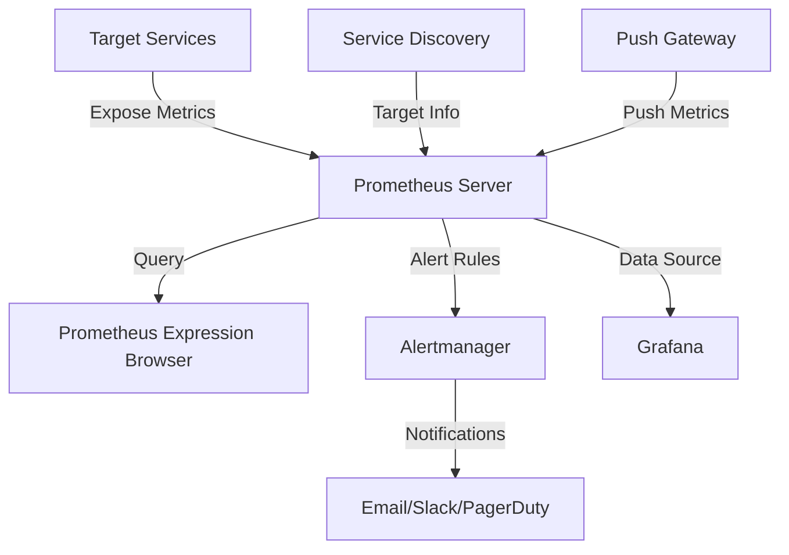

# Introduction to Observability (Prometheus Fundamentals)

## Table of Contents

- [SLO, SLI, and SLA](#slo-sli-and-sla)
- [Prometheus Use Case](#prometheus-use-case)
- [Prometheus Architecture](#prometheus-architecture)
- [Prometheus Installation](#prometheus-installation)
  - [Installation via systemd](#installation-via-systemd)
- [Node Exporter](#node-exporter)
  - [Node Exporter systemd Setup](#node-exporter-systemd-setup)
- [Prometheus Configuration](#prometheus-configuration)
  - [Authentication and Encryption](#authentication-and-encryption)
- [Metrics](#metrics)
- [Exploring Expression Browser](#exploring-expression-browser)
- [Prometheus in Docker Container](#prometheus-in-docker-container)
- [Introduction to PromTools](#introduction-to-promtools)
- [Monitoring Containers](#monitoring-containers)

## SLO, SLI, and SLA

### Service Level Indicators (SLI)
SLIs are quantitative measurements of service level. They are specific metrics that reflect the health of your service.

**Examples:**
- Request latency (how long it takes to return a response)
- Error rate (percentage of requests that fail)
- System throughput (requests per second)
- Availability (percentage of time the service is operational)

### Service Level Objectives (SLO)
SLOs are target values or ranges for SLIs that you want to achieve over a specified period.

**Example:**
- 99.9% of requests will have a latency less than 200ms measured over 30 days
- Error rate will be less than 0.1% over a rolling 7-day period

### Service Level Agreements (SLA)
SLAs are formal agreements between service providers and customers that include consequences if service levels aren't met.

**Relationship:**
```
SLI → SLO → SLA
Measure → Target → Contract
```

**Prometheus Role:** Prometheus excels at collecting and storing SLIs and helps monitor compliance with SLOs.

## Prometheus Use Case

Prometheus is particularly well-suited for:

1. **Dynamic Service-Oriented Architectures**: Microservices, containerized applications
2. **Multi-dimensional Data Model**: Labels allow for flexible querying and aggregation
3. **Operational Monitoring**: Real-time alerting and visualization
4. **Troubleshooting**: Identifying problems through metric correlation

**Typical Use Cases:**
- Monitoring container orchestration systems (Kubernetes, Docker Swarm)
- Monitoring individual microservices
- Tracking application-specific business metrics
- System monitoring (CPU, memory, disk, network)
- Batch job monitoring

## Prometheus Architecture



**Core Components:**

1. **Prometheus Server**: The central component that scrapes and stores time series data
2. **Client Libraries**: Used to instrument application code
3. **Exporters**: Programs that expose metrics from third-party systems
4. **Alertmanager**: Handles alerts and routes notifications
5. **Push Gateway**: Allows short-lived jobs to push metrics
6. **Expression Browser**: Built-in UI for querying metrics

## Prometheus Installation

### Prerequisites
- Linux server (Ubuntu/CentOS/RHEL)
- Sufficient disk space (depends on retention period and metric volume)
- Proper user/group permissions

### Installation Commands

```bash
# Download Prometheus
wget https://github.com/prometheus/prometheus/releases/download/v2.40.1/prometheus-2.40.1.linux-amd64.tar.gz

# Extract the archive
tar xvf prometheus-2.40.1.linux-amd64.tar.gz

# Navigate to Prometheus directory
cd prometheus-2.40.1.linux-amd64

# Test run Prometheus (background)
./prometheus > /dev/null 2>&1 &

# Create Prometheus user
useradd --no-create-home --shell /bin/false prometheus

# Create necessary directories
mkdir /etc/prometheus
mkdir /var/lib/prometheus

# Set ownership
chown prometheus:prometheus /etc/prometheus
chown prometheus:prometheus /var/lib/prometheus

# Copy binaries to local bin directory
cp /root/prometheus-2.40.1.linux-amd64/prometheus /usr/local/bin/
cp /root/prometheus-2.40.1.linux-amd64/promtool /usr/local/bin/

# Set ownership for binaries
chown prometheus:prometheus /usr/local/bin/prometheus
chown prometheus:prometheus /usr/local/bin/promtool

# Copy console libraries and templates
cp -r /root/prometheus-2.40.1.linux-amd64/consoles /etc/prometheus
cp -r /root/prometheus-2.40.1.linux-amd64/console_libraries /etc/prometheus

# Set ownership for console files
chown -R prometheus:prometheus /etc/prometheus/consoles
chown -R prometheus:prometheus /etc/prometheus/console_libraries

# Copy default configuration
cp /root/prometheus-2.40.1.linux-amd64/prometheus.yml /etc/prometheus/prometheus.yml
chown prometheus:prometheus /etc/prometheus/prometheus.yml
```

### Installation via systemd

Create a systemd service file:

```bash
vi /etc/systemd/system/prometheus.service
```

Add the following content:

```ini
[Unit]
Description=Prometheus
Wants=network-online.target
After=network-online.target

[Service]
User=prometheus
Group=prometheus
Type=simple
ExecStart=/usr/local/bin/prometheus \
    --config.file /etc/prometheus/prometheus.yml \
    --storage.tsdb.path /var/lib/prometheus/ \
    --web.console.templates=/etc/prometheus/consoles \
    --web.console.libraries=/etc/prometheus/console_libraries

[Install]
WantedBy=multi-user.target
```

Start and enable the service:

```bash
systemctl daemon-reload
systemctl start prometheus
systemctl enable prometheus
systemctl status prometheus
```

## Node Exporter

Node Exporter is a Prometheus exporter that collects hardware and OS metrics from Linux systems.

### Installation Commands

```bash
# Download Node Exporter
wget https://github.com/prometheus/node_exporter/releases/download/v1.4.0/node_exporter-1.4.0.linux-amd64.tar.gz

# Extract the archive
tar xvf node_exporter-1.4.0.linux-amd64.tar.gz

# Navigate to Node Exporter directory
cd node_exporter-1.4.0.linux-amd64

# Test run Node Exporter (background)
./node_exporter > /dev/null 2>&1 &
```

### Node Exporter systemd Setup

Create a dedicated user for Node Exporter:

```bash
useradd --no-create-home --shell /bin/false nodeusr
```

Create configuration directory:

```bash
mkdir /etc/node_exporter/
touch /etc/node_exporter/config.yml
chmod 700 /etc/node_exporter
chmod 600 /etc/node_exporter/config.yml
chown -R nodeusr:nodeusr /etc/node_exporter
```

Create systemd service file:

```bash
vi /etc/systemd/system/node_exporter.service
```

Add the following content:

```ini
[Unit]
Description=Node Exporter
Wants=network-online.target
After=network-online.target

[Service]
User=nodeusr
Group=nodeusr
Type=simple
ExecStart=/usr/local/bin/node_exporter \
    --web.config.file=/etc/node_exporter/config.yml

[Install]
WantedBy=multi-user.target
```

Start and enable the service:

```bash
systemctl daemon-reload
systemctl start node_exporter
systemctl enable node_exporter
systemctl status node_exporter
```

### Adding Node Exporter to Prometheus Configuration

Update the Prometheus configuration file to scrape metrics from Node Exporter:

```bash
vi /etc/prometheus/prometheus.yml
```

Add the following job to the `scrape_configs` section:

```yaml
scrape_configs:
  # Existing jobs...
  
  - job_name: 'node_exporter'
    static_configs:
      - targets: ['localhost:9100']
        labels:
          instance: 'localhost'
```

Restart Prometheus to apply the changes:

```bash
systemctl restart prometheus
```

## Prometheus Configuration

The primary configuration file is `prometheus.yml`, which includes several main sections:

- `global`: Controls global settings
- `scrape_configs`: Defines targets to scrape
- `alerting`: Configures Alertmanager endpoints
- `rule_files`: Points to recording and alerting rules

### Basic Configuration Example

```yaml
global:
  scrape_interval: 15s
  evaluation_interval: 15s

scrape_configs:
  - job_name: 'prometheus'
    static_configs:
      - targets: ['localhost:9090']

  - job_name: 'node_exporter'
    static_configs:
      - targets: ['localhost:9100', 'node01:9100', 'node02:9100']
```

### Authentication and Encryption

For securing Node Exporter endpoints, you can set up basic authentication and TLS:

1. Generate password hash:

```bash
apt update
apt install apache2-utils -y
htpasswd -nBC 10 "" | tr -d ':\n'; echo
```

2. Create TLS certificates:

```bash
openssl req -new -newkey rsa:2048 -days 365 -nodes -x509 \
    -keyout node_exporter.key -out node_exporter.crt \
    -subj "/C=US/ST=California/L=Oakland/O=MyOrg/CN=localhost" \
    -addext "subjectAltName = DNS:localhost"

mv node_exporter.crt node_exporter.key /etc/node_exporter/
chown nodeusr.nodeusr /etc/node_exporter/node_exporter.key
chown nodeusr.nodeusr /etc/node_exporter/node_exporter.crt
```

3. Configure Node Exporter with TLS and basic auth:

```yaml
# /etc/node_exporter/config.yml
tls_server_config:
  cert_file: /etc/node_exporter/node_exporter.crt
  key_file: /etc/node_exporter/node_exporter.key

basic_auth_users:
  prometheus: "$2y$10$bOOt..." # Your generated password hash
```

4. Update Prometheus configuration to use TLS and auth:

```yaml
# /etc/prometheus/prometheus.yml
scrape_configs:
  - job_name: 'node_exporter_tls'
    scheme: https
    tls_config:
      ca_file: /etc/prometheus/node_exporter.crt
      insecure_skip_verify: true
    basic_auth:
      username: prometheus
      password: your_password
    static_configs:
      - targets: ['node01:9100']
```

Copy the certificate from Node Exporter to Prometheus:

```bash
scp root@node01:/etc/node_exporter/node_exporter.crt /etc/prometheus/node_exporter.crt
chown prometheus.prometheus /etc/prometheus/node_exporter.crt
```

## Metrics

Prometheus metrics follow a specific format and have different types:

### Metric Types

1. **Counter**: Cumulative metric that only increases (e.g., total requests served)
2. **Gauge**: Metric that can go up and down (e.g., memory usage)
3. **Histogram**: Samples observations and counts them in configurable buckets (e.g., request duration)
4. **Summary**: Similar to histogram but also calculates quantiles

### Metric Format

```
metric_name{label1="value1",label2="value2"} value timestamp
```

Example:
```
http_requests_total{method="POST",endpoint="/api/users"} 42 1607022818
```

### Common Metrics

| Metric Type | Common Examples | Use Cases |
|-------------|----------------|-----------|
| Counter | http_requests_total, errors_total | Rate calculations, throughput |
| Gauge | memory_usage_bytes, cpu_usage_percent | Current state monitoring |
| Histogram | http_request_duration_seconds | Latency distribution, percentiles |
| Summary | rpc_duration_seconds | Quantile calculations |

## Exploring Expression Browser

Prometheus includes a built-in web UI accessible at `http://your-prometheus-server:9090`.

### Key Features:

1. **Graph**: Visualize metrics over time
2. **Console**: View raw data
3. **Alerts**: See active alerts
4. **Status**: Check Prometheus configuration and targets
5. **Help**: Access documentation

### Basic Query Examples:

- View all CPU usage metrics: `node_cpu_seconds_total`
- Calculate CPU usage rate (over 5 minutes): `rate(node_cpu_seconds_total{mode="user"}[5m])`
- Memory usage: `node_memory_MemFree_bytes / node_memory_MemTotal_bytes * 100`
- Disk space available: `node_filesystem_avail_bytes / node_filesystem_size_bytes * 100`

## Prometheus in Docker Container

Prometheus can be easily deployed in Docker containers:

```bash
# Create directories for persistent storage
mkdir -p /prometheus/data

# Create prometheus.yml config file
cat > /prometheus/prometheus.yml << EOF
global:
  scrape_interval: 15s

scrape_configs:
  - job_name: 'prometheus'
    static_configs:
      - targets: ['localhost:9090']
EOF

# Run Prometheus container
docker run -d \
  --name prometheus \
  -p 9090:9090 \
  -v /prometheus/prometheus.yml:/etc/prometheus/prometheus.yml \
  -v /prometheus/data:/prometheus \
  prom/prometheus
```

### Docker Compose Example

```yaml
version: '3'
services:
  prometheus:
    image: prom/prometheus
    ports:
      - "9090:9090"
    volumes:
      - ./prometheus.yml:/etc/prometheus/prometheus.yml
      - prometheus_data:/prometheus
    command:
      - '--config.file=/etc/prometheus/prometheus.yml'
      - '--storage.tsdb.path=/prometheus'
      - '--web.console.libraries=/usr/share/prometheus/console_libraries'
      - '--web.console.templates=/usr/share/prometheus/consoles'

volumes:
  prometheus_data:
```

## Introduction to PromTools

PromTools is a collection of utilities that enhance the Prometheus ecosystem:

### Key Tools:

1. **promtool**: Command-line utility for checking configuration and rules
2. **promlens**: Interactive query builder
3. **promql-cli**: Command-line PromQL client
4. **prom2json**: Converts Prometheus metrics to JSON

### promtool Examples:

```bash
# Check configuration
promtool check config /etc/prometheus/prometheus.yml

# Check rules
promtool check rules /etc/prometheus/rules.yml

# Debug metrics
promtool debug metrics http://localhost:9090
```

## Monitoring Containers

### Docker Metrics

To monitor Docker containers, use the cAdvisor exporter:

```bash
docker run \
  --volume=/:/rootfs:ro \
  --volume=/var/run:/var/run:ro \
  --volume=/sys:/sys:ro \
  --volume=/var/lib/docker/:/var/lib/docker:ro \
  --publish=8080:8080 \
  --detach=true \
  --name=cadvisor \
  gcr.io/cadvisor/cadvisor:v0.47.0
```

Add to Prometheus configuration:

```yaml
scrape_configs:
  - job_name: 'cadvisor'
    static_configs:
      - targets: ['localhost:8080']
```

### Kubernetes Metrics

For Kubernetes monitoring, Prometheus Operator simplifies deployment:

```bash
# Install Prometheus Operator using Helm
helm repo add prometheus-community https://prometheus-community.github.io/helm-charts
helm repo update
helm install prometheus prometheus-community/kube-prometheus-stack
```

Key Kubernetes metrics:

- Pod CPU/Memory usage
- Node resource utilization
- API server latency
- Container restart count

This provides a comprehensive monitoring solution for Kubernetes clusters with pre-configured dashboards and alerts.