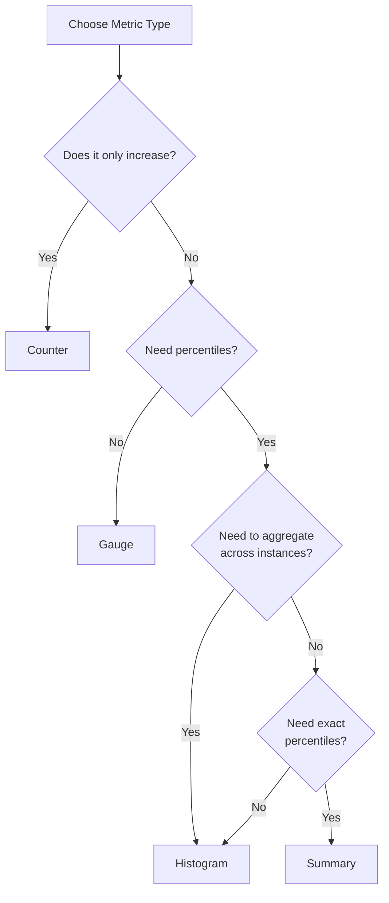

# Application Instruments

## Table of Contents

- [Instrumentation Basics](#instrumentation-basics)
  - [Client Libraries](#client-libraries)
  - [Instrumentation Patterns](#instrumentation-patterns)
- [Labels](#labels)
  - [Best Practices](#label-best-practices)
  - [Common Label Patterns](#common-label-patterns)
- [Metric Types in Detail](#metric-types-in-detail)
  - [Counter](#counter)
  - [Gauge](#gauge)
  - [Histogram](#histogram)
  - [Summary](#summary)
- [Choosing the Right Metric Type](#choosing-the-right-metric-type)
- [Practical Examples](#practical-examples)

## Instrumentation Basics

Instrumentation is the process of adding code to your application to expose metrics that can be collected by Prometheus. Well-instrumented applications provide insights into their behavior, performance, and health.

### Client Libraries

Prometheus provides official client libraries for many programming languages:

| Language | Library |
|----------|---------|
| Go | [prometheus/client_golang](https://github.com/prometheus/client_golang) |
| Python | [prometheus/client_python](https://github.com/prometheus/client_python) |
| Java | [prometheus/client_java](https://github.com/prometheus/client_java) |
| Ruby | [prometheus/client_ruby](https://github.com/prometheus/client_ruby) |
| Node.js | [siimon/prom-client](https://github.com/siimon/prom-client) |
| C# | [prometheus-net/prometheus-net](https://github.com/prometheus-net/prometheus-net) |
| PHP | [endclothing/prometheus_client_php](https://github.com/endclothing/prometheus_client_php) |

### Instrumentation Patterns

#### HTTP Server Example (Go)

```go
package main

import (
	"net/http"
	"time"

	"github.com/prometheus/client_golang/prometheus"
	"github.com/prometheus/client_golang/prometheus/promauto"
	"github.com/prometheus/client_golang/prometheus/promhttp"
)

var (
	// Counter for HTTP requests
	httpRequestsTotal = promauto.NewCounterVec(
		prometheus.CounterOpts{
			Name: "http_requests_total",
			Help: "Total number of HTTP requests",
		},
		[]string{"method", "endpoint", "status"},
	)
	
	// Histogram for request duration
	httpRequestDuration = promauto.NewHistogramVec(
		prometheus.HistogramOpts{
			Name:    "http_request_duration_seconds",
			Help:    "HTTP request duration in seconds",
			Buckets: prometheus.DefBuckets,
		},
		[]string{"method", "endpoint"},
	)
)

func instrumentHandler(next http.HandlerFunc) http.HandlerFunc {
	return func(w http.ResponseWriter, r *http.Request) {
		start := time.Now()
		
		// Call the original handler
		next(w, r)
		
		// Record metrics after the request is processed
		duration := time.Since(start).Seconds()
		httpRequestDuration.WithLabelValues(r.Method, r.URL.Path).Observe(duration)
		httpRequestsTotal.WithLabelValues(r.Method, r.URL.Path, "200").Inc()
	}
}

func helloHandler(w http.ResponseWriter, r *http.Request) {
	w.Write([]byte("Hello, World!"))
}

func main() {
	// Register your application handler with instrumentation
	http.HandleFunc("/hello", instrumentHandler(helloHandler))
	
	// Expose the Prometheus metrics endpoint
	http.Handle("/metrics", promhttp.Handler())
	
	http.ListenAndServe(":8080", nil)
}
```

#### Python Example

```python
from flask import Flask, request
import prometheus_client
from prometheus_client import Counter, Histogram
import time

app = Flask(__name__)

# Create metrics
REQUEST_COUNT = Counter(
    'http_requests_total',
    'Total HTTP Requests',
    ['method', 'endpoint', 'status']
)

REQUEST_LATENCY = Histogram(
    'http_request_duration_seconds',
    'HTTP Request Latency',
    ['method', 'endpoint']
)

# Start up the server to expose the metrics
prometheus_client.start_http_server(8000)

@app.route('/hello')
def hello():
    start_time = time.time()
    
    # Business logic here
    result = "Hello, World!"
    
    # Record request count and latency
    REQUEST_COUNT.labels(
        method=request.method,
        endpoint=request.path,
        status=200
    ).inc()
    
    REQUEST_LATENCY.labels(
        method=request.method,
        endpoint=request.path
    ).observe(time.time() - start_time)
    
    return result

if __name__ == '__main__':
    app.run(host='0.0.0.0', port=8080)
```

#### Java Example (with Spring Boot)

```java
import io.prometheus.client.Counter;
import io.prometheus.client.Histogram;
import io.prometheus.client.exporter.HTTPServer;
import org.springframework.boot.SpringApplication;
import org.springframework.boot.autoconfigure.SpringBootApplication;
import org.springframework.web.bind.annotation.GetMapping;
import org.springframework.web.bind.annotation.RestController;

import javax.annotation.PostConstruct;
import java.io.IOException;

@SpringBootApplication
@RestController
public class Application {

    private static final Counter requestsTotal = Counter.build()
            .name("http_requests_total")
            .help("Total HTTP requests")
            .labelNames("method", "endpoint", "status")
            .register();

    private static final Histogram requestLatency = Histogram.build()
            .name("http_request_duration_seconds")
            .help("HTTP request latency in seconds")
            .labelNames("method", "endpoint")
            .register();

    @PostConstruct
    public void init() throws IOException {
        // Start Prometheus HTTP server on port 8000
        new HTTPServer(8000);
    }

    @GetMapping("/hello")
    public String hello() {
        // Record start time
        Histogram.Timer timer = requestLatency
                .labels("GET", "/hello")
                .startTimer();
        
        // Business logic
        String result = "Hello, World!";
        
        // Stop timer and record request
        timer.observeDuration();
        requestsTotal.labels("GET", "/hello", "200").inc();
        
        return result;
    }

    public static void main(String[] args) {
        SpringApplication.run(Application.class, args);
    }
}
```

## Labels

Labels turn metrics into multi-dimensional data points by adding key-value pairs. They allow for fine-grained filtering and aggregation, but they also increase cardinality.

### Label Best Practices

1. **Use a Reasonable Number of Labels**: Each unique label value combination creates a new time series. Too many labels can cause performance issues.

2. **Choose Stable Labels**: Labels should be stable over time and not result in an unbounded number of values.

   ```
   # Good: Stable, limited cardinality
   http_requests_total{method="GET", status="200", endpoint="/api/users"}
   
   # Bad: Unstable, unbounded cardinality
   http_requests_total{user_id="12345", request_id="a7f93bc"}
   ```

3. **Use Consistent Label Names**: Keep label names consistent across related metrics.

4. **Avoid High Cardinality Labels**: Avoid labels that have many possible values.

5. **Label Naming Conventions**:
   - Use snake_case for label names
   - Be descriptive but concise
   - Use common names for common concepts (e.g., `instance`, `job`)

### Common Label Patterns

| Label | Description | Example Values |
|-------|-------------|----------------|
| `job` | The job name that scraped the metric | "api-server", "node-exporter" |
| `instance` | The instance being scraped | "10.0.0.1:9100", "server-01:8080" |
| `environment` | The deployment environment | "production", "staging", "development" |
| `service` | The service name | "auth-service", "payment-api" |
| `method` | HTTP method | "GET", "POST", "DELETE" |
| `status` | HTTP status code | "200", "404", "500" |
| `endpoint` | API endpoint | "/api/users", "/health" |
| `version` | Software version | "v1.2.3", "2.0" |

### Dynamic vs. Static Labels

- **Static Labels**: Set when the metric is created, typically for dimensions that don't change frequently.
- **Dynamic Labels**: Set when recording metric values, typically for dimensions that vary with each observation.

```go
// Static label (set at initialization)
httpRequestsTotal = prometheus.NewCounter(
    prometheus.CounterOpts{
        Name: "http_requests_total",
        Help: "Total HTTP requests",
        ConstLabels: prometheus.Labels{
            "service": "user-api",
            "version": "v1.2.3",
        },
    },
)

// Dynamic label (set at recording time)
httpRequestsTotal.WithLabelValues("GET", "/users", "200").Inc()
```

## Metric Types in Detail

### Counter

A counter is a cumulative metric that represents a single monotonically increasing value. Counters should only increase or be reset to zero (e.g., on process restart).

**Use Cases**:
- Number of requests served
- Number of errors
- Number of tasks completed
- Number of bytes received/sent

**Counter in Go**:
```go
requestsCounter := prometheus.NewCounter(prometheus.CounterOpts{
    Name: "http_requests_total",
    Help: "Total number of HTTP requests",
})

// Increment the counter
requestsCounter.Inc()

// Increment by a specific amount
requestsCounter.Add(5)
```

**Counter in Python**:
```python
from prometheus_client import Counter

c = Counter('http_requests_total', 'Total HTTP requests')

# Increment the counter
c.inc()

# Increment by a specific amount
c.inc(5)
```

**Counter in Java**:
```java
import io.prometheus.client.Counter;

Counter counter = Counter.build()
    .name("http_requests_total")
    .help("Total HTTP requests")
    .register();

// Increment the counter
counter.inc();

// Increment by a specific amount
counter.inc(5);
```

**Counter with Labels**:
```go
requestsCounter := prometheus.NewCounterVec(
    prometheus.CounterOpts{
        Name: "http_requests_total",
        Help: "Total number of HTTP requests",
    },
    []string{"method", "endpoint"},
)

// Increment counter with specific labels
requestsCounter.WithLabelValues("GET", "/users").Inc()
```

### Gauge

A gauge is a metric that represents a single numerical value that can arbitrarily go up and down. Gauges are appropriate for measured values like temperature, current memory usage, or concurrent requests.

**Use Cases**:
- Memory usage
- Temperature
- Current queue size
- Number of active connections
- CPU utilization

**Gauge in Go**:
```go
temperatureGauge := prometheus.NewGauge(prometheus.GaugeOpts{
    Name: "temperature_celsius",
    Help: "Current temperature in Celsius",
})

// Set to a specific value
temperatureGauge.Set(23.5)

// Increment/decrement
temperatureGauge.Inc()   // +1
temperatureGauge.Dec()   // -1
temperatureGauge.Add(2)  // +2
temperatureGauge.Sub(2)  // -2
```

**Gauge in Python**:
```python
from prometheus_client import Gauge

g = Gauge('temperature_celsius', 'Current temperature in Celsius')

# Set to a specific value
g.set(23.5)

# Increment/decrement
g.inc()   # +1
g.dec()   # -1
g.inc(2)  # +2
g.dec(2)  # -2
```

**Gauge with Labels**:
```go
cpuTemp := prometheus.NewGaugeVec(
    prometheus.GaugeOpts{
        Name: "cpu_temperature_celsius",
        Help: "CPU temperature in Celsius",
    },
    []string{"cpu"},
)

cpuTemp.WithLabelValues("cpu0").Set(65.3)
cpuTemp.WithLabelValues("cpu1").Set(57.8)
```

### Histogram

A histogram samples observations (usually things like request durations or response sizes) and counts them in configurable buckets. It also provides a sum of all observed values.

**Use Cases**:
- Request duration
- Response size
- Queue processing time

**Histogram in Go**:
```go
requestDuration := prometheus.NewHistogram(
    prometheus.HistogramOpts{
        Name:    "http_request_duration_seconds",
        Help:    "HTTP request duration in seconds",
        Buckets: prometheus.DefBuckets, // Default: [.005, .01, .025, .05, .1, .25, .5, 1, 2.5, 5, 10]
    },
)

// Record an observation
requestDuration.Observe(0.42)
```

**Custom Buckets**:
```go
requestDuration := prometheus.NewHistogram(
    prometheus.HistogramOpts{
        Name:    "http_request_duration_seconds",
        Help:    "HTTP request duration in seconds",
        Buckets: []float64{0.001, 0.005, 0.01, 0.05, 0.1, 0.5, 1, 5, 10},
    },
)
```

**Linear Buckets**:
```go
// Creates 10 buckets, starting at 0.1 with width 0.1
prometheus.LinearBuckets(0.1, 0.1, 10) // [0.1, 0.2, 0.3, ..., 1.0]
```

**Exponential Buckets**:
```go
// Creates 10 buckets, starting at 0.001 and doubling each time
prometheus.ExponentialBuckets(0.001, 2, 10) // [0.001, 0.002, 0.004, ..., 0.512]
```

**Histogram with Labels**:
```go
requestDuration := prometheus.NewHistogramVec(
    prometheus.HistogramOpts{
        Name:    "http_request_duration_seconds",
        Help:    "HTTP request duration in seconds",
        Buckets: prometheus.DefBuckets,
    },
    []string{"method", "endpoint"},
)

// Record observation with labels
requestDuration.WithLabelValues("GET", "/users").Observe(0.42)
```

### Summary

A summary is similar to a histogram but calculates configurable quantiles over a sliding time window. This is more expensive than histograms but provides more accurate quantiles.

**Use Cases**:
- Request duration with precise latency percentiles
- Response size with precise percentiles

**Summary in Go**:
```go
requestDuration := prometheus.NewSummary(
    prometheus.SummaryOpts{
        Name:       "http_request_duration_seconds",
        Help:       "HTTP request duration in seconds",
        Objectives: map[float64]float64{0.5: 0.05, 0.9: 0.01, 0.99: 0.001},
    },
)

// Record an observation
requestDuration.Observe(0.42)
```

**Summary with Labels**:
```go
requestDuration := prometheus.NewSummaryVec(
    prometheus.SummaryOpts{
        Name:       "http_request_duration_seconds",
        Help:       "HTTP request duration in seconds",
        Objectives: map[float64]float64{0.5: 0.05, 0.9: 0.01, 0.99: 0.001},
    },
    []string{"method", "endpoint"},
)

// Record observation with labels
requestDuration.WithLabelValues("GET", "/users").Observe(0.42)
```

## Choosing the Right Metric Type

| Metric Type | Use When | Avoid When |
|-------------|----------|------------|
| **Counter** | Measuring something that increases (requests, errors) | Values can decrease (use Gauge instead) |
| **Gauge** | Measuring values that go up and down (temperature, memory) | Measuring cumulative values (use Counter instead) |
| **Histogram** | Measuring distribution of values with predefined buckets | Need exact quantiles or high accuracy (use Summary) |
| **Summary** | Need precise quantiles | Care about performance or need to aggregate across instances (use Histogram) |

### Decision Flowchart



## Practical Examples

### Web Server Instrumentation

```go
package main

import (
	"math/rand"
	"net/http"
	"time"

	"github.com/prometheus/client_golang/prometheus"
	"github.com/prometheus/client_golang/prometheus/promhttp"
)

var (
	// Counter for total requests
	requestsTotal = prometheus.NewCounterVec(
		prometheus.CounterOpts{
			Name: "app_requests_total",
			Help: "Total number of requests",
		},
		[]string{"method", "endpoint", "status"},
	)

	// Histogram for request duration
	requestDuration = prometheus.NewHistogramVec(
		prometheus.HistogramOpts{
			Name:    "app_request_duration_seconds",
			Help:    "Request duration in seconds",
			Buckets: []float64{0.01, 0.05, 0.1, 0.5, 1, 2.5, 5, 10},
		},
		[]string{"method", "endpoint"},
	)

	// Gauge for active requests
	activeRequests = prometheus.NewGauge(
		prometheus.GaugeOpts{
			Name: "app_active_requests",
			Help: "Number of active requests",
		},
	)

	// Gauge for last request timestamp
	lastRequestTimestamp = prometheus.NewGauge(
		prometheus.GaugeOpts{
			Name: "app_last_request_timestamp_seconds",
			Help: "Timestamp of the last request",
		},
	)
)

func init() {
	// Register metrics with Prometheus
	prometheus.MustRegister(requestsTotal)
	prometheus.MustRegister(requestDuration)
	prometheus.MustRegister(activeRequests)
	prometheus.MustRegister(lastRequestTimestamp)
}

func metricsMiddleware(next http.HandlerFunc) http.HandlerFunc {
	return func(w http.ResponseWriter, r *http.Request) {
		// Increment active requests
		activeRequests.Inc()
		defer activeRequests.Dec()

		// Set last request timestamp
		lastRequestTimestamp.SetToCurrentTime()

		// Start timer
		timer := prometheus.NewTimer(requestDuration.WithLabelValues(r.Method, r.URL.Path))
		defer timer.ObserveDuration()

		// Process request
		next(w, r)

		// Record request
		requestsTotal.WithLabelValues(r.Method, r.URL.Path, "200").Inc()
	}
}

func handleRequest(w http.ResponseWriter, r *http.Request) {
	// Simulate processing time
	time.Sleep(time.Duration(rand.Intn(500)) * time.Millisecond)
	w.Write([]byte("Hello, World!"))
}

func main() {
	// Set up HTTP handlers
	http.HandleFunc("/", metricsMiddleware(handleRequest))
	http.Handle("/metrics", promhttp.Handler())

	// Start server
	http.ListenAndServe(":8080", nil)
}
```

### Database Connection Pool Instrumentation

```go
package main

import (
	"database/sql"
	"net/http"
	"time"

	_ "github.com/go-sql-driver/mysql"
	"github.com/prometheus/client_golang/prometheus"
	"github.com/prometheus/client_golang/prometheus/promhttp"
)

var (
	// Gauge for connection pool stats
	dbConnectionsOpen = prometheus.NewGauge(
		prometheus.GaugeOpts{
			Name: "db_connections_open",
			Help: "Number of open DB connections",
		},
	)

	dbConnectionsInUse = prometheus.NewGauge(
		prometheus.GaugeOpts{
			Name: "db_connections_in_use",
			Help: "Number of DB connections in use",
		},
	)

	// Counter for DB operations
	dbOperationsTotal = prometheus.NewCounterVec(
		prometheus.CounterOpts{
			Name: "db_operations_total",
			Help: "Total number of DB operations",
		},
		[]string{"operation", "status"},
	)

	// Histogram for query duration
	dbQueryDuration = prometheus.NewHistogramVec(
		prometheus.HistogramOpts{
			Name:    "db_query_duration_seconds",
			Help:    "DB query duration in seconds",
			Buckets: []float64{0.001, 0.005, 0.01, 0.05, 0.1, 0.5, 1},
		},
		[]string{"operation"},
	)
)

func init() {
	// Register metrics
	prometheus.MustRegister(dbConnectionsOpen)
	prometheus.MustRegister(dbConnectionsInUse)
	prometheus.MustRegister(dbOperationsTotal)
	prometheus.MustRegister(dbQueryDuration)
}

func main() {
	// Connect to database
	db, err := sql.Open("mysql", "user:password@tcp(127.0.0.1:3306)/dbname")
	if err != nil {
		panic(err)
	}
	defer db.Close()

	// Set connection pool settings
	db.SetMaxOpenConns(25)
	db.SetMaxIdleConns(10)
	db.SetConnMaxLifetime(5 * time.Minute)

	// Start background monitoring of DB stats
	go monitorDBStats(db)

	// Expose metrics endpoint
	http.Handle("/metrics", promhttp.Handler())
	http.ListenAndServe(":8080", nil)
}

func monitorDBStats(db *sql.DB) {
	for {
		stats := db.Stats()
		dbConnectionsOpen.Set(float64(stats.OpenConnections))
		dbConnectionsInUse.Set(float64(stats.InUse))
		time.Sleep(1 * time.Second)
	}
}

func executeQuery(db *sql.DB, operation string, query string, args ...interface{}) (result *sql.Rows, err error) {
	timer := prometheus.NewTimer(dbQueryDuration.WithLabelValues(operation))
	defer timer.ObserveDuration()

	result, err = db.Query(query, args...)
	if err != nil {
		dbOperationsTotal.WithLabelValues(operation, "error").Inc()
		return nil, err
	}

	dbOperationsTotal.WithLabelValues(operation, "success").Inc()
	return result, nil
}
```

### Batch Job Instrumentation

```go
package main

import (
	"net/http"
	"time"

	"github.com/prometheus/client_golang/prometheus"
	"github.com/prometheus/client_golang/prometheus/promhttp"
)

var (
	// Gauge for job status (0 = not running, 1 = running)
	jobStatus = prometheus.NewGaugeVec(
		prometheus.GaugeOpts{
			Name: "batch_job_status",
			Help: "Status of the batch job (0=not running, 1=running)",
		},
		[]string{"job_name"},
	)

	// Counter for job executions
	jobExecutions = prometheus.NewCounterVec(
		prometheus.CounterOpts{
			Name: "batch_job_executions_total",
			Help: "Total number of job executions",
		},
		[]string{"job_name", "status"},
	)

	// Counter for processed items
	itemsProcessed = prometheus.NewCounterVec(
		prometheus.CounterOpts{
			Name: "batch_job_items_processed_total",
			Help: "Total number of items processed by the job",
		},
		[]string{"job_name"},
	)

	// Gauge for last execution timestamp
	lastExecutionTimestamp = prometheus.NewGaugeVec(
		prometheus.GaugeOpts{
			Name: "batch_job_last_execution_timestamp_seconds",
			Help: "Timestamp of the last job execution",
		},
		[]string{"job_name"},
	)

	// Histogram for job duration
	jobDuration = prometheus.NewHistogramVec(
		prometheus.HistogramOpts{
			Name:    "batch_job_duration_seconds",
			Help:    "Duration of job execution in seconds",
			Buckets: []float64{1, 5, 10, 30, 60, 300, 600, 1800},
		},
		[]string{"job_name"},
	)
)

func init() {
	// Register metrics
	prometheus.MustRegister(jobStatus)
	prometheus.MustRegister(jobExecutions)
	prometheus.MustRegister(itemsProcessed)
	prometheus.MustRegister(lastExecutionTimestamp)
	prometheus.MustRegister(jobDuration)
}

func executeJob(jobName string, processItems func() int) {
	// Set job as running
	jobStatus.WithLabelValues(jobName).Set(1)
	jobExecutions.WithLabelValues(jobName, "started").Inc()
	lastExecutionTimestamp.WithLabelValues(jobName).SetToCurrentTime()

	// Start timer
	timer := prometheus.NewTimer(jobDuration.WithLabelValues(jobName))

	// Track success/failure
	success := true

	// Execute job
	defer func() {
		// Stop timer
		timer.ObserveDuration()

		// Set job as not running
		jobStatus.WithLabelValues(jobName).Set(0)

		// Record completion status
		if success {
			jobExecutions.WithLabelValues(jobName, "success").Inc()
		} else {
			jobExecutions.WithLabelValues(jobName, "failure").Inc()
		}
	}()

	// Handle panics
	defer func() {
		if r := recover(); r != nil {
			success = false
		}
	}()

	// Process items and count them
	itemCount := processItems()
	itemsProcessed.WithLabelValues(jobName).Add(float64(itemCount))
}

func main() {
	// Start metrics server
	http.Handle("/metrics", promhttp.Handler())
	go http.ListenAndServe(":8080", nil)

	// Run job every minute
	for {
		executeJob("data_processor", func() int {
			// Simulate processing
			time.Sleep(3 * time.Second)
			return 100 // Processed 100 items
		})

		time.Sleep(1 * time.Minute)
	}
}
```