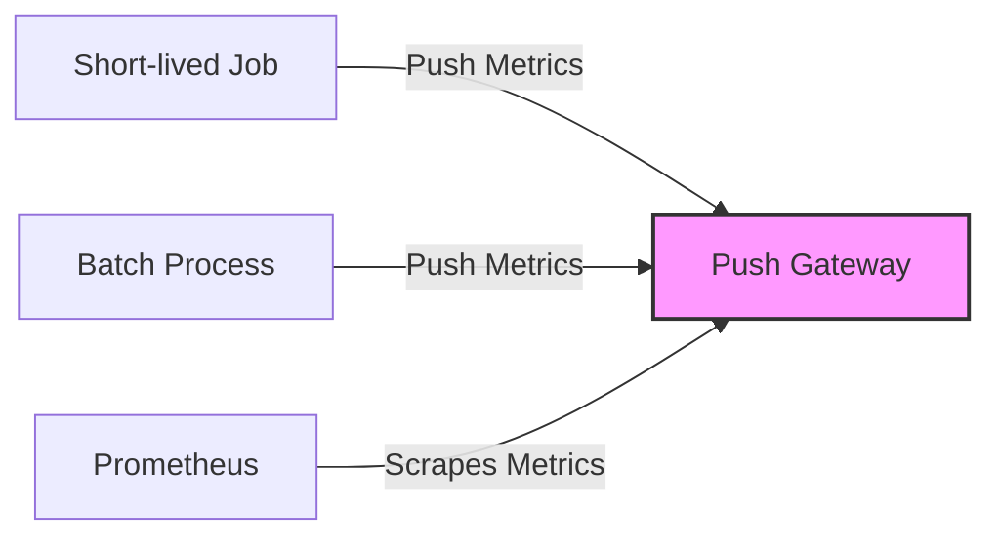

# Service Discovery and Push Gateway in Prometheus

## Table of Contents
- [1. Service Discovery](#1-service-discovery)
  - [1.1 Introduction to Service Discovery](#11-introduction-to-service-discovery)
  - [1.2 File-based Service Discovery](#12-file-based-service-discovery)
  - [1.3 Dynamic Service Discovery](#13-dynamic-service-discovery)
  - [1.4 Relabeling](#14-relabeling)
- [2. Push Gateway](#2-push-gateway)
  - [2.1 Introduction to Push Gateway](#21-introduction-to-push-gateway)
  - [2.2 Push Gateway Installation](#22-push-gateway-installation)
  - [2.3 Pushing Metrics](#23-pushing-metrics)
  - [2.4 Client Libraries for Push Gateway](#24-client-libraries-for-push-gateway)
  - [2.5 Best Practices](#25-best-practices)

## 1. Service Discovery

### 1.1 Introduction to Service Discovery

Service Discovery in Prometheus is the mechanism for automatically finding and monitoring targets in dynamic environments. Instead of manually configuring each target, service discovery allows Prometheus to adapt to changing infrastructure.

**Benefits of Service Discovery:**
- Automatic target detection in dynamic environments
- Reduced configuration maintenance
- Increased reliability and adaptability
- Better scalability with growing infrastructure

**Common Service Discovery Mechanisms:**
- File-based service discovery
- Kubernetes service discovery
- Consul service discovery
- AWS EC2 service discovery
- Azure service discovery
- DNS-based service discovery
- Others (Docker, Eureka, OpenStack, etc.)

### 1.2 File-based Service Discovery

File-based service discovery is the simplest form of service discovery where Prometheus reads targets from files. It's particularly useful for static environments or when integrating with external systems that can generate these files.

#### Configuration

To configure file-based service discovery in Prometheus, you need to modify the `prometheus.yml` configuration file:

```yaml
scrape_configs:
  - job_name: 'file_sd_targets'
    file_sd_configs:
      - files:
          - '/etc/prometheus/file_sd/*.json'
          - '/etc/prometheus/file_sd/*.yml'
        refresh_interval: 30s
```

The `refresh_interval` determines how often Prometheus checks for changes in the files.

#### File Formats

Prometheus supports both JSON and YAML formats for file-based service discovery:

**JSON Format Example:**
```json
[
  {
    "targets": ["10.0.0.1:9100", "10.0.0.2:9100"],
    "labels": {
      "env": "production",
      "job": "node_exporter"
    }
  },
  {
    "targets": ["10.0.0.3:9090"],
    "labels": {
      "env": "staging",
      "job": "prometheus"
    }
  }
]
```

**YAML Format Example:**
```yaml
- targets:
  - 10.0.0.1:9100
  - 10.0.0.2:9100
  labels:
    env: production
    job: node_exporter
- targets:
  - 10.0.0.3:9090
  labels:
    env: staging
    job: prometheus
```

#### Practical Implementation

1. Create a directory for the service discovery files:
   ```bash
   sudo mkdir -p /etc/prometheus/file_sd
   ```

2. Create a service discovery file:
   ```bash
   sudo nano /etc/prometheus/file_sd/nodes.json
   ```

3. Add the target information to the file:
   ```json
   [
     {
       "targets": ["server1:9100", "server2:9100"],
       "labels": {
         "env": "production",
         "team": "infrastructure"
       }
     }
   ]
   ```

4. Update the Prometheus configuration to use this file:
   ```yaml
   scrape_configs:
     - job_name: 'nodes'
       file_sd_configs:
         - files:
             - '/etc/prometheus/file_sd/nodes.json'
           refresh_interval: 5m
   ```

5. Restart Prometheus to apply the changes:
   ```bash
   sudo systemctl restart prometheus
   ```

### 1.3 Dynamic Service Discovery

While file-based service discovery is useful, Prometheus excels at integrating with popular service discovery mechanisms in dynamic environments.

#### Kubernetes Service Discovery

For Kubernetes environments, Prometheus can discover and monitor pods, services, endpoints, and more:

```yaml
scrape_configs:
  - job_name: 'kubernetes-pods'
    kubernetes_sd_configs:
      - role: pod
        api_server: 'https://kubernetes.default.svc.cluster.local'
        tls_config:
          ca_file: /var/run/secrets/kubernetes.io/serviceaccount/ca.crt
        bearer_token_file: /var/run/secrets/kubernetes.io/serviceaccount/token
```

**Available roles:** `node`, `pod`, `service`, `endpoints`, `ingress`, `endpointslice`

#### Consul Service Discovery

For Consul-based service discovery:

```yaml
scrape_configs:
  - job_name: 'consul-services'
    consul_sd_configs:
      - server: 'localhost:8500'
        services: []  # Empty list means all services
```

#### AWS EC2 Service Discovery

For AWS EC2 instances:

```yaml
scrape_configs:
  - job_name: 'ec2-instances'
    ec2_sd_configs:
      - region: us-east-1
        access_key: YOUR_ACCESS_KEY
        secret_key: YOUR_SECRET_KEY
        port: 9100
```

### 1.4 Relabeling

Relabeling is a powerful feature in Prometheus that allows you to manipulate labels before metrics are stored. It's especially useful with service discovery to filter targets or modify their metadata.

#### Types of Relabeling

1. **relabel_configs**: Processed before target scraping
2. **metric_relabel_configs**: Processed after target scraping but before storage

#### Common Relabeling Actions

- `replace`: Replace a label value
- `keep`: Keep targets with matching label values
- `drop`: Drop targets with matching label values
- `labelmap`: Map regex capture groups to labels
- `labeldrop`: Remove labels matching regex
- `labelkeep`: Keep only labels matching regex

#### Example: Filtering Targets

This example keeps only targets with a specific label value:

```yaml
scrape_configs:
  - job_name: 'kubernetes-pods'
    kubernetes_sd_configs:
      - role: pod
    relabel_configs:
      - source_labels: [__meta_kubernetes_pod_annotation_prometheus_io_scrape]
        action: keep
        regex: true
```

#### Example: Extracting Labels from Target Names

```yaml
scrape_configs:
  - job_name: 'services'
    file_sd_configs:
      - files:
          - '/etc/prometheus/file_sd/*.json'
    relabel_configs:
      - source_labels: [__address__]
        regex: '(.*):.*'
        target_label: instance
        replacement: '${1}'
```

#### Example: Complete Relabeling Workflow

```yaml
scrape_configs:
  - job_name: 'web-servers'
    file_sd_configs:
      - files: ['/etc/prometheus/file_sd/servers.json']
    relabel_configs:
      # Keep only targets with environment=production
      - source_labels: [environment]
        action: keep
        regex: production
      
      # Extract hostname from address
      - source_labels: [__address__]
        regex: '([^:]+)(?::\d+)?'
        target_label: hostname
        replacement: '${1}'
      
      # Add a region label based on datacenter
      - source_labels: [datacenter]
        regex: 'dc-(us|eu|asia).*'
        target_label: region
        replacement: '${1}'
        
      # Drop any test labels
      - regex: 'test_.*'
        action: labeldrop
```

## 2. Push Gateway

### 2.1 Introduction to Push Gateway

The Prometheus Push Gateway is a component that allows ephemeral and batch jobs to expose their metrics to Prometheus. Unlike the standard pull model, the Push Gateway accepts metrics pushed to it and exposes them for Prometheus to scrape.

**Why Use Push Gateway:**
- For short-lived jobs that may complete before Prometheus scrapes them
- For batch jobs that run at irregular intervals
- For services behind firewalls that Prometheus can't reach directly
- For jobs in environments where a pull model isn't feasible



**Important Considerations:**
- Push Gateway is an intermediary that introduces a single point of failure
- Metrics persist until explicitly deleted or the Push Gateway restarts
- It's not designed for scaling to hundreds of clients
- It should not be used for regular monitoring of persistently running services

### 2.2 Push Gateway Installation

#### Using Binary Release

1. Download the latest release from the [Prometheus Push Gateway GitHub repository](https://github.com/prometheus/pushgateway/releases):
   ```bash
   wget https://github.com/prometheus/pushgateway/releases/download/v1.6.2/pushgateway-1.6.2.linux-amd64.tar.gz
   ```

2. Extract the archive:
   ```bash
   tar xvfz pushgateway-1.6.2.linux-amd64.tar.gz
   ```

3. Move the binary to a standard location:
   ```bash
   sudo mv pushgateway-1.6.2.linux-amd64/pushgateway /usr/local/bin/
   ```

4. Create a systemd service file:
   ```bash
   sudo nano /etc/systemd/system/pushgateway.service
   ```

5. Add the following content to the service file:
   ```
   [Unit]
   Description=Prometheus Push Gateway
   Wants=network-online.target
   After=network-online.target

   [Service]
   User=prometheus
   Group=prometheus
   Type=simple
   ExecStart=/usr/local/bin/pushgateway \
       --web.listen-address=":9091" \
       --web.telemetry-path="/metrics" \
       --persistence.file="/var/lib/pushgateway/metrics.json" \
       --persistence.interval=5m

   Restart=always

   [Install]
   WantedBy=multi-user.target
   ```

6. Create the persistence directory:
   ```bash
   sudo mkdir -p /var/lib/pushgateway
   sudo chown prometheus:prometheus /var/lib/pushgateway
   ```

7. Start and enable the service:
   ```bash
   sudo systemctl daemon-reload
   sudo systemctl start pushgateway
   sudo systemctl enable pushgateway
   ```

#### Using Docker

For a quick setup, you can use Docker:

```bash
docker run -d \
  --name=pushgateway \
  -p 9091:9091 \
  prom/pushgateway
```

With persistence:

```bash
docker run -d \
  --name=pushgateway \
  -p 9091:9091 \
  -v /path/to/persistence:/data \
  prom/pushgateway \
  --persistence.file=/data/metrics.json \
  --persistence.interval=5m
```

#### Configure Prometheus to Scrape Push Gateway

Add the following to your `prometheus.yml`:

```yaml
scrape_configs:
  - job_name: 'pushgateway'
    honor_labels: true  # Important: Preserves labels from pushed metrics
    static_configs:
      - targets: ['pushgateway:9091']
```

The `honor_labels: true` directive is crucial as it preserves the job and instance labels set during the push.

### 2.3 Pushing Metrics

#### Using cURL

The simplest way to push metrics is using cURL:

```bash
echo "some_metric 3.14" | curl --data-binary @- http://pushgateway:9091/metrics/job/job_name
```

To add instance label:

```bash
echo "some_metric 3.14" | curl --data-binary @- http://pushgateway:9091/metrics/job/job_name/instance/instance_name
```

With additional labels:

```bash
echo "some_metric{label=\"value\"} 3.14" | curl --data-binary @- http://pushgateway:9091/metrics/job/job_name
```

#### Multiple Metrics at Once

You can push multiple metrics in one request:

```bash
cat <<EOF | curl --data-binary @- http://pushgateway:9091/metrics/job/batch_job/instance/batch1
# TYPE process_cpu_seconds counter
process_cpu_seconds 123.4
# TYPE memory_usage gauge
memory_usage{area="heap"} 8234342
memory_usage{area="stack"} 235342
EOF
```

#### HTTP Methods for Push Gateway

- **POST**: Replace all metrics for the group identified by the URL
- **PUT**: Replace metrics with the same name for the group
- **DELETE**: Delete metrics for the group

Examples:

```bash
# Replace all metrics for the job
curl -X POST --data-binary @metrics.txt http://pushgateway:9091/metrics/job/job_name

# Replace only matching metrics
curl -X PUT --data-binary @metrics.txt http://pushgateway:9091/metrics/job/job_name

# Delete all metrics for this job and instance
curl -X DELETE http://pushgateway:9091/metrics/job/job_name/instance/instance_name
```

### 2.4 Client Libraries for Push Gateway

Prometheus client libraries provide built-in support for pushing metrics to the Push Gateway.

#### Python Example

Using the `prometheus_client` library:

```python
from prometheus_client import CollectorRegistry, Gauge, push_to_gateway

# Create a registry and metric
registry = CollectorRegistry()
g = Gauge('job_last_success_unixtime', 
          'Last time the batch job succeeded', 
          registry=registry)
g.set_to_current_time()

# Push to the Push Gateway
push_to_gateway('localhost:9091', 
                job='batch_job', 
                registry=registry)
```

With additional grouping labels:

```python
push_to_gateway('localhost:9091', 
                job='batch_job', 
                registry=registry,
                grouping_key={'instance': 'batch1'})
```

#### Go Example

Using the official Go client:

```go
package main

import (
	"github.com/prometheus/client_golang/prometheus"
	"github.com/prometheus/client_golang/prometheus/push"
)

func main() {
	completionTime := prometheus.NewGauge(prometheus.GaugeOpts{
		Name: "job_last_success_unixtime",
		Help: "Last time the batch job succeeded, in unix time.",
	})
	completionTime.SetToCurrentTime()
	
	// Create a Pusher and add the metric
	pusher := push.New("http://localhost:9091", "batch_job")
	pusher.Collector(completionTime)
	
	// Add an instance label
	pusher.Grouping("instance", "batch1")
	
	// Push metrics
	if err := pusher.Push(); err != nil {
		log.Fatal("Could not push to Pushgateway:", err)
	}
}
```

#### Node.js Example

Using the `prom-client` package:

```javascript
const client = require('prom-client');
const gateway = new client.Pushgateway('http://localhost:9091');

// Create a registry
const registry = new client.Registry();

// Create a gauge
const gauge = new client.Gauge({
    name: 'job_last_success_unixtime',
    help: 'Last time the batch job succeeded',
    registers: [registry]
});

// Set the gauge value
gauge.setToCurrentTime();

// Push metrics
gateway.pushAdd({ jobName: 'batch_job', groupings: { instance: 'batch1' } }, registry)
    .then(() => console.log('Metrics pushed successfully'))
    .catch((err) => console.error('Error pushing metrics:', err));
```

### 2.5 Best Practices

#### When to Use Push Gateway

✅ **Good Use Cases:**
- Short-lived batch jobs (ETL processes, cron jobs)
- Jobs that run too infrequently to be reliably scraped
- Systems that can't be directly reached by Prometheus

❌ **Bad Use Cases:**
- Long-running services that could be scraped directly
- As a proxy for all metrics collection
- When you need real-time monitoring (Push Gateway introduces delays)

#### Security Considerations

- The Push Gateway has no built-in authentication
- Consider using a reverse proxy for TLS and authentication:

Using Nginx example:

```nginx
server {
    listen 443 ssl;
    server_name pushgateway.example.com;

    ssl_certificate /etc/nginx/ssl/pushgateway.crt;
    ssl_certificate_key /etc/nginx/ssl/pushgateway.key;

    auth_basic "Restricted";
    auth_basic_user_file /etc/nginx/htpasswd;

    location / {
        proxy_pass http://localhost:9091;
        proxy_set_header Host $host;
        proxy_set_header X-Real-IP $remote_addr;
    }
}
```

#### Metrics Lifecycle Management

Since metrics persist in the Push Gateway until deletion, implement a cleanup strategy:
- Use unique instance labels for each job run
- Delete metrics after they're no longer needed
- Set up TTL mechanisms through external processes

**Example cleanup script:**

```bash
#!/bin/bash
# Delete metrics for jobs older than 24 hours
curl -X DELETE http://pushgateway:9091/metrics/job/daily_backup/instance/$(date --date="yesterday" +%Y%m%d)
```

#### Useful Push Gateway Flags

| Flag | Description | Example |
|------|-------------|---------|
| `--web.listen-address` | Address on which to expose metrics | `--web.listen-address=":9091"` |
| `--web.telemetry-path` | Path under which to expose metrics | `--web.telemetry-path="/metrics"` |
| `--persistence.file` | File to persist metrics | `--persistence.file="/data/metrics.json"` |
| `--persistence.interval` | Duration between persistence writes | `--persistence.interval=5m` |
| `--web.enable-admin-api` | Enable API for admin operations | `--web.enable-admin-api` |
| `--web.enable-lifecycle` | Enable shutdown via API | `--web.enable-lifecycle` |

#### Monitoring the Push Gateway Itself

Ensure you monitor the Push Gateway as it becomes a critical component:

```yaml
scrape_configs:
  - job_name: 'pushgateway_health'
    static_configs:
      - targets: ['pushgateway:9091']
    metrics_path: '/metrics'
```

Key metrics to alert on:
- `push_time_seconds` (latency of push operations)
- `pushgateway_http_requests_total` (request count by code, method)
- `process_resident_memory_bytes` (memory usage)