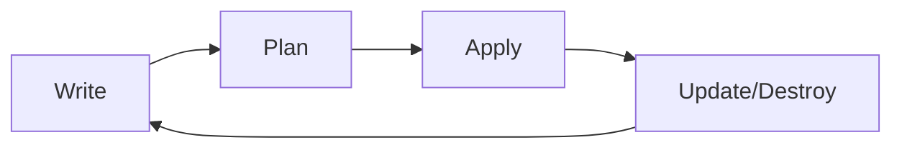

# Introduction to Infrastructure as Code (IaC)

## Table of Contents
- [Challenges with Traditional IT Infrastructure](#challenges-with-traditional-it-infrastructure)
- [Types of Infrastructure as Code Tools](#types-of-infrastructure-as-code-tools)
  - [Configuration Management Tools](#configuration-management-tools)
  - [Server Templating Tools](#server-templating-tools)
  - [Infrastructure Provisioning Tools](#infrastructure-provisioning-tools)
- [What is Terraform?](#what-is-terraform)
  - [Core Features of Terraform](#core-features-of-terraform)
  - [How Terraform Solves Traditional IT Challenges](#how-terraform-solves-traditional-it-challenges)
- [Terraform Workflow](#terraform-workflow)

## Challenges with Traditional IT Infrastructure

Traditional IT infrastructure management was characterized by several significant challenges:

| Challenge | Description | Impact |
|-----------|-------------|--------|
| **Manual Processes** | Infrastructure setup and changes performed manually through web consoles or GUI interfaces | Prone to human error, inconsistent results, poor documentation |
| **Configuration Drift** | Differences between intended configuration and actual configuration | Unreliable systems, unexpected behavior, troubleshooting difficulties |
| **Scaling Limitations** | Difficulty in scaling infrastructure as needs grow | Slow deployment of new resources, business agility constraints |
| **Environment Inconsistency** | Inconsistencies between development, testing, and production environments | "Works on my machine" syndrome, unexpected behavior in production |
| **Knowledge Silos** | Infrastructure knowledge concentrated in specific individuals | Single points of failure, operational bottlenecks |
| **Documentation Challenges** | Difficulty maintaining up-to-date documentation | Knowledge gaps, troubleshooting difficulties |
| **Collaboration Barriers** | Limited ability for teams to collaborate on infrastructure changes | Slower innovation, increased risk when making changes |
| **Disaster Recovery** | Lengthy recovery times due to manual recreation procedures | Business continuity risks, extended downtime |

## Types of Infrastructure as Code Tools

### Configuration Management Tools

Configuration management tools focus on installing and managing software on existing servers.

- **Examples:**
  - Ansible
  - Chef
  - Puppet
  - SaltStack

- **Key Capabilities:**
  - Software installation and configuration
  - Ensuring system state
  - Configuration enforcement
  - Often use an agent-based architecture

### Server Templating Tools

Server templating tools are used to create machine images with preinstalled software and configurations.

- **Examples:**
  - Docker
  - Packer
  - Vagrant

- **Key Capabilities:**
  - Creating immutable infrastructure
  - Standardizing server configurations
  - Enabling container-based deployments
  - Faster server provisioning

### Infrastructure Provisioning Tools

Infrastructure provisioning tools focus on creating the infrastructure itself - servers, databases, networks, etc.

- **Examples:**
  - Terraform
  - AWS CloudFormation
  - Azure Resource Manager (ARM) Templates
  - Google Cloud Deployment Manager

- **Key Capabilities:**
  - Creating and managing entire infrastructure stacks
  - Cross-platform/multi-cloud capabilities (for some tools)
  - Infrastructure lifecycle management
  - State management

## What is Terraform?

Terraform is an open-source infrastructure as code tool created by HashiCorp that enables users to define and provision infrastructure using a declarative configuration language called HashiCorp Configuration Language (HCL).

### Core Features of Terraform

- **Declarative Language**: Users define the desired end state rather than the steps to get there
- **Multi-Cloud Capability**: Works with numerous cloud providers (AWS, Azure, GCP, etc.)
- **State Management**: Tracks resource state to manage changes and dependencies
- **Resource Graph**: Creates a dependency graph for efficient resource creation/modification
- **Provider Ecosystem**: Extensive provider ecosystem for various platforms
- **Plan & Apply Workflow**: Preview changes before applying them
- **Modular Design**: Reusable modules for infrastructure components

### How Terraform Solves Traditional IT Challenges

| Traditional Challenge | Terraform Solution |
|-----------------------|-------------------|
| Manual Processes | Automated, repeatable infrastructure provisioning through code |
| Configuration Drift | State management that reconciles actual vs. desired state |
| Scaling Limitations | Easy replication of infrastructure components at scale |
| Environment Inconsistency | Consistent environments through identical code across all stages |
| Knowledge Silos | Infrastructure defined as code, accessible to all team members |
| Documentation Challenges | Self-documenting infrastructure through code |
| Collaboration Barriers | Version control for infrastructure enabling collaboration |
| Disaster Recovery | Rapid recovery by reapplying configuration to new resources |

## Terraform Workflow

Terraform follows a simple workflow:

1. **Write**: Author infrastructure as code in HCL
2. **Plan**: Preview changes before applying them
3. **Apply**: Execute the planned changes to create/modify infrastructure
4. **Update/Destroy**: Modify or teardown infrastructure as needed

This workflow creates a feedback loop allowing for iterative development of infrastructure.