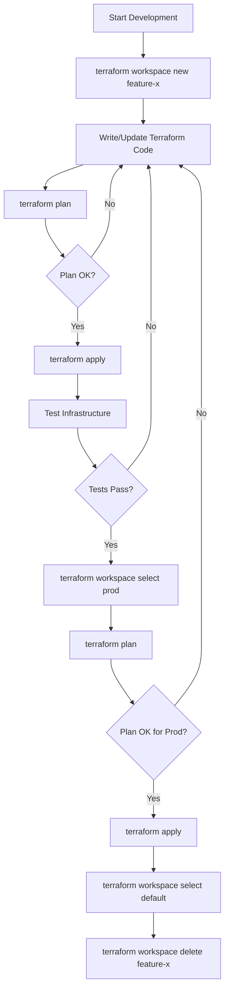

# Terraform Advanced Guide

## Table of Contents
- [Terraform Taint and Untaint](#terraform-taint-and-untaint)
- [Debugging in Terraform](#debugging-in-terraform)
- [Terraform Imports](#terraform-imports)
- [Terraform Modules](#terraform-modules)
  - [Creating and Using Modules](#creating-and-using-modules)
  - [Using Modules from the Registry](#using-modules-from-the-registry)
- [Terraform Functions](#terraform-functions)
  - [Numeric Functions](#numeric-functions)
  - [String Functions](#string-functions)
  - [Collection Functions](#collection-functions)
  - [Type Conversion Functions](#type-conversion-functions)
- [Terraform Conditional Expressions](#terraform-conditional-expressions)
- [Terraform Workspaces](#terraform-workspaces)

## Terraform Taint and Untaint

### Theory

Tainting a resource marks it for destruction and recreation during the next `terraform apply`. This is useful when:
- A resource is in an inconsistent state
- You want to force the recreation of a specific resource
- You need to trigger dependent resource updates

The untaint command reverses this operation, removing the taint marker from a resource.

### Practical Usage

#### Tainting a Resource

```bash
# Basic syntax
terraform taint [options] ADDRESS

# Example - tainting an AWS instance
terraform taint aws_instance.web_server

# Tainting a resource within a module
terraform taint module.app.aws_instance.example

# Tainting a resource in a specific state file
terraform taint -state=path/to/state aws_instance.web_server
```

#### Untainting a Resource

```bash
# Basic syntax
terraform untaint [options] ADDRESS

# Example - untainting an AWS instance
terraform untaint aws_instance.web_server

# Untainting a resource within a module
terraform untaint module.app.aws_instance.example

# Untainting with specific state file
terraform untaint -state=path/to/state aws_instance.web_server
```

#### Command Options

| Option | Description |
|--------|-------------|
| `-allow-missing` | Don't error if the resource doesn't exist |
| `-backup=path` | Path to backup the state file |
| `-lock=true` | Lock the state file when locking is supported |
| `-lock-timeout=0s` | Duration to retry a state lock |
| `-state=path` | Path to read and write state (instead of default) |

### Important Notes

- Tainting is being **deprecated** in favor of the `-replace` flag with `terraform apply`
- Modern replacement command: `terraform apply -replace="aws_instance.web_server"`
- Tainting doesn't immediately destroy the resource; it happens during the next apply
- Tainting affects dependent resources due to Terraform's dependency graph
- Tainting works with state as of Terraform 0.15.2; any resources deleted from configuration but still in state can be tainted

## Debugging in Terraform

### Theory

Terraform offers debugging capabilities to help troubleshoot issues with configurations, providers, and execution. Debugging in Terraform involves:
- Log level control
- Environment variables for debugging
- Crash log analysis
- Provider debugging

### Practical Usage

#### Log Levels

Terraform uses the `TF_LOG` environment variable to enable logging:

```bash
# Available log levels (most to least verbose)
# TRACE, DEBUG, INFO, WARN, ERROR

# Enable maximum logging
export TF_LOG=TRACE

# Enable specific subsystem logging
export TF_LOG_CORE=TRACE    # Core Terraform functionality
export TF_LOG_PROVIDER=TRACE  # Provider-specific operations

# Log to a file
export TF_LOG_PATH=./terraform.log

# Run Terraform with logging enabled
TF_LOG=DEBUG terraform apply
```

#### Crash Logs

When Terraform crashes, it creates a crash log file in the current directory:

```bash
# Example crash log file
crash.log

# To capture crash logs to specific location
export TF_LOG_PATH=./debug.log
```

#### Provider Debugging

For provider-specific debugging:

```bash
# AWS provider debugging
export AWS_DEBUG=true
export AWS_DEBUG_REQUEST=true
export AWS_DEBUG_RESPONSE=true

# Azure provider debugging
export ARM_CLIENT_ID=xxx
export ARM_CLIENT_SECRET=xxx
export ARM_SUBSCRIPTION_ID=xxx
export ARM_TENANT_ID=xxx
export ARM_DEBUG=1
```

### Advanced Debugging Techniques

1. **Structured Tracing**:
```bash
export TF_LOG_CORE=TRACE
export TF_LOG_PATH=./terraform.trace.json
export TF_LOG_JSON=1
```

2. **Single Resource Targeting**:
```bash
terraform apply -target=aws_instance.example
```

3. **Provider Plugin Cache**:
```bash
export TF_PLUGIN_CACHE_DIR="$HOME/.terraform.d/plugin-cache"
mkdir -p "$TF_PLUGIN_CACHE_DIR"
```

## Terraform Imports

### Theory

Terraform imports allow you to bring existing infrastructure under Terraform management. This is useful when:
- Taking over manual or previously unmanaged infrastructure
- Recovering from state loss
- Moving resources between state files
- Copying resources across environments

### Practical Usage

#### Basic Import Command

```bash
# Syntax
terraform import [options] ADDRESS ID

# Example - importing an AWS instance
terraform import aws_instance.web_server i-1234567890abcdef0

# Importing resources into modules
terraform import module.app.aws_instance.web_server i-1234567890abcdef0

# Importing with a different state file
terraform import -state=staging.tfstate aws_instance.web_server i-1234567890abcdef0
```

#### Import Options

| Option | Description |
|--------|-------------|
| `-backup=path` | Path to backup the state file |
| `-config=path` | Path to config directory |
| `-input=true` | Ask for input for variables if not directly set |
| `-lock=true` | Lock the state file when locking is supported |
| `-lock-timeout=0s` | Duration to retry a state lock |
| `-no-color` | Disable color output |
| `-state=path` | Path to read and write state |
| `-state-out=path` | Path to write updated state file |
| `-var 'foo=bar'` | Set a variable in the Terraform configuration |
| `-var-file=path` | Set variables from a file |

#### Import Workflow

1. **Create Configuration**: First, write the resource configuration block in your `.tf` files:

```hcl
resource "aws_instance" "web_server" {
  # Required attributes must be defined
  instance_type = "t2.micro"
  ami           = "ami-0c55b159cbfafe1f0"
  
  # Other attributes will be filled from the imported state
  # But you should add them later for better configuration management
}
```

2. **Run Import Command**:
```bash
terraform import aws_instance.web_server i-1234567890abcdef0
```

3. **Update Configuration**:
Run `terraform plan` to see any differences and update your configuration:

```hcl
resource "aws_instance" "web_server" {
  instance_type = "t2.micro"
  ami           = "ami-0c55b159cbfafe1f0"
  subnet_id     = "subnet-0123456789abcdef0"
  vpc_security_group_ids = ["sg-0123456789abcdef0"]
  # Add all attributes discovered from the imported state
}
```

### Import Block (Terraform 1.5+)

Terraform 1.5 introduced declarative import blocks:

```hcl
import {
  to = aws_instance.web_server
  id = "i-1234567890abcdef0"
}

resource "aws_instance" "web_server" {
  # Configuration...
}
```

Run with:
```bash
terraform plan -generate-config-out=generated_resources.tf
```

### Multi-Resource Import Tools

For complex imports:
- `terraformer` - Generate tf/json and tfstate files from existing resources
- `terracognita` - Read from cloud providers and generate Terraform code
- `terraform-import-docs` - Documentation generator for importable resources

## Terraform Modules

### Theory

Modules in Terraform are containers for multiple resources that are used together. Benefits include:
- Code reusability and abstraction
- Consistent configurations across environments
- Encapsulation and logical separation
- Version control and distribution

### Creating and Using Modules

#### Module Structure

A standard module structure:

```
my-module/
├── main.tf          # Main resource definitions
├── variables.tf     # Input variable declarations
├── outputs.tf       # Output value declarations
├── README.md        # Documentation
├── examples/        # Example implementations
│   └── basic/
│       ├── main.tf
│       └── variables.tf
└── modules/         # Nested modules (optional)
    └── submodule/
```

#### Creating a Module

**variables.tf**:
```hcl
variable "instance_type" {
  description = "The type of EC2 instance"
  type        = string
  default     = "t2.micro"
}

variable "ami_id" {
  description = "The AMI ID to use for the instance"
  type        = string
}

variable "tags" {
  description = "Tags to apply to resources"
  type        = map(string)
  default     = {}
}
```

**main.tf**:
```hcl
resource "aws_instance" "instance" {
  ami           = var.ami_id
  instance_type = var.instance_type
  tags          = var.tags
}

resource "aws_eip" "ip" {
  instance = aws_instance.instance.id
  vpc      = true
}
```

**outputs.tf**:
```hcl
output "instance_id" {
  description = "ID of the EC2 instance"
  value       = aws_instance.instance.id
}

output "public_ip" {
  description = "Public IP address of the EC2 instance"
  value       = aws_eip.ip.public_ip
}
```

#### Using a Local Module

```hcl
module "web_server" {
  source = "./modules/ec2-instance"
  
  ami_id        = "ami-0c55b159cbfafe1f0"
  instance_type = "t2.medium"
  tags = {
    Name = "WebServer"
    Environment = "Production"
  }
}

# Access module outputs
output "server_id" {
  value = module.web_server.instance_id
}
```

#### Module Commands

```bash
# Initialize modules
terraform init

# Plan with module
terraform plan

# Apply with module
terraform apply

# Target specific module
terraform apply -target=module.web_server

# Update modules
terraform get -update
```

### Using Modules from the Registry

#### Public Registry Modules

The Terraform Registry (registry.terraform.io) hosts public modules:

```hcl
module "vpc" {
  source  = "terraform-aws-modules/vpc/aws"
  version = "3.14.0"

  name = "my-vpc"
  cidr = "10.0.0.0/16"
  
  azs             = ["us-east-1a", "us-east-1b", "us-east-1c"]
  private_subnets = ["10.0.1.0/24", "10.0.2.0/24", "10.0.3.0/24"]
  public_subnets  = ["10.0.101.0/24", "10.0.102.0/24", "10.0.103.0/24"]
  
  enable_nat_gateway = true
  single_nat_gateway = true
  
  tags = {
    Environment = "production"
    Terraform   = "true"
  }
}
```

#### Private Registry Modules

For private modules (like those in Terraform Cloud):

```hcl
module "networking" {
  source  = "app.terraform.io/mycompany/networking/aws"
  version = "1.2.0"
  
  # Module inputs
  vpc_cidr = "10.0.0.0/16"
}
```

#### Git Repository Modules

```hcl
module "vpc" {
  source = "git::https://github.com/example/terraform-aws-vpc.git?ref=v1.2.0"
}

# With SSH
module "vpc" {
  source = "git::ssh://git@github.com/example/terraform-aws-vpc.git?ref=v1.2.0"
}

# Specific subfolder
module "vpc" {
  source = "git::https://github.com/example/terraform-modules.git//vpc?ref=v1.2.0"
}
```

#### Other Source Types

```hcl
# HTTP URL
module "vpc" {
  source = "https://example.com/vpc-module.zip"
}

# S3 bucket
module "vpc" {
  source = "s3::https://s3-eu-west-1.amazonaws.com/examplebucket/vpc-module.zip"
}

# Terraform Cloud/Enterprise private module registry
module "vpc" {
  source  = "app.terraform.io/example-corp/vpc/aws"
  version = "1.0.0"
}
```

### Module Versioning

```hcl
module "vpc" {
  source  = "terraform-aws-modules/vpc/aws"
  
  # Version constraints
  version = "3.14.0"                # Exact version
  # version = "~> 3.14.0"           # Patch releases only (3.14.x)
  # version = "~> 3.14"             # Minor releases (3.x)
  # version = ">= 3.14.0, < 4.0.0"  # Range constraint
  
  # Module inputs
  name = "my-vpc"
  # ...
}
```

## Terraform Functions

### Theory

Terraform provides built-in functions for transformations and operations within expressions. Functions are categorized by their purpose and operate on specific data types.

### Numeric Functions

| Function | Description | Example |
|----------|-------------|---------|
| `abs(number)` | Returns absolute value | `abs(-12.4)` → `12.4` |
| `ceil(number)` | Rounds up to nearest integer | `ceil(5.1)` → `6` |
| `floor(number)` | Rounds down to nearest integer | `floor(5.9)` → `5` |
| `log(number, base)` | Returns logarithm | `log(16, 2)` → `4` |
| `max(numbers...)` | Returns highest number | `max(5, 12, 9)` → `12` |
| `min(numbers...)` | Returns lowest number | `min(5, 12, 9)` → `5` |
| `parseint(string, base)` | Parses string as integer | `parseint("100", 10)` → `100` |
| `pow(number, power)` | Power calculation | `pow(3, 2)` → `9` |
| `signum(number)` | Returns sign (-1, 0, 1) | `signum(-13.2)` → `-1` |

#### Practical Examples

```hcl
resource "aws_autoscaling_group" "web" {
  name                 = "web-asg"
  min_size             = max(var.min_instances, 1)
  max_size             = var.environment == "prod" ? ceil(var.min_instances * 2.5) : ceil(var.min_instances * 1.5)
  desired_capacity     = var.min_instances
  
  # Use floor for downscaling calculations
  instance_refresh {
    preferences {
      min_healthy_percentage = floor(var.min_healthy * 100)
    }
  }
}
```

### String Functions

| Function | Description | Example |
|----------|-------------|---------|
| `chomp(string)` | Removes trailing newlines | `chomp("hello\n")` → `"hello"` |
| `format(spec, values...)` | Formats string | `format("Hello, %s!", "World")` → `"Hello, World!"` |
| `formatlist(spec, values...)` | Formats each element | `formatlist("%s=%s", ["a", "b"], ["1", "2"])` → `["a=1", "b=2"]` |
| `indent(num, string)` | Adds indentation | `indent(2, "line\nline")` → `"  line\n  line"` |
| `join(separator, list)` | Joins list with separator | `join(", ", ["foo", "bar"])` → `"foo, bar"` |
| `lower(string)` | Converts to lowercase | `lower("HELLO")` → `"hello"` |
| `regex(pattern, string)` | Extract regex match | `regex("(?:a)(.)", "abc")` → `"b"` |
| `replace(string, search, replace)` | String replacement | `replace("hello world", "world", "earth")` → `"hello earth"` |
| `split(separator, string)` | Splits string into list | `split(",", "foo,bar,baz")` → `["foo", "bar", "baz"]` |
| `strrev(string)` | Reverses string | `strrev("hello")` → `"olleh"` |
| `substr(string, offset, length)` | Extract substring | `substr("hello", 1, 3)` → `"ell"` |
| `title(string)` | Title cases string | `title("hello world")` → `"Hello World"` |
| `trim(string, chars)` | Removes chars | `trim("  hello  ", " ")` → `"hello"` |
| `trimprefix(string, prefix)` | Removes prefix | `trimprefix("helloworld", "hello")` → `"world"` |
| `trimsuffix(string, suffix)` | Removes suffix | `trimsuffix("helloworld", "world")` → `"hello"` |
| `upper(string)` | Converts to uppercase | `upper("hello")` → `"HELLO"` |

#### Practical Examples

```hcl
locals {
  # Generate standardized resource names
  name_prefix   = "${lower(var.project_name)}-${lower(var.environment)}"
  instance_name = format("%s-instance-%03d", local.name_prefix, var.instance_number)
  
  # Parse tags from comma-separated string
  tag_list = split(",", var.tags_string)
  tag_map  = {for t in local.tag_list : split("=", t)[0] => split("=", t)[1]}
  
  # Format user data with variables
  user_data = templatefile("${path.module}/user_data.tpl", {
    hostname    = local.instance_name
    environment = upper(var.environment)
  })
}

resource "aws_instance" "app" {
  ami           = var.ami_id
  instance_type = var.instance_type
  tags          = merge(local.tag_map, {
    Name = local.instance_name
  })
  user_data = local.user_data
}
```

### Collection Functions

| Function | Description | Example |
|----------|-------------|---------|
| `alltrue(list)` | Returns true if all elements are true | `alltrue([true, true])` → `true` |
| `anytrue(list)` | Returns true if any element is true | `anytrue([false, true])` → `true` |
| `chunklist(list, chunk_size)` | Splits list into fixed-size chunks | `chunklist(["a", "b", "c", "d"], 2)` → `[["a", "b"], ["c", "d"]]` |
| `coalesce(vals...)` | Returns first non-null value | `coalesce(null, "", "hello")` → `""` |
| `coalescelist(lists...)` | Returns first non-empty list | `coalescelist([], ["a", "b"])` → `["a", "b"]` |
| `compact(list)` | Removes empty strings | `compact(["a", "", "b"])` → `["a", "b"]` |
| `concat(lists...)` | Combines lists | `concat(["a"], ["b", "c"])` → `["a", "b", "c"]` |
| `contains(list, value)` | Checks if list contains value | `contains(["a", "b"], "a")` → `true` |
| `distinct(list)` | Removes duplicates | `distinct(["a", "b", "a"])` → `["a", "b"]` |
| `element(list, index)` | Returns element at index | `element(["a", "b", "c"], 1)` → `"b"` |
| `flatten(list)` | Flattens nested lists | `flatten([["a"], ["b"]])` → `["a", "b"]` |
| `index(list, value)` | Finds index of value | `index(["a", "b"], "b")` → `1` |
| `keys(map)` | Returns map keys | `keys({a=1, b=2})` → `["a", "b"]` |
| `length(value)` | Returns collection length | `length(["a", "b"])` → `2` |
| `lookup(map, key, default)` | Looks up map value | `lookup({a="x"}, "a", "y")` → `"x"` |
| `map(keys, values)` | Creates map from key/value lists | `map("a", "b", "c", "d")` → `{a="b", c="d"}` |
| `matchkeys(values, keys, searchset)` | Filters by matching keys | `matchkeys(["a", "b"], [1, 2], [2])` → `["b"]` |
| `merge(maps...)` | Merges maps | `merge({a=1}, {b=2})` → `{a=1, b=2}` |
| `one(list)` | Requires exactly one item | `one(["a"])` → `"a"` |
| `range(start, limit, step)` | Generates number sequence | `range(0, 5, 1)` → `[0, 1, 2, 3, 4]` |
| `reverse(list)` | Reverses list order | `reverse(["a", "b"])` → `["b", "a"]` |
| `setintersection(sets...)` | Set intersection | `setintersection(["a", "b"], ["b", "c"])` → `["b"]` |
| `setproduct(sets...)` | Cartesian product | `setproduct(["a"], ["b", "c"])` → `[["a", "b"], ["a", "c"]]` |
| `setsubtract(a, b)` | Set subtraction | `setsubtract(["a", "b"], ["b"])` → `["a"]` |
| `setunion(sets...)` | Set union | `setunion(["a", "b"], ["b", "c"])` → `["a", "b", "c"]` |
| `slice(list, start, end)` | Extracts sublist | `slice(["a", "b", "c"], 0, 2)` → `["a", "b"]` |
| `sort(list)` | Sorts list | `sort(["c", "a", "b"])` → `["a", "b", "c"]` |
| `sum(list)` | Sums list of numbers | `sum([1, 2, 3])` → `6` |
| `transpose(map)` | Swaps keys and values | `transpose({a=[1, 2], b=[2, 3]})` → `{1=[a], 2=[a, b], 3=[b]}` |
| `values(map)` | Returns map values | `values({a=1, b=2})` → `[1, 2]` |
| `zipmap(keys, values)` | Creates map from keys and values | `zipmap(["a", "b"], [1, 2])` → `{a=1, b=2}` |

#### Practical Examples

```hcl
locals {
  # Ensure required tags are present
  required_tags = ["Environment", "Project", "Owner"]
  provided_tags = keys(var.resource_tags)
  missing_tags  = setsubtract(local.required_tags, local.provided_tags)
  
  # Generate subnets across availability zones
  availability_zones = ["us-east-1a", "us-east-1b", "us-east-1c"]
  cidr_blocks        = ["10.0.1.0/24", "10.0.2.0/24", "10.0.3.0/24"]
  
  # Create subnets with AZ and CIDR combinations
  subnet_config = zipmap(local.availability_zones, local.cidr_blocks)
  
  # Create instance names for a cluster
  instance_count = 3
  instance_names = [for i in range(local.instance_count): "${var.name_prefix}-instance-${i+1}"]
  
  # Convert list of objects to map keyed by a property
  instances = [
    { id = "i-123", env = "prod", role = "web" },
    { id = "i-456", env = "prod", role = "api" },
    { id = "i-789", env = "dev", role = "web" }
  ]
  
  # Group instances by role
  instances_by_role = {
    for instance in local.instances :
    instance.role => instance...
  }
  
  # Convert to map keyed by ID for easier lookup
  instances_by_id = {
    for instance in local.instances :
    instance.id => instance
  }
}

resource "aws_instance" "cluster" {
  for_each = toset(local.instance_names)
  
  ami           = var.ami_id
  instance_type = var.instance_type
  
  tags = merge(
    var.resource_tags,
    {
      Name = each.key
    },
    length(local.missing_tags) > 0 ? {
      Warning = "Missing required tags: ${join(", ", local.missing_tags)}"
    } : {}
  )
}
```

### Type Conversion Functions

| Function | Description | Example |
|----------|-------------|---------|
| `tobool(value)` | Converts to boolean | `tobool("true")` → `true` |
| `tolist(value)` | Converts to list | `tolist(["a", "b"])` → `["a", "b"]` |
| `tomap(value)` | Converts to map | `tomap({a=1, b=2})` → `{a=1, b=2}` |
| `tonumber(value)` | Converts to number | `tonumber("5")` → `5` |
| `toset(value)` | Converts to set | `toset(["a", "a", "b"])` → `["a", "b"]` |
| `tostring(value)` | Converts to string | `tostring(5)` → `"5"` |
| `try(expressions...)` | Returns first successful | `try(var.alternative, "default")` |
| `can(expression)` | Tests if expression works | `can(var.map["key"])` → `true` or `false` |

#### Practical Examples

```hcl
locals {
  # Handle variable type conversions
  instance_count = tonumber(var.instance_count_param)
  
  # Convert comma-separated string to list then to set (deduplicates)
  allowed_cidrs = toset(split(",", var.allowed_cidrs_param))
  
  # Default empty list when null
  target_groups = try(tolist(var.target_groups), [])
  
  # Safely access potentially missing map keys
  domain_name = try(var.settings.domain.name, "example.com")
  
  # Convert port strings to numbers
  port_map = {
    for k, v in var.service_ports :
    k => tonumber(v)
  }
  
  # Boolean parsing with fallback
  enable_feature = try(tobool(var.features["advanced"]), false)
}

resource "aws_security_group" "example" {
  name        = "example-sg"
  description = "Example security group"
  
  dynamic "ingress" {
    for_each = local.allowed_cidrs
    content {
      from_port   = 443
      to_port     = 443
      protocol    = "tcp"
      cidr_blocks = [ingress.value]
      description = "HTTPS from ${ingress.value}"
    }
  }
  
  tags = tomap({
    Name        = "example-sg",
    Environment = var.environment,
    ManagedBy   = "terraform"
  })
}
```

## Terraform Conditional Expressions

### Theory

Conditional expressions in Terraform allow for dynamic, condition-based value selection using the syntax `condition ? true_val : false_val`. They enable:
- Dynamic resource creation
- Environment-specific configurations
- Feature toggling
- Error handling and validation

### Basic Conditional Syntax

```hcl
condition ? true_value : false_value
```

### Practical Examples

#### Simple Conditionals

```hcl
# Set instance type based on environment
resource "aws_instance" "server" {
  ami           = var.ami_id
  instance_type = var.environment == "prod" ? "m5.large" : "t3.medium"
  
  # Enable backups only in production
  ebs_block_device {
    device_name = "/dev/sdf"
    volume_size = 100
    encrypted   = true
    
    tags = {
      Backup = var.environment == "prod" ? "true" : "false"
    }
  }
}
```

#### Conditional With Variables

```hcl
# Define variables
variable "environment" {
  description = "Deployment environment"
  type        = string
  default     = "dev"
}

variable "high_availability" {
  description = "Enable high availability features"
  type        = bool
  default     = false
}

# Use conditions with variables
locals {
  # Instance counts based on HA and environment
  app_instance_count    = var.high_availability ? (var.environment == "prod" ? 3 : 2) : 1
  database_replica_count = var.high_availability && var.environment == "prod" ? 2 : 0
  
  # Feature flags
  enable_backups        = var.environment != "dev"
  enable_monitoring     = var.environment == "prod" ? true : var.high_availability
  custom_domain         = var.environment != "dev" ? "${var.environment}.example.com" : null
}
```

#### Complex Conditionals

```hcl
# Set up different configurations based on environment
locals {
  environments = {
    dev = {
      instance_type  = "t3.medium"
      instance_count = 1
      multi_az       = false
      backup_retention = 1
    },
    staging = {
      instance_type  = "t3.large"
      instance_count = 2
      multi_az       = true
      backup_retention = 7
    },
    prod = {
      instance_type  = "m5.large"
      instance_count = 3
      multi_az       = true
      backup_retention = 30
    }
  }
  
  # Get config for current environment or default to dev
  config = lookup(local.environments, var.environment, local.environments.dev)
  
  # Additional conditional logic
  is_prod_like      = var.environment == "prod" || var.environment == "staging"
  instance_type     = var.override_instance_type != null ? var.override_instance_type : local.config.instance_type
  backup_retention  = var.high_availability ? max(local.config.backup_retention, 7) : local.config.backup_retention
}

# Apply conditional logic to resources
resource "aws_instance" "app" {
  count         = local.config.instance_count
  ami           = var.ami_id
  instance_type = local.instance_type
  
  tags = merge(
    var.common_tags,
    {
      Name        = "${var.app_name}-${count.index + 1}"
      Environment = var.environment
    },
    local.is_prod_like ? {
      Monitoring  = "enhanced"
      Compliance  = "pci-dss"
    } : {}
  )
}

resource "aws_db_instance" "database" {
  allocated_storage    = var.environment == "prod" ? 100 : 20
  storage_type         = var.environment == "prod" ? "io1" : "gp2"
  engine               = "postgres"
  engine_version       = "13.7"
  instance_class       = local.is_prod_like ? "db.m5.large" : "db.t3.medium"
  multi_az             = local.config.multi_az
  backup_retention_period = local.backup_retention
  
  # Use ternary with string interpolation
  final_snapshot_identifier = var.environment == "dev" ? null : "${var.app_name}-final-${formatdate("YYYYMMDDhhmmss", timestamp())}"
}
```

### Conditional with Count and For Each

```hcl
# Conditional resource creation using count
resource "aws_route53_record" "www" {
  # Create only if custom domain is specified
  count = var.custom_domain != null ? 1 : 0
  
  zone_id = var.route53_zone_id
  name    = var.custom_domain
  type    = "A"
  ttl     = 300
  records = [aws_eip.app.public_ip]
}

# Conditional resource creation using for_each
resource "aws_cloudwatch_metric_alarm" "cpu_alarm" {
  # Create alarms only for production instances
  for_each = var.environment == "prod" ? toset(aws_instance.app[*].id) : toset([])
  
  alarm_name          = "high-cpu-${each.value}"
  comparison_operator = "GreaterThanThreshold"
  evaluation_periods  = 2
  metric_name         = "CPUUtilization"
  namespace           = "AWS/EC2"
  period              = 120
  statistic           = "Average"
  threshold           = 80
  
  dimensions = {
    InstanceId = each.value
  }
  
  alarm_description = "This metric monitors EC2 CPU utilization"
  alarm_actions     = [var.sns_topic_arn]
}
```

### Nested Conditionals

```hcl
# Nested conditional expressions
locals {
  # Determine backup strategy
  backup_strategy = (
    var.environment == "prod" ? "daily" : (
      var.environment == "staging" ? "weekly" : (
        var.high_availability ? "weekly" : "none"
      )
    )
  )
  
  # Determine monitoring level with nested conditions
  monitoring_level = (
    var.environment == "prod" ? "detailed" : (
      var.high_availability ? "basic" : (
        var.opt_in_monitoring ? "basic" : "none"
      )
    )
  )
}
```

### Conditional with Dynamic Blocks

```hcl
resource "aws_security_group" "app" {
  name        = "${var.app_name}-${var.environment}"
  description = "Security group for ${var.app_name} application"
  vpc_id      = var.vpc_id
  
  # Basic ingress rule always present
  ingress {
    from_port   = 443
    to_port     = 443
    protocol    = "tcp"
    cidr_blocks = ["0.0.0.0/0"]
  }
  
  # Conditionally add monitoring ports
  dynamic "ingress" {
    for_each = local.monitoring_level != "none" ? [1] : []
    content {
      from_port   = 9100
      to_port     = 9100
      protocol    = "tcp"
      cidr_blocks = [var.monitoring_cidr]
      description = "Node exporter metrics"
    }
  }
  
  # Advanced monitoring ports only in detailed mode
  dynamic "ingress" {
    for_each = local.monitoring_level == "detailed" ? [1] : []
    content {
      from_port   = 9090
      to_port     = 9091
      protocol    = "tcp"
      cidr_blocks = [var.monitoring_cidr]
      description = "Advanced monitoring"
    }
  }
}
```

### Validation with Conditionals

```hcl
# Input variable with conditional validation
variable "db_instance_type" {
  description = "RDS instance type"
  type        = string
  default     = "db.t3.medium"
  
  validation {
    condition     = contains(["db.t3.medium", "db.t3.large", "db.m5.large", "db.m5.xlarge"], var.db_instance_type)
    error_message = "The db_instance_type value must be a valid instance type."
  }
  
  validation {
    # Require larger instances for production
    condition     = var.environment != "prod" || can(regex("^db\\.m5\\.", var.db_instance_type))
    error_message = "Production environment requires at least m5 instance types."
  }
}
```

## Terraform Workspaces

### Theory

Terraform workspaces allow you to manage multiple distinct sets of infrastructure resources with the same Terraform configuration. Benefits include:
- Managing multiple environments (dev, staging, prod)
- Testing changes in isolation
- Supporting multiple configurations or regions
- Team collaboration with isolated state

Workspaces store their state separately but share the same configuration.

### Practical Usage

#### Basic Workspace Commands

```bash
# List workspaces
terraform workspace list

# Create a new workspace
terraform workspace new dev
terraform workspace new staging 
terraform workspace new prod

# Select workspace
terraform workspace select dev

# Show current workspace
terraform workspace show

# Delete workspace (must not be current)
terraform workspace select default
terraform workspace delete dev
```

#### Using Workspaces in Configuration

```hcl
# Access the current workspace name
locals {
  workspace_name = terraform.workspace
  
  # Map workspace to environment config
  environment_config = {
    default = {
      instance_type = "t3.micro"
      instance_count = 1
      region = "us-east-1"
    }
    dev = {
      instance_type = "t3.medium"
      instance_count = 1
      region = "us-east-1"
    }
    staging = {
      instance_type = "t3.large"
      instance_count = 2
      region = "us-east-1"
    }
    prod = {
      instance_type = "m5.large"
      instance_count = 3
      region = "us-west-2"
    }
  }
  
  # Get config for current workspace
  config = lookup(local.environment_config, local.workspace_name, local.environment_config.default)
  
  # Create workspace-specific names
  name_prefix = "${var.project_name}-${local.workspace_name}"
}

# Use workspace configuration
provider "aws" {
  region = local.config.region
}

resource "aws_instance" "app" {
  count         = local.config.instance_count
  ami           = var.amis[local.config.region]
  instance_type = local.config.instance_type
  
  tags = {
    Name        = "${local.name_prefix}-instance-${count.index + 1}"
    Environment = local.workspace_name
    Workspace   = local.workspace_name
  }
}
```

### Workspace Workflow Example



### Workspace Backend Configuration

For S3 backend with workspace-specific paths:

```hcl
terraform {
  backend "s3" {
    bucket = "my-terraform-states"
    key    = "app/terraform.tfstate"
    region = "us-east-1"
    
    # Workspace state will be stored at:
    # s3://my-terraform-states/app/env:/WORKSPACE/terraform.tfstate
  }
}
```

For Terraform Cloud with workspace-specific states:

```hcl
terraform {
  backend "remote" {
    organization = "my-org"
    
    workspaces {
      # Option 1: Fixed prefix (e.g., app-dev, app-prod)
      prefix = "app-"
      
      # Option 2: Fixed name (only one workspace)
      # name = "app-production"
    }
  }
}
```

### Workspace Best Practices

1. **Consistent Naming**:
   - Use consistent naming conventions across workspaces
   - Include workspace name in resource names to prevent conflicts

2. **Workspace Initialization**:
   ```bash
   # Create standardized workspaces
   for ENV in dev staging prod; do
     terraform workspace new $ENV
   done
   ```

3. **CI/CD Integration**:
   ```bash
   #!/bin/bash
   # Example CI/CD script
   ENV=${1:-dev}
   
   # Select or create workspace
   terraform workspace select $ENV || terraform workspace new $ENV
   
   # Plan and apply
   terraform plan -out=tfplan
   terraform apply tfplan
   ```

4. **Use with caution for production**:
   - Consider separate states/repos for production
   - Use remote backends with locking
   - Implement stronger access controls for production workspaces

### Comparing Workspaces vs. Directories

| Feature | Workspaces | Separate Directories |
|---------|------------|----------------------|
| Configuration | Single configuration | Separate configurations |
| State files | Separate states | Separate states |
| Variables | Same variables.tf | Can differ |
| Providers | Same providers | Can differ |
| Code DRY | Better | Requires modules for DRY |
| Isolation | Limited | Complete |
| Collaboration | Limited | Better |
| Best for | Dev/test environments | Fully separate environments |

For more complete separation, consider directory structure:

```
project/
├── common/
│   ├── main.tf
│   └── outputs.tf
├── dev/
│   ├── main.tf
│   └── terraform.tfvars
├── staging/
│   ├── main.tf
│   └── terraform.tfvars
└── prod/
    ├── main.tf
    └── terraform.tfvars
```
<!-- </antArtifact>  -->