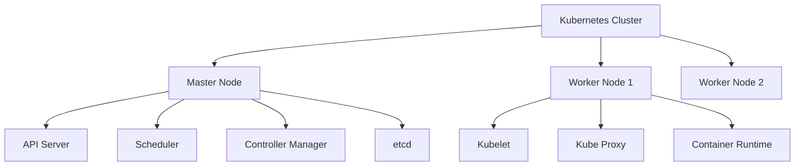
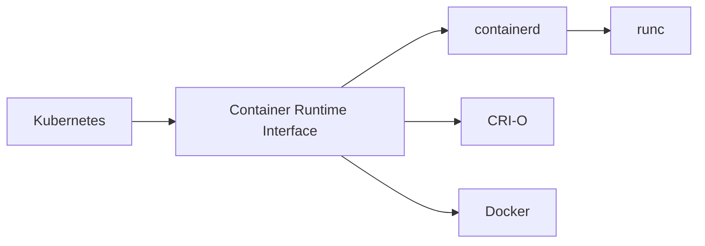

# Kubernetes Basics: Comprehensive Guide

## Table of Contents
1. [Introduction to Kubernetes](#introduction-to-kubernetes)
   - [What is Kubernetes?](#what-is-kubernetes)
   - [Why is Kubernetes used?](#why-is-kubernetes-used)
2. [Docker vs ContainerD](#docker-vs-containerd)
   - [Why containerd?](#why-containerd)
   - [Container Runtime Interface (CRI)](#container-runtime-interface-cri)
3. [CLI Tools Comparison](#cli-tools-comparison)
   - [nerdctl](#nerdctl)
   - [crictl](#crictl)
   - [ctr vs nerdctl vs crictl](#ctr-vs-nerdctl-vs-crictl)

## Introduction to Kubernetes

### What is Kubernetes?
Kubernetes (often abbreviated as K8s) is an open-source container orchestration platform that automates the deployment, scaling, and management of containerized applications.

Key features:
- **Container orchestration**: Manages lifecycle of containers
- **Self-healing**: Restarts failed containers, replaces and reschedules containers
- **Load balancing**: Distributes network traffic to ensure stable deployments
- **Horizontal scaling**: Scale applications up and down with simple commands
- **Storage orchestration**: Automatically mounts storage systems
- **Automated rollouts and rollbacks**: Gradually updates applications



### Why is Kubernetes used?
Kubernetes addresses several challenges in modern application deployment:

1. **Microservices architecture**: Manages hundreds or thousands of containers
2. **High availability**: Ensures applications are always running
3. **Resource optimization**: Efficiently utilizes hardware resources
4. **DevOps enablement**: Facilitates CI/CD pipelines
5. **Multi-cloud flexibility**: Runs on any cloud or on-premises

Common use cases:
- Deploying and scaling web applications
- Migrating traditional applications to containers
- Implementing microservices architectures
- Machine learning workloads

## Docker vs ContainerD

### Why containerd?
containerd is a high-level container runtime that was spun out from Docker as a separate project. It's now a graduated CNCF project.

Advantages over Docker:
- **Lightweight**: Smaller footprint, fewer components
- **Stability**: Focused solely on core container runtime functionality
- **Standardization**: Implements CRI (Container Runtime Interface) for Kubernetes
- **Performance**: Optimized for production environments



### Container Runtime Interface (CRI)
CRI is a plugin interface that enables kubelet to use different container runtimes without needing to recompile.

Components:
- **RuntimeService**: For container lifecycle operations
- **ImageService**: For image operations

Key implementations:
- containerd (with CRI plugin)
- CRI-O (Red Hat's lightweight implementation)
- Docker (via dockershim, now deprecated)

## CLI Tools Comparison

### nerdctl
nerdctl is a Docker-compatible CLI for containerd, developed by the containerd community.

Installation:
```bash
# For Linux
wget https://github.com/containerd/nerdctl/releases/download/v1.0.0/nerdctl-1.0.0-linux-amd64.tar.gz
tar -xvf nerdctl-1.0.0-linux-amd64.tar.gz
sudo mv nerdctl /usr/local/bin/
```

Common commands:
```bash
# List containers
nerdctl ps -a

# Run a container
nerdctl run -d --name nginx -p 8080:80 nginx:alpine

# Build an image
nerdctl build -t my-app .

# View images
nerdctl images
```

### crictl
crictl is a CLI for CRI-compatible container runtimes, designed for debugging Kubernetes nodes.

Installation:
```bash
VERSION="v1.26.0"
wget https://github.com/kubernetes-sigs/cri-tools/releases/download/$VERSION/crictl-$VERSION-linux-amd64.tar.gz
sudo tar zxvf crictl-$VERSION-linux-amd64.tar.gz -C /usr/local/bin
```

Common commands:
```bash
# List pods (Kubernetes pods)
crictl pods

# List containers
crictl ps -a

# Get container info
crictl inspect <container-id>

# Execute command in container
crictl exec -it <container-id> sh

# Pull image
crictl pull nginx:alpine
```

### ctr vs nerdctl vs crictl

| Feature        | ctr (containerd CLI) | nerdctl | crictl |
|---------------|---------------------|---------|--------|
| **Purpose**   | Low-level containerd operations | Docker-compatible UX | Kubernetes node debugging |
| **Image Management** | Yes | Yes | Yes |
| **Container Management** | Yes | Yes | Yes |
| **Network Management** | Limited | Yes (CNI) | No |
| **Volume Management** | No | Yes | No |
| **Build Images** | No | Yes | No |
| **Compose Support** | No | Yes | No |
| **Kubernetes Integration** | No | Limited | Yes |
| **User Friendliness** | Low | High | Medium |

**When to use each:**
- `ctr`: Direct containerd operations, debugging containerd itself
- `nerdctl`: Daily container operations when not using Kubernetes
- `crictl`: Debugging Kubernetes nodes and container runtime issues

**Command Comparison Table:**

| Docker Command | nerdctl Equivalent | crictl Equivalent | ctr Equivalent |
|----------------|--------------------|-------------------|----------------|
| `docker ps` | `nerdctl ps` | `crictl ps` | `ctr containers ls` |
| `docker images` | `nerdctl images` | `crictl images` | `ctr images ls` |
| `docker pull` | `nerdctl pull` | `crictl pull` | `ctr images pull` |
| `docker run` | `nerdctl run` | N/A | `ctr run` |
| `docker exec` | `nerdctl exec` | `crictl exec` | N/A |
| `docker build` | `nerdctl build` | N/A | N/A |
| `docker compose up` | `nerdctl compose up` | N/A | N/A |

## Practical Examples

### Working with nerdctl
```bash
# Create a network
nerdctl network create mynet

# Run a container with the network
nerdctl run -d --name web --network mynet nginx:alpine

# Check logs
nerdctl logs web

# Remove container
nerdctl rm -f web
```

### Working with crictl (Kubernetes environment)
```bash
# Get all pods in the node
crictl pods

# Get all containers
crictl ps -a

# Inspect a specific container
crictl inspect <container-id>

# Get container logs
crictl logs <container-id>
```

### Working with ctr (low-level containerd operations)
```bash
# List all containers
ctr containers ls

# List all images
ctr images ls

# Pull an image
ctr images pull docker.io/library/nginx:alpine

# Run a container
ctr run --rm -t docker.io/library/alpine:latest alpine sh
```