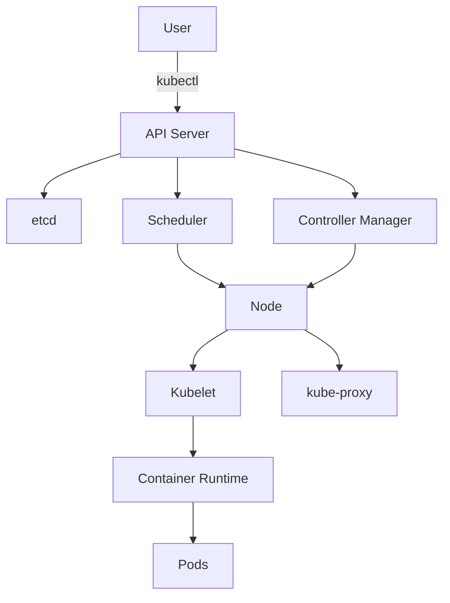
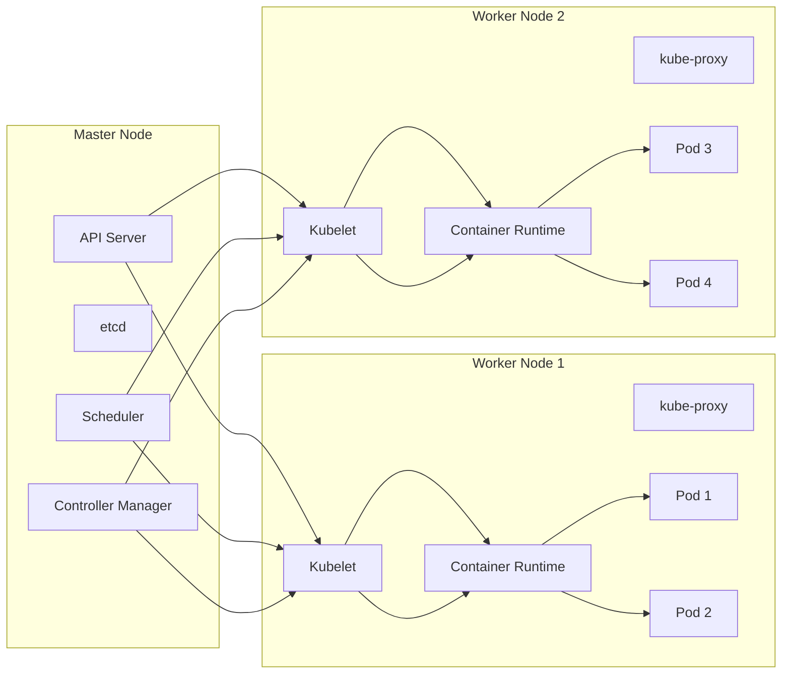

# Kubernetes Architecture: Comprehensive Guide

## Table of Contents
1. [Kubernetes Terminologies](#kubernetes-terminologies)
   - [Nodes (Minions)](#nodes-minions)
   - [Cluster](#cluster)
   - [Master](#master)
2. [Components of Kubernetes](#components-of-kubernetes)
   - [API Server](#api-server)
   - [etcd](#etcd)
   - [Scheduler](#scheduler)
   - [Controller](#controller)
   - [Container Runtime](#container-runtime)
   - [Kubelet](#kubelet)
3. [Practical Commands](#practical-commands)
4. [Architecture Diagrams](#architecture-diagrams)

## Kubernetes Terminologies

### Nodes (Minions)
Nodes are the worker machines in Kubernetes that run containerized applications. Each node is managed by the control plane.

**Types of Nodes:**
- **Worker Nodes**: Run application workloads
- **Master Nodes**: Run control plane components

**Node Components:**
1. **Kubelet**: Agent that communicates with the control plane
2. **kube-proxy**: Network proxy maintaining network rules
3. **Container Runtime**: Software that runs containers (e.g., containerd, CRI-O)

**Node Status Check:**
```bash
kubectl get nodes
kubectl describe node <node-name>
```

### Cluster
A Kubernetes cluster is a set of nodes that run containerized applications.

**Cluster Components:**
- Control Plane (Master)
- Worker Nodes
- Networking components (CNI plugins)
- Storage infrastructure

**Cluster Information:**
```bash
kubectl cluster-info
kubectl config view  # View cluster configuration
```

### Master
The master node is the control plane that makes global decisions about the cluster.

**Master Responsibilities:**
- Scheduling workloads
- Maintaining cluster state
- Responding to cluster events
- Managing scaling operations

**Master Components:**
1. API Server
2. Scheduler
3. Controller Manager
4. etcd

## Components of Kubernetes

### API Server
The central management entity that exposes the Kubernetes API.

**Key Features:**
- RESTful interface
- Processes REST operations
- Validates and configures data
- Serves cluster shared state through etcd

**API Server Commands:**
```bash
# Check API server status
kubectl get --raw='/readyz?verbose'

# List all API resources
kubectl api-resources

# View API versions
kubectl api-versions
```

### etcd
Consistent and highly-available key-value store used as Kubernetes' backing store.

**Characteristics:**
- Stores all cluster data
- Uses Raft consensus algorithm
- Typically runs on master nodes
- Needs regular backups

**etcd Operations:**
```bash
# Check etcd status (when accessed via etcdctl)
ETCDCTL_API=3 etcdctl --endpoints=https://127.0.0.1:2379 \
  --cacert=/etc/kubernetes/pki/etcd/ca.crt \
  --cert=/etc/kubernetes/pki/etcd/server.crt \
  --key=/etc/kubernetes/pki/etcd/server.key \
  endpoint health

# List all keys
ETCDCTL_API=3 etcdctl --endpoints=https://127.0.0.1:2379 \
  --cacert=/etc/kubernetes/pki/etcd/ca.crt \
  --cert=/etc/kubernetes/pki/etcd/server.crt \
  --key=/etc/kubernetes/pki/etcd/server.key \
  get / --prefix --keys-only
```

### Scheduler
Component that assigns Pods to Nodes based on resource availability and constraints.

**Scheduling Process:**
1. Filtering (Find feasible Nodes)
2. Scoring (Rank feasible Nodes)
3. Binding (Assign Pod to best Node)

**Scheduler Commands:**
```bash
# View scheduler logs
kubectl logs -n kube-system <scheduler-pod-name>

# Check scheduler status
kubectl get events --field-selector involvedObject.kind=Pod
```

### Controller
Control loops that watch the state of your cluster and make changes to move the current state closer to the desired state.

**Controller Types:**
- Node Controller
- Replication Controller
- Endpoints Controller
- Service Account & Token Controllers

**Controller Manager Commands:**
```bash
# View controller manager logs
kubectl logs -n kube-system <controller-manager-pod-name>

# Check running controllers
kubectl get pods -n kube-system | grep controller
```

### Container Runtime
Software responsible for running containers.

**Common Runtimes:**
- containerd
- CRI-O
- Docker (deprecated)

**Runtime Checks:**
```bash
# Check container runtime on a node
kubectl get node <node-name> -o jsonpath='{.status.nodeInfo.containerRuntimeVersion}'

# Using crictl to inspect runtime
crictl info
```

### Kubelet
Primary node agent that runs on each node.

**Responsibilities:**
- Register node with API server
- Manage Pod lifecycle
- Report node and Pod status
- Execute liveness probes

**Kubelet Commands:**
```bash
# Check kubelet status
systemctl status kubelet

# View kubelet logs
journalctl -u kubelet -f

# Check kubelet configuration
ps aux | grep kubelet
```

## Practical Commands

**Cluster Inspection:**
```bash
# Get all components status
kubectl get componentstatuses

# Check control plane pods
kubectl get pods -n kube-system

# View cluster events
kubectl get events --sort-by=.metadata.creationTimestamp
```

**Node Operations:**
```bash
# Drain a node for maintenance
kubectl drain <node-name> --ignore-daemonsets

# Cordon a node (mark as unschedulable)
kubectl cordon <node-name>

# Uncordon a node
kubectl uncordon <node-name>
```

## Architecture Diagrams





**Component Interaction Table:**

| Component | Interacts With | Communication Protocol | Purpose |
|-----------|----------------|------------------------|---------|
| API Server | etcd | gRPC | Store/retrieve cluster state |
| API Server | kubelet | HTTPS | Send Pod specifications |
| API Server | Scheduler | HTTPS | Receive scheduling decisions |
| API Server | Controller | HTTPS | Receive cluster state changes |
| Scheduler | API Server | HTTPS | Get unscheduled Pods, report decisions |
| Controller | API Server | HTTPS | Watch cluster state, make changes |
| Kubelet | API Server | HTTPS | Report node status, receive Pod specs |
| Kubelet | Container Runtime | CRI (gRPC) | Manage container lifecycle |
| kube-proxy | API Server | HTTPS | Watch Service/Endpoint changes |