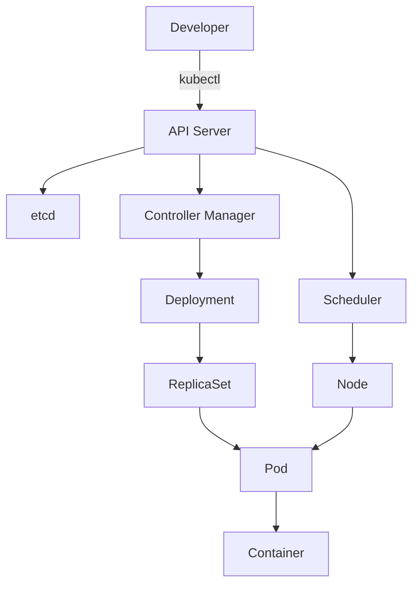

# Kubernetes Setup and Command Line Guide

## Table of Contents
1. [Kubernetes Setup using Minikube](#kubernetes-setup-using-minikube)
   - [What is Minikube?](#what-is-minikube)
   - [How to Setup Minikube](#how-to-setup-minikube)
2. [Command Line Utilities (kubectl)](#command-line-utilities-kubectl)
   - [kubectl Basics](#kubectl-basics)
   - [Essential kubectl Commands](#essential-kubectl-commands)
   - [Advanced kubectl Usage](#advanced-kubectl-usage)

## Kubernetes Setup using Minikube

### What is Minikube?
Minikube is a lightweight Kubernetes implementation that creates a local single-node Kubernetes cluster on your development machine.

**Key Features:**
- Runs a single-node Kubernetes cluster inside a VM
- Supports multiple container runtimes (Docker, containerd, CRI-O)
- Ideal for development and testing purposes
- Cross-platform (Windows, macOS, Linux)
- Supports Kubernetes features like DNS, NodePorts, ConfigMaps, and Secrets

**Comparison with Other Solutions:**

| Feature        | Minikube | kubeadm | Kind | MicroK8s |
|---------------|----------|---------|------|----------|
| Nodes         | 1        | Multi   | Multi | 1+       |
| Setup Complexity | Easy   | Medium  | Easy | Easiest  |
| Resource Usage | Medium   | High    | Low  | Low      |
| Production Use | No       | Yes     | No   | Maybe    |
| Local Dev     | Excellent| Poor    | Excellent | Good |

### How to Setup Minikube

**Prerequisites:**
- 2 CPUs or more
- 2GB of free memory
- 20GB of free disk space
- Internet connection
- Virtualization enabled in BIOS

**Installation Steps:**

1. **Install a Hypervisor** (choose one):
   ```bash
   # For macOS (HyperKit)
   brew install hyperkit

   # For Linux (KVM)
   sudo apt install qemu-kvm libvirt-daemon-system libvirt-clients bridge-utils

   # For Windows (Hyper-V or VirtualBox)
   ```
   
2. **Install Minikube**:
   ```bash
   # Linux
   curl -LO https://storage.googleapis.com/minikube/releases/latest/minikube-linux-amd64
   sudo install minikube-linux-amd64 /usr/local/bin/minikube

   # macOS
   brew install minikube

   # Windows (Admin PowerShell)
   choco install minikube
   ```

3. **Start Minikube**:
   ```bash
   # Basic start with default driver
   minikube start

   # Specific driver (virtualbox, docker, hyperkit, etc.)
   minikube start --driver=virtualbox

   # With specific Kubernetes version
   minikube start --kubernetes-version=v1.26.0

   # With more resources
   minikube start --memory=4096 --cpus=4
   ```

4. **Verify Installation**:
   ```bash
   minikube status
   kubectl get nodes
   minikube dashboard  # Opens Kubernetes dashboard in browser
   ```

**Common Minikube Commands:**
```bash
# Stop the cluster
minikube stop

# Delete the cluster
minikube delete

# SSH into minikube VM
minikube ssh

# Get cluster IP
minikube ip

# List available addons
minikube addons list

# Enable addons (e.g., ingress)
minikube addons enable ingress
```

## Command Line Utilities (kubectl)

### kubectl Basics
kubectl is the command-line tool for controlling Kubernetes clusters.

**Installation:**
```bash
# Linux
curl -LO "https://dl.k8s.io/release/$(curl -L -s https://dl.k8s.io/release/stable.txt)/bin/linux/amd64/kubectl"
sudo install -o root -g root -m 0755 kubectl /usr/local/bin/kubectl

# macOS
brew install kubectl

# Windows
choco install kubernetes-cli
```

**Configuration:**
```bash
# View current config
kubectl config view

# Set default namespace
kubectl config set-context --current --namespace=mynamespace

# Switch context (for multiple clusters)
kubectl config use-context my-cluster
```

### Essential kubectl Commands

**Cluster Management:**
```bash
# Get cluster info
kubectl cluster-info

# Get component statuses
kubectl get componentstatuses

# Get all API resources
kubectl api-resources
```

**Node Operations:**
```bash
# List nodes
kubectl get nodes

# Get node details
kubectl describe node <node-name>

# Drain a node
kubectl drain <node-name> --ignore-daemonsets

# Cordon/uncordon a node
kubectl cordon <node-name>
kubectl uncordon <node-name>
```

**Pod Operations:**
```bash
# List pods
kubectl get pods -A  # All namespaces
kubectl get pods -o wide  # More details
kubectl get pods --watch  # Watch changes

# Create a pod
kubectl run nginx --image=nginx:alpine

# Describe pod
kubectl describe pod <pod-name>

# Pod logs
kubectl logs <pod-name>
kubectl logs -f <pod-name>  # Follow logs
kubectl logs --previous <pod-name>  # Previous instance

# Execute command in pod
kubectl exec -it <pod-name> -- sh

# Delete pod
kubectl delete pod <pod-name>
```

**Deployment Operations:**
```bash
# Create deployment
kubectl create deployment nginx --image=nginx:alpine

# Scale deployment
kubectl scale deployment nginx --replicas=3

# Update image
kubectl set image deployment/nginx nginx=nginx:latest

# Rollout status
kubectl rollout status deployment/nginx

# Rollback
kubectl rollout undo deployment/nginx
```

### Advanced kubectl Usage

**YAML Operations:**
```bash
# Create from YAML
kubectl apply -f deployment.yaml

# Generate YAML
kubectl create deployment nginx --image=nginx --dry-run=client -o yaml > nginx.yaml

# Diff changes
kubectl diff -f updated-deployment.yaml
```

**Troubleshooting:**
```bash
# Get events sorted by time
kubectl get events --sort-by=.metadata.creationTimestamp

# Top nodes/pods
kubectl top nodes
kubectl top pods

# Port forwarding
kubectl port-forward <pod-name> 8080:80

# Proxy to API server
kubectl proxy --port=8001
```

**Plugins and Customization:**
```bash
# Install kubectl plugins (krew)
(
  set -x; cd "$(mktemp -d)" &&
  OS="$(uname | tr '[:upper:]' '[:lower:]')" &&
  ARCH="$(uname -m | sed -e 's/x86_64/amd64/' -e 's/\(arm\)\(64\)\?.*/\1\2/' -e 's/aarch64$/arm64/')" &&
  KREW="krew-${OS}_${ARCH}" &&
  curl -fsSLO "https://github.com/kubernetes-sigs/krew/releases/latest/download/${KREW}.tar.gz" &&
  tar zxvf "${KREW}.tar.gz" &&
  ./"${KREW}" install krew
)

# Add krew to PATH
export PATH="${KREW_ROOT:-$HOME/.krew}/bin:$PATH"

# Install useful plugins
kubectl krew install ctx ns view-allocations neat
```

**Aliases and Shortcuts:**
```bash
# Common aliases
alias k='kubectl'
alias kg='kubectl get'
alias kd='kubectl describe'
alias kdel='kubectl delete'
alias ka='kubectl apply -f'
alias kaf='kubectl apply -f'
alias kgp='kubectl get pods'
alias kgn='kubectl get nodes'

# Set autocompletion
source <(kubectl completion bash)  # bash
source <(kubectl completion zsh)   # zsh
complete -F __start_kubectl k      # for alias
```



**kubectl Output Formatting:**

| Option | Description | Example |
|--------|-------------|---------|
| -o wide | Additional details | `kubectl get pods -o wide` |
| -o json | JSON output | `kubectl get pod nginx -o json` |
| -o yaml | YAML output | `kubectl get pod nginx -o yaml` |
| -o name | Only resource names | `kubectl get pods -o name` |
| -o custom-columns | Custom columns | `kubectl get pods -o custom-columns=NAME:.metadata.name,STATUS:.status.phase` |
| --sort-by | Sort output | `kubectl get pods --sort-by=.metadata.creationTimestamp` |