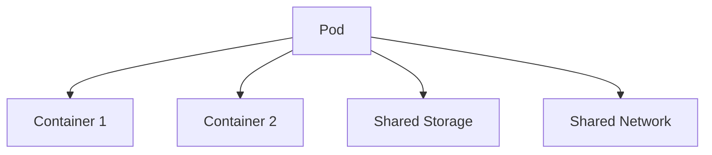

# Kubernetes Core Concepts: Pods, ReplicaSets, Deployments, and Services

## Table of Contents
1. [Pods in Kubernetes](#pods-in-kubernetes)
   - [Pods Basics](#pods-basics)
   - [Pods with YAML](#pods-with-yaml)
2. [ReplicaSets](#replicasets)
   - [Replication Controllers](#replication-controllers)
   - [ReplicaSets vs Replication Controllers](#replicasets-vs-replication-controllers)
   - [Labels & Selectors](#labels--selectors)
   - [ReplicaSet Commands](#replicaset-commands)
3. [Deployments](#deployments)
   - [Defining Deployments](#defining-deployments)
   - [Deployment Strategies](#deployment-strategies)
   - [Rollbacks](#rollbacks)
4. [Services](#services)
   - [Service Types](#service-types)
5. [YAML Configuration](#yaml-configuration)
6. [API Versions](#api-versions)

## Pods in Kubernetes

### Pods Basics
Pods are the smallest deployable units in Kubernetes that can be created and managed.

**Key Characteristics:**
- One or more containers sharing storage/network
- Atomic unit of scheduling
- Ephemeral (temporary) by nature
- Each pod gets its own IP address



**Basic Pod Commands:**
```bash
# Create a pod
kubectl run nginx-pod --image=nginx:alpine

# List pods
kubectl get pods
kubectl get pods -o wide  # with more details

# Describe pod
kubectl describe pod nginx-pod

# Delete pod
kubectl delete pod nginx-pod

# View pod logs
kubectl logs nginx-pod
kubectl logs -f nginx-pod  # follow logs
```

### Pods with YAML

#### General Structure of a Kubernetes YAML File
```yaml
apiVersion: v1
kind: Pod
metadata:
  name: nginx-pod
  labels:
    app: nginx
    tier: frontend
spec:
  containers:
  - name: nginx-container
    image: nginx:alpine
    ports:
    - containerPort: 80
```

**Key Sections:**
1. `apiVersion`: Kubernetes API version
2. `kind`: Resource type (Pod, Deployment, etc.)
3. `metadata`: Identifying information
4. `spec`: Desired state configuration

**Creating Pod from YAML:**
```bash
# Create pod from YAML
kubectl apply -f pod.yaml

# Edit live configuration
kubectl edit pod nginx-pod

# Export pod definition
kubectl get pod nginx-pod -o yaml > exported-pod.yaml
```

## ReplicaSets

### Replication Controllers
Legacy method to ensure a specified number of pod replicas are running.

**Basic RC Example:**
```yaml
apiVersion: v1
kind: ReplicationController
metadata:
  name: nginx-rc
spec:
  replicas: 3
  selector:
    app: nginx
  template:
    metadata:
      labels:
        app: nginx
    spec:
      containers:
      - name: nginx
        image: nginx:1.14
        ports:
        - containerPort: 80
```

### ReplicaSets vs Replication Controllers

| Feature | ReplicaSet | ReplicationController |
|---------|------------|-----------------------|
| Selector | Supports set-based selectors | Only equality-based |
| API Version | apps/v1 | v1 |
| Recommended | Yes | No (legacy) |
| Rolling Updates | No (use Deployments) | No |

### Labels & Selectors
**Label Example:**
```yaml
metadata:
  labels:
    app: frontend
    environment: production
    tier: web
```

**Selector Types:**
1. Equality-based: `environment = production`
2. Set-based: `environment in (production, staging)`

### ReplicaSet Commands
```bash
# Create ReplicaSet
kubectl apply -f replicaset.yaml

# List ReplicaSets
kubectl get replicasets
kubectl get rs  # short form

# Scale ReplicaSet
kubectl scale rs nginx-rs --replicas=5

# Describe ReplicaSet
kubectl describe rs nginx-rs

# Delete ReplicaSet (keeps pods)
kubectl delete rs nginx-rs --cascade=orphan

# Delete ReplicaSet and pods
kubectl delete rs nginx-rs
```

## Deployments

### Defining Deployments
Deployments provide declarative updates for Pods and ReplicaSets.

```yaml
apiVersion: apps/v1
kind: Deployment
metadata:
  name: nginx-deployment
spec:
  replicas: 3
  selector:
    matchLabels:
      app: nginx
  template:
    metadata:
      labels:
        app: nginx
    spec:
      containers:
      - name: nginx
        image: nginx:1.14.2
        ports:
        - containerPort: 80
```

### Deployment Strategies

1. **Recreate**: 
   - Kills all old pods before creating new ones
   - Causes downtime
   ```yaml
   strategy:
     type: Recreate
   ```

2. **RollingUpdate (default)**:
   - Gradually replaces old pods with new ones
   - Zero downtime
   ```yaml
   strategy:
     type: RollingUpdate
     rollingUpdate:
       maxUnavailable: 1
       maxSurge: 1
   ```

**Deployment Commands:**
```bash
# Create deployment
kubectl apply -f deployment.yaml

# List deployments
kubectl get deployments
kubectl get deploy  # short form

# Update deployment
kubectl set image deployment/nginx-deployment nginx=nginx:1.16.1

# Check rollout status
kubectl rollout status deployment/nginx-deployment

# Pause/resume rollout
kubectl rollout pause deployment/nginx-deployment
kubectl rollout resume deployment/nginx-deployment

# View rollout history
kubectl rollout history deployment/nginx-deployment

# Rollback to previous version
kubectl rollout undo deployment/nginx-deployment

# Rollback to specific revision
kubectl rollout undo deployment/nginx-deployment --to-revision=2
```

## Services

### Service Types

1. **ClusterIP (default)**:
   - Internal cluster IP
   - Only accessible within cluster
   ```yaml
   kind: Service
   apiVersion: v1
   metadata:
     name: my-service
   spec:
     selector:
       app: MyApp
     ports:
     - protocol: TCP
       port: 80
       targetPort: 9376
   ```

2. **NodePort**:
   - Exposes service on each Node's IP at static port
   ```yaml
   spec:
     type: NodePort
     ports:
     - port: 80
       targetPort: 80
       nodePort: 30007
   ```

3. **LoadBalancer**:
   - Creates external load balancer in cloud providers
   ```yaml
   spec:
     type: LoadBalancer
   ```

**Service Commands:**
```bash
# Create service
kubectl apply -f service.yaml

# List services
kubectl get services
kubectl get svc  # short form

# Describe service
kubectl describe svc my-service

# Expose deployment as service
kubectl expose deployment nginx-deployment --port=80 --type=NodePort

# Port forwarding
kubectl port-forward svc/my-service 8080:80
```

## YAML Configuration

**Comparison Table:**

| Resource | Key Fields | Required Selector |
|----------|-----------|-------------------|
| Pod | containers, volumes | No |
| ReplicaSet | replicas, selector, template | Yes |
| Deployment | replicas, selector, template, strategy | Yes |
| Service | selector, ports, type | Yes (except headless) |

**Complete Example Workflow:**
```bash
# Create deployment
kubectl apply -f deployment.yaml

# Verify deployment
kubectl get deploy,rs,pod

# Expose as service
kubectl apply -f service.yaml

# Verify service
kubectl get svc
curl <service-ip>
```

## API Versions

| Resource | Recommended API Version | Deprecated Versions |
|----------|-------------------------|---------------------|
| Pod | v1 | - |
| ReplicationController | v1 | - |
| ReplicaSet | apps/v1 | extensions/v1beta1 |
| Deployment | apps/v1 | extensions/v1beta1 |
| Service | v1 | - |

**Checking API Versions:**
```bash
# List all API resources with versions
kubectl api-resources

# Check preferred version for a resource
kubectl explain pod.apiVersion
```