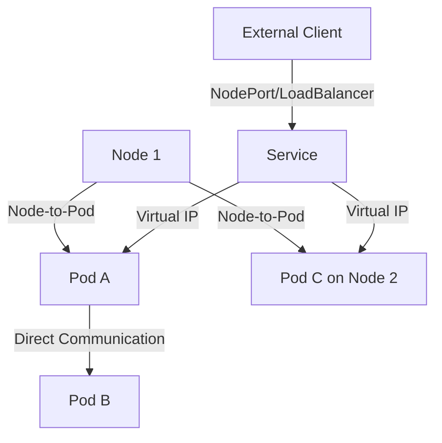

# Kubernetes Networking Fundamentals

## Table of Contents
1. [Kubernetes Networking Basics](#kubernetes-networking-basics)
   - [Core Networking Principles](#core-networking-principles)
   - [Network Communication Flows](#network-communication-flows)
2. [Prebuilt Networking Solutions](#prebuilt-networking-solutions)
   - [Popular CNI Plugins](#popular-cni-plugins)
   - [Comparison of Solutions](#comparison-of-solutions)

## Kubernetes Networking Basics

### Core Networking Principles
Kubernetes networking follows four fundamental requirements:

1. **Pod-to-Pod Communication**:
   - All pods can communicate with all other pods without NAT
   - Each pod gets its own unique IP address
   - Pod IPs are routable within the cluster

2. **Node-to-Pod Communication**:
   - Nodes can communicate with all pods on that node
   - Nodes can communicate with all pods in the cluster

3. **Service Networking**:
   - Services get virtual IPs (ClusterIPs) that are routable within the cluster
   - kube-proxy maintains network rules for service IP routing

4. **External Access**:
   - Services can be exposed outside the cluster via NodePort or LoadBalancer
   - Ingress controllers provide HTTP-layer routing



### Network Communication Flows

**Pod-to-Pod Communication**:
- Same Node: Through the node's network bridge (cbr0)
- Different Nodes: Routed through the cluster network

**Service-to-Pod Communication**:
1. kube-proxy watches API server for Service/Endpoint changes
2. Creates iptables/IPVS rules to route Service VIP to Pod IPs
3. Performs load balancing across Pod endpoints

**Key Components**:
- **CNI (Container Network Interface)**: Plugin that configures pod networking
- **kube-proxy**: Maintains network rules on nodes
- **CoreDNS**: Provides name resolution for Services

## Prebuilt Networking Solutions

### Popular CNI Plugins

1. **Calico**:
   - Uses BGP for routing
   - Supports network policies
   - Good for on-prem and cloud deployments

2. **Flannel**:
   - Simple overlay network
   - Uses VXLAN or host-gw backend
   - Lightweight and easy to configure

3. **Weave Net**:
   - Creates a mesh overlay network
   - Includes DNS-based service discovery
   - Encrypts traffic between nodes

4. **Cilium**:
   - Uses eBPF for high performance
   - Advanced security features
   - Good for cloud-native applications

5. **kubenet**:
   - Basic built-in plugin
   - Requires cloud provider or manual route configuration
   - Limited features

### Comparison of Solutions

| Feature | Calico | Flannel | Weave | Cilium |
|---------|--------|---------|-------|--------|
| Network Policy | Yes | Limited | Yes | Advanced |
| Encryption | Optional | No | Yes | Yes |
| Routing | BGP | VXLAN | Mesh | eBPF |
| Performance | High | Medium | Medium | Very High |
| Complexity | Medium | Low | Medium | High |
| Cloud Support | All | All | All | All |
| On-prem Support | Excellent | Good | Good | Excellent |

**Implementation Notes**:
- Most cloud providers offer managed CNI solutions
- Choice depends on security needs, performance requirements, and environment
- Network Policies are crucial for production security

**Basic Network Troubleshooting Commands**:
```bash
# Check pod network
kubectl exec -it <pod-name> -- ping <another-pod-ip>

# Verify DNS resolution
kubectl exec -it <pod-name> -- nslookup <service-name>

# Check kube-proxy logs
kubectl logs -n kube-system <kube-proxy-pod>

# View iptables rules (on node)
sudo iptables-save | grep <service-name>

# Check network interfaces (on node)
ip addr show
```

**Network Policy Example (YAML)**:
```yaml
apiVersion: networking.k8s.io/v1
kind: NetworkPolicy
metadata:
  name: allow-web-traffic
spec:
  podSelector:
    matchLabels:
      app: web
  policyTypes:
  - Ingress
  ingress:
  - from:
    - podSelector:
        matchLabels:
          role: frontend
    ports:
    - protocol: TCP
      port: 80
```

This policy allows only pods with label `role=frontend` to access pods labeled `app=web` on port 80.